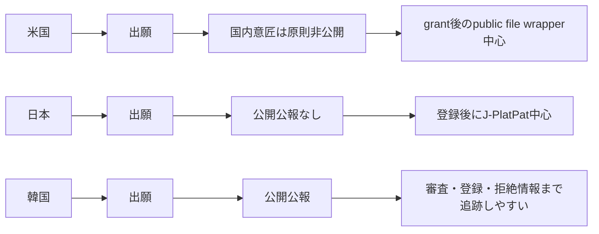

# 意匠データの出願引用紐付きと拒絶理由文の取得可能性

## エグゼクティブサマリ

結論から言うと、三極の中で最も実務向きに「意匠の出願―先行意匠／関連意匠の紐付き」と「拒絶理由文」を取りやすいのは韓国です。無料UIのKIPRISでは関連デザイン検索や行政状態の絞り込みができ、KIPRIS Plusでは意匠公報、意匠行政処理履歴、意見提出通知書、拒絶決定書がAPI/Bulkで日次提供されています。とくに意匠公報のBibliographic.txtに `S=Similar / Y=Basic / R=Relation` が入る点は、構造化ペア生成に非常に強いです。 citeturn29view0turn29view5turn32search0turn29view2turn29view3turn29view4

日本は、公開UIでは登録後中心ですが、APIはかなり強いです。J-PlatPatでは経過情報から審査記録や発送書類を追えますが、意匠には公開公報がないため、一般公開UIで未登録案件を体系的に集める用途には向きません。他方、entity["organization","特許庁","jp patent office"] の特許情報取得APIは、意匠についても経過情報、申請書類、発送書類、拒絶理由通知書、登録情報などを明示的に提供しており、意匠用APIとしてはかなり整っています。 citeturn9view1turn21search0turn21search2turn9view3turn14search4turn17search0

米国は、拒絶理由文の取得自体は可能ですが、「意匠の出願―類似先行意匠」の公式・構造化リンクは弱いです。entity["organization","USPTO","us patent office"] のOpen Data PortalとPatent File Wrapperでは、public caseになった意匠案件のApplication Data、Documents、Transactionsを取得でき、意匠案件のDocuments画面には `CTNF / Non-Final Rejection` のような拒絶文書も確認できます。しかし、米国の国内意匠出願は原則として出願公開されず、公開ドキュメントからは Enriched Citations API の design coverage も明示できません。したがって、米国は Patent File Wrapper と granted design XML を主軸にし、引用ペアは擬似生成と考えるのが安全です。 citeturn6view0turn6view5turn36search6turn43search0turn41search0turn42search0

先に一点だけ、以前の論点を整理すると、Enriched Citations API を「米国意匠の主たる紐付き引用ソース」と断定するのは避けるべきです。公式説明は “patent evaluation process” という一般表現で、検索項目にも `patentApplicationNumber` が出ますが、取得対象として design を明示していません。しかも国内意匠は pre-grant publication がないため、仮に一部 design record が取れても、米国意匠の網羅的な紐付き基盤とはみなしにくい、というのが今回の実務判断です。 citeturn41search0turn42search0turn6view0

## 国×取得手段の比較

以下の表でいう「紐付き」は、**構造化された関連意匠／基本意匠リンク**と、**拒絶理由文・経過情報の中に出る引用文献番号や先行意匠番号**のいずれかを公式ソースから取得できる場合を含めています。後者のみで、正規化された citation graph がない場合は「部分可」としています。

| 国 | UI | 静的バルクデータ | 動的API | 実務判断 | 根拠 |
|---|---|---|---|---|---|
| 米国 | 紐付き **部分可** / 拒絶理由文 **可** | 紐付き **部分可** / 拒絶理由文 **部分可** | 紐付き **部分可** / 拒絶理由文 **可** | 拒絶文書は取れるが、意匠向けの構造化引用リンクは弱い。Enriched Citationsは補助扱い。 | Patent File Wrapperでdesign案件と `Non-Final Rejection` 文書が確認でき、ODP APIキー要件も明示。国内意匠は非公開出願。Enriched Citationsは一般的な patent API の説明にとどまる。 citeturn6view0turn6view5turn36search6turn43search0turn40search1turn41search0 |
| 日本 | 紐付き **部分可** / 拒絶理由文 **部分可** | 紐付き **部分可** / 拒絶理由文 **部分可** | 紐付き **部分可** / 拒絶理由文 **可** | 公開UIは登録後中心。大規模取得はAPI優先。 | J-PlatPatは経過情報・審査記録を見られるが、意匠は公開公報がなく登録されない限り一般公開UIでは検索困難。JPO APIは意匠拒絶理由通知書等を明示提供。 citeturn9view1turn21search0turn21search2turn7search8turn9view3turn14search4 |
| 韓国 | 紐付き **可** / 拒絶理由文 **部分可** | 紐付き **可** / 拒絶理由文 **可** | 紐付き **可** / 拒絶理由文 **可** | 三極で最も実務向き。まず韓国を基準実装にすべき。 | KIPRISのUIで関連デザイン・行政状態が検索でき、KIPRIS Plusで意匠公報、行政処理履歴、意見提出通知書、拒絶決定書が日次のAPI/Bulk提供。公報書誌には `S/Y/R` が入る。 citeturn29view0turn29view5turn32search0turn29view2turn29view3turn29view4 |

国内通常出願を念頭に置いた公開タイミングの違いは、概念的には次のように整理できます。 citeturn6view0turn21search0turn21search2turn29view0turn29view5



## 米国

米国では、意匠の「拒絶理由文」は official source から取れますが、「出願―類似先行意匠の構造化リンク」は弱い、というのが実務上の要点です。公開の中心は Patent Center / Patent File Wrapper であり、国内意匠出願は 18か月公開の対象外です。そのため、未公開の審査中 domestic design を第三者が網羅収集する前提は置けません。 citeturn6view0turn6view5turn5search11turn5search20

### UI

公開UIでは Patent Center / Patent File Wrapper が主ルートです。USPTO の portal applications ページは、Patent Center が Public PAIR の後継であり、application image file wrapper を閲覧できると説明しています。実際に ODP の design application detail には `Application Type: Design` の案件があり、Documents 画面には `CTNF / Non-Final Rejection`、`Other reference-Patent/Application/Search Documents`、応答書類などが並びます。したがって、**publicになった意匠案件**については、拒絶理由文や検索資料の存在をUIで追えます。公開レベルは、国内通常意匠では主として grant 後・その他 public case です。形式は HTML 画面＋PDF/MS Word/XML/PNG ダウンロードです。 citeturn6view5turn36search6turn43search0turn43search1

UIでの最短手順は、Patent Center / Patent File Wrapper の search から design application を開き、`Application Data` で案件種別と公開性を確認し、`Documents` で `CTNF` や amendment を追い、`Transactions` で文書送達の時系列を確認する流れです。引用の正規化は弱いので、`Other reference-Patent/Application/Search Documents` のような文書区分や、office action 本文からの抽出が必要になります。 citeturn35search2turn35search5turn38search18turn43search1

### 静的バルクデータ

静的バルクは ODP の Bulk Data Directory に移行済みです。USPTO は 2025年に旧 BDSS から ODP への移行を告知しており、Bulk Dataset Directory を raw public bulk data の単一リポジトリと位置づけています。意匠については、少なくとも granted design を含む Patent Grant XML 群と grantDocumentMetaData 系のファイルが使えます。これらの grant XML スキーマには `us-citation` や `category=applicant` のような citation element があり、**grant 後の引用**は構造化できます。もっとも、これは「審査官がこの類似先行意匠を引いた」という design-specific pair table ではなく、米国意匠専用の citation graph と言うには弱いです。 citeturn6view3turn6view4turn40search19turn36search10turn36search13turn3search20

実務上のダウンロード起点は Bulk Data Directory です。ファイル構造は dataset ごとに分かれ、grant XML は ZIP / XML 単位で扱うのが基本です。拒絶理由文をバルクだけで完結させるより、grant XML で citation を取り、拒絶文書は file wrapper 側で補完する方が現実的です。 citeturn40search19turn6view3turn43search0

### 動的API

動的APIは ODP 経由で利用します。公式の Getting Started は、API key の取得に USPTO.gov 登録アカウントと、検証・連携された entity["company","ID.me","identity service"] アカウントが必要だと説明しています。Patent File Wrapper の Search / Application Data / Documents API は公開ドキュメント化されており、Search は daily refreshed と案内されています。 citeturn40search0turn40search1turn40search3turn40search4turn40search6turn5search6

米国意匠で確認済みの API 利用対象は、少なくとも Patent File Wrapper 系です。公開資料上で確認できる operation は次のとおりです。なお、下の文字列は Swagger 上の operation 名・docs path であり、**実際の callable URL は API key 前提の Swagger で確認するのが安全**です。 citeturn40search4turn40search6turn40search9

```text
USPTO ODP / Patent File Wrapper
POST  Search
GET   Application Data
GET   Documents
GET   Transactions
POST  Enriched Citations   # design coverageは公開説明では未明示
```

Enriched Citations API については、公開説明が “greater insight into the patent evaluation process” という一般説明で、検索項目にも `patentApplicationNumber` が見えます。しかし、今回取得できた公式説明だけでは design を明示的に保証していません。よって、**米国意匠での第一選択は Patent File Wrapper Documents/Transactions**、Enriched Citations は補助・検証用途とみなすのが無難です。 citeturn41search0turn42search0turn6view0turn43search0

## 日本

日本は、公開UIだけを見ると弱く見えますが、意匠APIまで含めるとかなり強いです。特に拒絶理由通知書を official API で直接扱える点は、実務上かなり大きいです。ただし、意匠は公開公報がないため、「一般公開UIで未登録案件を広く集める」用途には限界があります。 citeturn21search0turn21search2turn9view3turn14search4

### UI

公開UIは J-PlatPat が中心で、運営は entity["organization","INPIT","jp ip info center"] です。INPIT は J-PlatPat について、公報情報だけでなく、手続や審査経過等のリーガルステータス情報も収録していると説明しています。操作マニュアルでは、検索結果から `経過情報` ボタンを押し、`経過情報照会` 画面で審査記録の各書類リンクを開けること、サイズが大きい場合は ZIP でダウンロードされることが示されています。したがって、登録済み案件については、UIから審査経過と関連書類を追えます。 citeturn8search5turn9view1

ただし、意匠には公開公報がありません。INPIT の操作講習会資料は「意匠には公開公報がないので、登録されない限り検索できません」と明言しています。また、審査着手状況の問い合わせは出願人または代理人が `審査状況伺書` で行う仕組みです。つまり、**一般公開UIでは未登録・審査中意匠の網羅収集は困難**です。公開レベルは、実務的には登録後中心です。 citeturn21search0turn21search2turn7search8

引用紐付きの観点では、INPIT の 2025年講習資料が意匠公報の構成要素として `参考文献` を挙げており、別の公式講習資料では `経過情報番号照会` により `引用文献番号` と `参考文献番号` を確認できると説明しています。したがって、J-PlatPat UI では **登録後の意匠公報の参考文献** と、**経過情報中の引用／参考文献番号**から、限定的な紐付けは可能です。ただし、これは米国のような applicant/examiner 付き citation API ではなく、UI中心の追跡です。 citeturn19search6turn19search8

UIでの最短手順は、`意匠番号照会` または `意匠検索` で案件を開き、`文献表示` で公報を確認し、そこから `経過情報` に入る流れです。審査書類はリンクから個別に開き、必要に応じて PDF/ZIP を取得します。 citeturn19search1turn9view1turn10view2

### 静的バルクデータ

静的バルクは、JPO の「特許情報標準データ（書誌・経過情報に関するデータ）」が中核です。これは意匠を含む書誌・経過情報の bulk data で、開庁日ごとに発行され、原則として更新情報は翌営業日に反映されます。形式は TSV で、仕様書とサンプルデータも別途公開されていますが、利用にはダウンロードサービスへの登録が必要です。 citeturn9view2turn11search5

このバルクは、**書誌・経過情報のDB構築**には向きますが、今回の論点である「拒絶理由文そのもの」は別経路が必要です。つまり、バルクは案件マスタや経過イベントの基盤として有効であり、文書本文は API または J-PlatPat 経過情報で補う、という役割分担になります。公開ページの抜粋だけでは、意匠向けの正規化済み citation table のタグ名までは確認できなかったため、その点は未指定です。 citeturn9view2turn11search5

### 動的API

JPO の特許情報取得APIは、2022年1月開始で、意匠・商標APIは 2023年4月20日から提供開始です。利用には登録が必要です。2023年説明資料と 2026年 API一覧では、意匠について **経過情報、シンプル版経過情報、優先基礎出願情報、申請人氏名・コード、番号参照、申請書類、発送書類、拒絶理由通知書、登録情報、J-PlatPat固定アドレス取得** など、11種のAPIが列挙されています。形式は、経過情報・登録情報系が JSON、書類実体が HTM 形式（ZIP内）です。さらに説明資料では、意匠・商標の書類実体は 2019年1月以降に受付・作成されたものが取得可能とされています。 citeturn9view3turn13view0turn14search2turn14search4turn14search5turn8search7

公開資料から確認できる endpoint 例は、少なくとも次のとおりです。これは今回の調査で最も endpoint が明確に見えた国です。 citeturn17search0turn15search0

```text
GET /design/v1/app_progress/{出願番号}
GET /design/v1/app_progress_simple/{出願番号}
GET /design/v1/app_doc_cont_refusal_reason/{出願番号}
GET /design/v1/registration_info/{出願番号}
```

APIの取得手順は、API情報提供サイトで利用登録し、仕様書・Swagger を参照し、出願番号ベースで呼ぶ流れです。`app_progress` 系で審査経過一覧を取り、`app_doc_cont_refusal_reason` で拒絶理由通知書本体を取り、必要なら `registration_info` で登録結果を結ぶ、という設計が自然です。公開説明上、意匠出願情報の一部取得は明示されていますが、**未登録・審査中の国内意匠を第三者がどこまで取得できるか**は今回取得した公開資料だけでは明確に言い切れず、その点は未指定とします。 citeturn9view3turn14search4turn17search0turn8search7

## 韓国

韓国は、三極の中で最も「意匠データの収集パイプライン」を組みやすい国です。無料UIで関連デザインや行政状態を追え、有料側の KIPRIS Plus では意匠公報、行政処理履歴、意見提出通知書、拒絶決定書が日次でAPI/Bulk提供されています。つまり、**構造化リンクの種**と**拒絶理由文の本文**が、同じ公式エコシステム内にあります。 citeturn29view0turn29view5turn29view2turn29view3turn29view4

### UI

無料の KIPRIS は、entity["organization","KIPI","kr patent info institute"] が運営する公開 search service です。design help では、検索タイプとして `related design (구 유사디자인)`、`partial design`、`other` があり、行政状態として `公開 / 公告 / 登録 / 거절 / 무효 / 소멸 / 취하 / 포기` などを明示しています。したがって、**関連意匠の探索**と**拒絶・登録・消滅といった状態ベースの絞り込み**は UI レベルで可能です。 citeturn22search5turn29view0

ただし、今回取得した free UI の公開 help だけでは、design 案件の office action 文書群をどの画面で安定取得するかまでは明瞭ではありません。KIPRIS Plus 側では意見提出通知書・拒絶決定書が明示データ商品になっているため、実務では **UIは探索と検証、系統取得は KIPRIS Plus** と役割分担するのが安全です。 citeturn29view0turn29view3turn29view4

### 静的バルクデータ

KIPRIS Plus の `디자인 공보` は、design opening gazette と registration gazette を API/Bulk で提供します。APIは XML、図面や全文は JPG / XML、Bulk は PDF / Tiff / TXT です。重要なのは、2025年2月の公式 notice で `Bibliographic.txt` の `기본유사유무` に `R=Relation(関連デザイン)` が追加され、`S=Similar`, `Y=Basic`, `R=Relation` の3値になったことです。これは、**基本デザイン―関連デザイン―類似デザインの構造化リンク**が bulk 書誌に載ることを意味し、ペア生成に非常に有利です。 citeturn29view5turn32search0

さらにこの notice は、初期構築手順まで具体的で、`디자인공보 > 2024 > back~20241231(Bibliographic.txt).zip` で初期データを作り、以後は 2025年分を週次の `Bibliographic.txt` で順次更新するよう案内しています。つまり、**ファイル構造と更新手順が公式にかなり明示的**です。 citeturn32search0

拒絶理由文については、別商品として `의견제출통지서` と `거절결정서` が用意されています。いずれも Bulk で `出願番号 / 発送番号 / 拒絶決定文句 / 拒絶内容 / 法的根拠` などを TXT/XML/PDF で提供し、拒絶決定書データは 2000年〜現在の提供期間が明示されています。加えて `디자인 행정처리 이력` は 1948年〜現在、日次更新の統合行政履歴を提供します。したがって韓国は、**書誌リンク・審査履歴・拒絶本文の3層が全部公式bulkにある**という評価になります。 citeturn29view4turn29view3turn29view2

### 動的API

KIPRIS Plus の Open API は、年額制の申請サービスですが、英語の fee page では「月1,000件までは free」と案内されています。設計上、API は design gazette、design admin history、opinion notice、rejection decision をそれぞれ個別商品として持っています。 `디자인 공보` API は XML search / bibliographic data / drawings-fulltext を出し、`디자인 행정처리 이력` API は application number, document number, stage, status, document name を XML で返し、`의견제출통지서` と `거절결정서` API は bibliographic data、examiner data、PDF download URL を XML で返します。更新は日次です。 citeturn29view7turn29view5turn29view2turn29view3turn29view4

今回取得できた public catalog page では、JPO のような fully explicit endpoint path までは見えませんでしたが、operation 名は公開されています。少なくとも次の operation 群が見えています。 citeturn29view2turn29view3turn29view4

```text
Design Bulletin
- search
- bibliographic info
- drawings / full text

Design Administrative History
- integrated history information

Opinion Notice
- full search
- PDF information

Rejection Decision
- examiner info
- decision content
- PDF_V2
```

APIの実務手順は、KIPRIS Plus でサービス申請を行い、まず `디자인 공보` の書誌と画像で案件母集団を作り、`디자인 행정처리 이력` で時系列を付与し、`의견제출통지서` / `거절결정서` で拒絶本文を結ぶ、という流れです。関連デザインの構造化と拒絶本文の機械取得が同一基盤で揃うため、三極の中では最も再現性の高い実装になります。 citeturn29view5turn29view2turn29view3turn29view4

## 実務上の注意点

第一に、三極で「紐付き」の意味が違います。韓国では `Basic / Similar / Relation` のような**制度リンク**が公報書誌に出ますが、これは必ずしも審査官が拒絶理由で引いた prior design そのものではありません。日本でも `参考文献` や `引用文献番号` は取れますが、Applicant / Examiner の二値が明示された citation graph とは性質が違います。米国だけは grant XML スキーマに applicant / examiner citation category がある一方、design-specific な prior-design pair table は弱いです。つまり、**制度リンク**と**審査引用**を同じ列に混ぜない設計が重要です。 citeturn32search0turn19search6turn19search8turn3search20

第二に、意匠は画像依存が強いです。日本の意匠公報は図面が中心で、韓国の design gazette API も JPG の六面図を返し、米国の Documents でも PDF / PNG / XML が混在します。したがって、拒絶理由文をテキスト抽出しても、**何がどこまで類似と評価されたか**は図面参照なしでは読み違えやすいです。とくに類否判断用の gold data を作るなら、本文 parser だけでなく代表図・六面図の image asset を必ず同時保管すべきです。 citeturn19search6turn29view5turn43search0

第三に、認証と費用を混同しないことが大事です。米国の ODP API key は USPTO.gov と連携済み ID.me が必要ですが、今回確認した公式資料はそこまでで、KIPRIS Plus のような年額商品とは性格が異なります。日本の JPO API は試行提供で利用登録が必要、韓国の KIPRIS Plus は申請・課金型です。**PoC の時点では、米国は public UI/API、韓国は free KIPRIS UI、日本は J-PlatPat UI から始め、量産段階で JPO API と KIPRIS Plus に投資する**のが現実的です。 citeturn40search1turn40search3turn9view3turn29view7

第四に、引用が構造化されていない場合の代替手法は、公式データに寄せて設計すべきです。これは推論ですが、韓国は `S/Y/R` と拒絶文書、日本は `経過情報 + 拒絶理由通知書 + 参考文献` を正解寄りデータにし、米国は public design file wrapper の `CTNF` や `Other reference-Patent/Application/Search Documents`、grant XML citation を組み合わせて pseudo pair を作るのが、三極横断で最も実務的です。 citeturn32search0turn29view3turn29view4turn19search8turn19search6turn43search0turn43search1turn3search20

## 推奨ワークフロー

本件を実データ収集に落とすなら、私なら次の順で組みます。

1. **韓国を先に実装する。**  
   KIPRIS Plus の `디자인 공보`、`디자인 행정처리 이력`、`의견제출통지서`、`거절결정서` をつなぎ、`S/Y/R` を制度リンク、拒絶内容・法的根拠を審査本文として別テーブルに置きます。三極の中で最も「構造化リンク」と「本文」が同時に揃います。 citeturn29view5turn32search0turn29view2turn29view3turn29view4

2. **日本は API を主、UI を従にする。**  
   JPO API の `app_progress` と `app_doc_cont_refusal_reason` を中核にし、J-PlatPat は登録後の検証・補完に使います。UIだけでやると、意匠に公開公報がないため母集団形成が苦しくなります。 citeturn17search0turn15search0turn21search0turn21search2turn9view1

3. **米国は public file wrapper ベースで擬似ペア生成に切る。**  
   Patent File Wrapper で design public cases の `Documents` と `Transactions` を集め、`CTNF`、応答書類、`Other reference-Patent/Application/Search Documents` を parse し、grant XML の applicant / examiner citation を付与します。Enriched Citations API は design の一次ソースと見なさず、補助的に扱います。 citeturn43search0turn43search1turn38search18turn3search20turn41search0turn42search0

4. **共通スキーマを最初に固定する。**  
   三極共通で、`application_no / publication_or_registration_no / source_country / source_method(UI/Bulk/API) / public_level / status_date / office_action_type / cited_doc_raw / structured_relation_type / image_asset_path` を持つ形にすると、あとで制度リンクと審査引用を分離しやすくなります。これは制度差を吸収するための設計上の推奨です。