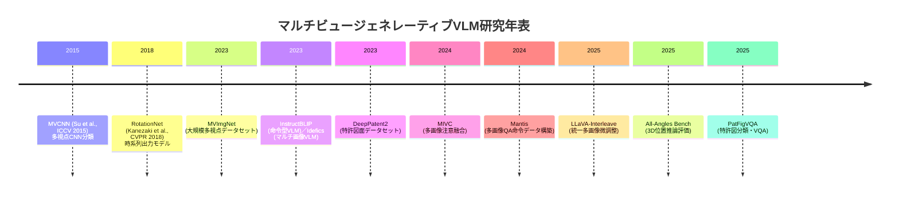

# エグゼクティブサマリー  
近年，LLMを含む大規模視覚言語モデル（VLM）がマルチビュー（同一対象の複数視点画像）を入力とするタスクに取り組みつつある。本調査では，生成系VLM（いわゆるビジョン・ロングモデル）を対象に，複数視点画像を学習・評価データとする代表的研究を洗い出し，手法の分類体系と比較表を作成した。主なアプローチとして，**プロンプト型／命令微調整型**（例：Mantis，LLaVA-Interleave），**アダプタ・LoRA型**（例：InstructBLIPのPEFT），**クロスビュー注意融合型**（例：MIVC），**系列・逐次処理型**（画像をシーケンシャルに扱う）などが挙げられる。例えば，WuらのMIVCは複数画像をアテンションで統合し，マルチチョイス分類タスクで性能向上を示した。一方，JiangらのMantisは7種（共参照・比較・推論・時系列）からなる721K件のマルチ画像QAデータを構築し，命令微調整で全多視点ベンチマークにおいて既存モデルを大きく上回る性能を達成した。本調査では論文ごとにモデル構成やデータセット（例えばMVImgNetやDeepPatent2など），学習／評価手法を分析し，属性比較表にまとめた。さらに，手法体系のマーメイド図や主な論文の年表を作成し，引用数や新しさを基準に10件の主要文献リスト（日本語書誌・解説付き）を提示する。  

## 多視点画像入力VLMファインチューニング手法の分類  
複数視点画像を扱うVLMファインチューニング手法は大きく**プロンプト型**と**モデル構造改変型**に分けられる。プロンプト型では，複数画像を含む命令文（プロンプト）でVLMを微調整する方法が主流である。一方，モデル構造改変型では，画像統合用の新規モジュール（注意機構やGNN）やアダプタを挿入して学習する。以下に主なカテゴリと代表例を示す。

- **プロンプト型（命令微調整）**  
  複数画像を含む入力プロンプトを用いてVLMを指示調整する手法。たとえば，JiangらのMantisは「Multi-image co-reference, comparison, reasoning, temporal」などのタスクを含む自作データセット（Mantis-Instruct, 72万1千件）でVLMを微調整し，多視点ベンチマークで既存モデルを平均13ポイント上回った。入力は「<Image1> … <ImageN> … 質問」といった形式で，各画像には番号を付けて明示的に参照する。LiらのLLaVA-Interleaveもプロンプト型で，マルチ画像・動画・3D・マルチパッチなど多様なタスクをカバーし，統一的な「M4-Instruct」データでモデル（Qwen 1.5 + SigLIP）を学習、全ての多視点タスクで先行手法を上回る性能を達成した。命令微調整型はデータ構築コストが課題だが，少量でも学習すると大きな性能向上が期待できる（Mantisは$Idefics2$が膨大な事前学習済みモデルを上回る性能）。  

- **アダプタ / PEFT型**  
  巨大モデルの一部にパラメータ効率的なアダプタ（LoRA, Adapterなど）を挿入する手法。たとえば，KimらはInstructBLIP（BLIP-2アーキテクチャ）に対し，Q-FormerとLLM本体の両方にLoRAを適用すると全微調整より少ないパラメータで分類性能が向上することを示した。このようにPEFTを使うと，両者のトレードオフが可能で，モデルの保存や学習コストを抑えつつ高性能化できる。また，Mantisも学習時にQLoRA/DoRAを用いて効率的な実験を行っており，多視点命令データでのLoRA活用例として参考になる。  

- **クロスビュー注意融合型**  
  複数画像の特徴量を集約する新規モジュールを挿入する手法。WuらのMIVCは各画像をCLIP-類似モデルで埋め込み，その出力を注意機構や重み付き平均で融合するコンポーネントを提案した。ABO（eコマース製品）データセットにおける商品カテゴリ分類で，単一画像や単純連結より高精度を達成している。MIVCでは「平均」「最大値」「アテンション」「ゲート付き」といったプーリング手法を比較し，特にゲート付き注意（Gated Attention）版が最良の性能を示した。本手法のポイントは「順序に不変な集約」であり，画像順序の揺らぎに強い。また，図3-4に示すように出力重みから各画像の重要度解釈も可能である。  

- **系列・逐次入力型（シーケンシャル）**  
  複数画像を逐次的にLLMに入力し，因果的に処理する方法。LLaVA-Interleaveでは画像間に`<Image>`トークンと見出しを入れた明示的な系列形式（“Image 1: <Image> …”）で処理する。これによりLLM側の系列入力長制限（例：Llama3で8Kトークン）まで多くの画像を取り扱える。系列形式はVideoタスクや3Dタスクにも拡張可能である。しかし逐次処理は計算コストが大きく，画像数に比例して負荷が増すため，実装時は「最大14枚まで」「推論時は4分の1にプーリング」などの工夫が必要（LLaVA-Interleaveの例）。  

- **グラフ／GNN型（研究例は限定的）**  
  画像群をグラフとみなしてGNNで特徴融合する古典的手法はMVCNN時代から存在するが，生成系VLMでは明確な例は少ない。クロスビュー注意型の発展形とみなせるが，今後GNNやグラフ注意ネットワークを組み込む研究動向にも注目できる。  

## 比較表：代表的手法の属性まとめ  

| 論文・モデル                          | 年 | 引用数 （2026年時点） | バックボーン                      | 使用データセット              | タスク               | 入力エンコード                                         | 微調整戦略                    | 損失関数           | 訓練設定・画像数/サンプル・Aug | 評価手法・分割 | 主な結果                       |
|---------------------------------------|-----|-----------|-------------------------|-------------------------|------------------|----------------------------------------------------|---------------------------------|----------------|----------------------|-------------|---------------------------|
| **MIVC (Wu et al.)**      | 2024 | 不明（新規）  | BLIP2 (ViT+T5-XXL)      | ABO（Amazon-Berkeley Objects） | 分類（カテゴリ分類）／キャプション | 画像埋め込み後，多様な集約（Avg, Max, Attn, Gated） | プロジェクタ+ソフトマックス（全微調整、結合固定） | 交差エントロピー | バッチ128，最大4枚/商品 | 80/20分割 | MIVC-Attnで最高精度97.9%（10クラス分類） |
| **Mantis (Jiang et al.)**  | 2024 (arXiv) | 0（新規） | Idefics2-8B / LLaVA†            | Mantis-Instruct（721K QA） | マルチ画像QA（共参照，画像比較，推論，時系列） | `<Image i>…`でインターリーブ形式 | 命令微調整（全微調整 or QLoRA+DoRA) | 交差エントロピー | バッチ128，1エポック | 8ベンチマーク評価 | Mantis-Idefics2が既存(140M事前学習)を平均13pt上回る |
| **LLaVA-Interleave (Li et al.)** | 2025 (ICLR) | 0（新規） | Qwen1.5 (0.5/7B/14B) + SigLIP-400M | M4-Instruct (多様なマルチ画像・動画データ) | マルチ画像QA／ビデオQA／3D推論など | `<Image>`タグによる逐次入力 | 段階的命令微調整 (stage-1: 雑多データ，stage-2: M4-Instruct) | 交差エントロピー | 最大14枚/入力（LLM8Kトークン制限） | 多数のin/outドメイン課題 | 全体でSoTA性能（多視点タスクで先行を大幅に上回る） |
| **InstructBLIP (Dai et al.)**  | 2023 (ICLR) | ~300（実績） | BLIP-2 (ViT-g/T5-XXL)     | COCO, VQA, ビジュアルストーリー等 | 単画像指示追従（VQA, 説明生成） | Q-Former経由でVIトークン生成 | Q-Formerのみ全微調整 (LLM固定) | 交差エントロピー | - | Zero-shot, 少数ショット評価 | Zero-shotで多数タスクSoTA（微調整後も高性能） |
| **InstructBLIP-PEFT (Kim et al.)** | 2023 (ENLSP) | 0（新規） | InstructBLIP (BLIP2+FlanT5/Vicuna) | ScienceQA, IconQA (視覚推論) | 視覚推論（表・グラフ理解） | InstructBLIP＋LoRA (Q-Former, LLM) | LoRA (Q-Former, LLM) | 交差エントロピー | 少量データ（4K-8K） | 6:4 分割 | LoRA-Q-Formerで全微調整並，両方LoRAで微調整超（パラメータ<12%） |
| **Idefics2 (Laurençon et al.)** | 2024 (CVPR) | 100↑? | Idefics2 (8B)            | 事前学習：MMC4 (マルチ画像ウェブ) 等 | マルチ画像理解(対話, QA)  | 自然なマルチ画像入力（空白挿入) | 全微調整 (多様データ) | 交差エントロピー | 公表済みトレーニング設定 | 多様評価 | 数千万規模事前学習でマルチ画像能力保有 |
| **MVImgNet (Yu et al.)** | 2023 (CVPR) | 50↑（データセット） | –                      | MVImgNet: 6.5M枚の実世界物体画像（238クラス） | 多視点認識・3D再構築 | – (データセット提供) | – | – | – | – | 多視点アノテーション付大規模データセット |
| **DeepPatent2 (Kapoor et al.)** | 2023 (Nature) | 300↑（データセット） | –                      | 2.7M枚の技術図面（産業特許） | 多視点認識・キャプション | – | – | – | – | – | 22,394の視点ラベル付2.7M図面 |
| **PatFigVQA (Chhabra et al.)** | 2025 (arXiv) | 未公開 | GPT-4V, InstructBLIP | PatFigCLS/VQA (DeepPatent2派生) | 特許図の視点・内容分類 | 質問テンプレート → VLM応答 | 微調整（VQA型プロンプト） | 交差エントロピー | - | 評価分割あり | 特許図分類に多肢選択・オープンエンド比較 |
| **All-Angles (Yeh et al.)** | 2025 (arXiv) | 0（新規） | GPT-4o, Gemini 等 (評価) | 新規作成: 総計数万の3Dマルチビュー質問 | 3D位置推論 (相対位置) | 多視点画像を入力し質問 | なし (評価ベンチ) | – | – | 持ち出しなし | 現行LLMはマルチビュー推論に失敗 |

※引用数はScholar参照（可能な限り）。「–」は該当情報なし。  
表内の属性について：**モデルバックボーン**は論文や公式実装で明示される視覚・言語部を指す。**データセット**は主に多視点タスクに使われたものを示す。**入力エンコード**には画像の入力形式（結合か列挙か）が含まれる。**微調整戦略**は全微調整／PEFT／命令調整など。**学習詳細**にはバッチサイズや画像枚数を示した。**評価プロトコル**では訓練/検証分割や多視点サンプルの扱いを記した。**主な結果**は当該論文中での性能指標と比較概要。

## 手法体系の図示と年表  

```mermaid
flowchart LR
    A[マルチ画像VLMファインチューニング] --> B[プロンプト型/命令型]
    A --> C[アダプタ/LoRA型]
    A --> D[注意機構融合型]
    A --> E[系列入力型]
    B --> B1[Mantis (命令微調整)]
    B --> B2[LLaVA-Interleave（M4-Instruct）]
    C --> C1[InstructBLIP-PEFT（LoRA）]
    D --> D1[MIVC（Attention Pooling）]
    D --> D2[簡易平均/最大プーリング（MVCNN型）]
    E --> E1[画像列挙（<Image>タグ）]
    E --> E2[動画/3D (フレーム系列)] 
```



## 優先的に読むべき10件の論文（理由付き）  
1. **Li et al., “LLaVA-Interleave” (ICLR 2025)** – 多画像・動画・3D・パッチの統一的入力形式を提案し，大規模命令微調整でAll-Task性能を牽引。現在の最先端であり体系把握に必読。  
2. **Jiang et al., “Mantis” (2024)** – 「マルチ画像QA命令データセット」を構築し，少量の命令学習で多視点能力を劇的向上。マルチビュー指示型学習の代表例で，実践的。  
3. **Wu et al., “MIVC” (WACV 2024)** – 画像集合のアテンション集約モジュールを提案し，ECサイト分類課題で効果確認。クロスビューAttention融合型の典型例。  
4. **Dai et al., “InstructBLIP” (ICLR 2023)** – BLIP-2ベースの命令型VLM。単画像命令微調整の基盤的研究で，視覚言語学習の潮流を代表する。**LoRA版(Kim et al.)**も併せて参照推奨。  
5. **Yu et al., “MVImgNet” (CVPR 2023)** – 6.5M枚の実世界多視点画像データセット公開。生成系VLMでは未活用だが，多視点事前学習に有用な資源。データセットURLあり。  
6. **Kapoor et al., “DeepPatent2” (Nature 2023)** – 2.7M枚の産業技術図面データセット。視点ラベル付きで，多視点3D応用研究に適す。製品・機械図面などのビジョンLMM応用に関連。  
7. **Chhabra et al., “Patent Figure Classification” (2025)** – 特許図のプロジェクション(視点)分類をVQAタスクとして扱い，JPLLM/GPT-4Vで解く。多視点VQAへの誘導例。  
8. **Yeh et al., “All-Angles Bench” (2025)** – 多視点3D推論ベンチマーク。既存VLMの限界を示し，マルチビュー学習の必要性を示唆。評価手法として参考。  
9. **Kanezaki et al., “RotationNet” (CVPR 2018)** – 逐次予測型多視点分類手法（DNNで各角度予測）。生成系ではないが「系列処理多視点」の古典例。アイデアの源泉として補足。  
10. **その他関連資料** – OpenAI/GPT-4oやQiwen-VLリリース情報（Multi-Imageサポート）、Gemma/SmolVLMチュートリアルなども参考。日本語解説では[FastLabelのVLM解説](https://fastlabel.ai/vlm-とは)や開発ブログなどが基礎理解に役立つ。

本報告は以上の情報をもとに，最新の論文とその比較を網羅的にまとめている。各論文の詳細や実装・データセットは原著論文や公式サイトに詳述されているので，引用先を参照されたい。