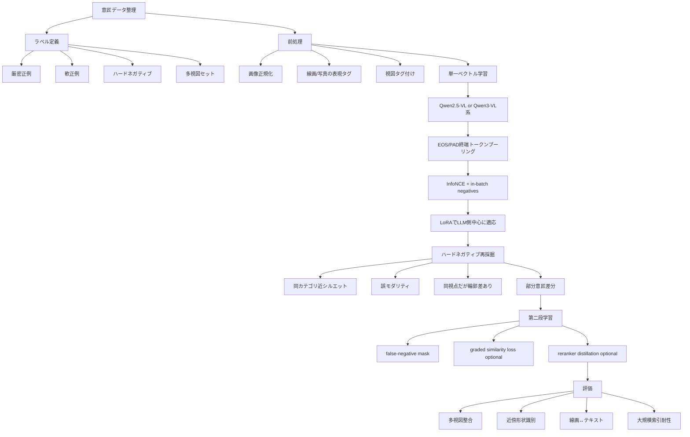
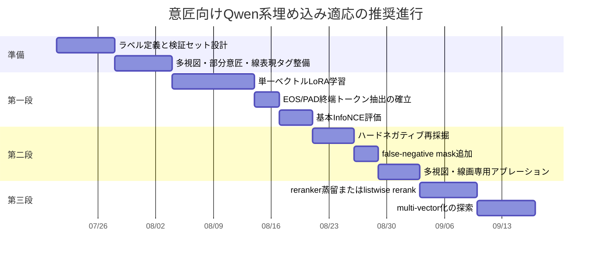

# デコーダー型VLMを用いたマルチモーダル埋め込みのドメイン適応  
## 意匠・形状中心・線画表現を見据えた非CLIP系サーベイ

## エグゼクティブサマリー

本調査の結論を先に述べると、**Qwen-VL系のような強いデコーダー型VLMを埋め込みモデルとしてドメイン特化させるうえで、現在の公開文献が最も強く支持している基本形は、`終端トークン表現 + 対照学習 + LoRA/PEFT` です**。E5-V、VLM2Vec、GME、LamRA、Qwen3-VL-Embeddingはいずれも、生成モデルをそのまま使うのではなく、明示的な埋め込みトークンやEOS/PAD相当の終端位置の最終隠れ状態を埋め込みとして抽出し、InfoNCE系の損失で検索向きの空間へ再整形しています。特にQwen3-VL-Embeddingは、Qwen3-VL上で**マルチステージ対照学習→リランキング蒸留→モデルマージ**という、かなり完成度の高い検索特化レシピを提示しています。citeturn13view1turn14view0turn15view0turn19view3turn24view1turn28view1

一方で、**意匠そのものを対象にした公開事例はかなり少ない**です。2024–2026年の主要な非CLIP系の公開文献で近い証拠が厚いのは、ユニバーサル・マルチモーダル検索、視覚文書検索、複合クエリ検索の系譜です。つまり、意匠向けには「そのまま適用できる既製論文」が豊富にあるというより、**Qwen2-VL/Qwen2.5-VL/Qwen3-VL系の埋め込み化手法を、形状・輪郭・多視点・線画という意匠の性質に合わせて翻訳する**のが現実的です。Qwen2-VLは動的解像度とM-RoPEを持ち、Qwen2.5-VLは図表・レイアウト・文書理解を大きく強化しています。これらは、輪郭や局所形状の差異を拾いたい意匠用途と相性がよい基盤特性です。citeturn34view0turn34view1

PEFTの観点では、公開事例はかなり一貫しており、**まずはVision Encoderを凍結し、LLM側にLoRAを入れ、必要ならprojectorや最終投影層だけ追加学習する**構成が主流です。LamRAはvision sideを固定してLLM側のみLoRAで検索能力を付与し、ColQwen2.5は言語モデル層と最終投影層のみをLoRAで学習し、GMEはLoRA rank 8が最良、VLM2Vec-V2はLoRA rank 16 / alpha 32、Qwen3-VL-Embedding公式実装はrank 32 / alpha 32で`q/k/v + MLP`を対象にしています。**「全体を動かすほどよい」とは公開証拠は言っておらず、むしろLoRAが全学習より強い、または少なくとも安定しやすい**という結果が複数あります。citeturn23view1turn23view2turn27view1turn27view0turn39view3turn25view2turn37view0turn18view0

プーリング戦略については、**mean poolingより、EOS/PAD/明示埋め込みトークンの最終隠れ状態を使う設計に証拠が寄っています**。GMEはmean poolingやbi-attentionよりEOSトークン表現が良いと示し、LamRAは`<emb>`直前の隠れ状態、Qwen3-VL-Embeddingは末尾の`<|endoftext|>`対応状態、VLM2Vec/E5-Vも最後のトークン表現を使っています。したがって、単一ベクトルに落とすなら、**まず終端トークン方式を第一候補**にすべきです。さらに、局所輪郭や微細差分が支配的なタスクでは、ColQwen2系のような**multi-vector late interaction**が単一ベクトルより強い可能性が高く、視覚文書検索ではBiQwen2よりColQwen2が大きく優位でした。これは意匠の“微差識別”にもかなり示唆的です。citeturn27view1turn27view0turn24view0turn13view1turn19view3turn28view0turn25view0turn32view0

損失設計では、**大きなin-batch negatives、明示hard negatives、偽陰性マスキング**が鍵です。VLM2Vecはhard negative不足を大バッチとGradCacheで補い、GMEは1正例+8 hard negatives、Qwen3-VL-EmbeddingはInfoNCEに加えてhard negatives・in-batch negatives・false negative mask・段階別の損失変更・reranker distillationまで入れています。MM-Embedは**modality-aware hard negative mining**で、誤モダリティだが上位に来るサンプルと、同モダリティだが情報が足りないサンプルを分けて掘る設計を提案し、M-BEIRで約5ポイント改善しました。意匠でいえば、これは「同一カテゴリだが輪郭が違う」「同じ輪郭だが装飾が違う」「正面は似るが側面で違う」といったハードネガティブにそのまま対応します。citeturn19view2turn27view0turn15view0turn31view0turn31view1

実装優先度としては、**最初から派手な拡張を入れるより、Qwen2.5-VLまたはQwen3-VL系を土台に、単一ベクトルのLoRA対照学習をまず完成させ、その後にhard-negative強化、最後に必要ならreranker蒸留やmulti-vector化へ進む**のが最も堅いです。意匠は形状・輪郭・線画・多視点が重要なので、評価も一般的なimage-text retrievalだけでは足りず、**同一意匠の多視点整合、輪郭近傍の判別、部分意匠の識別、線画↔説明文の対応**を独立に測る検証セットが必要です。JPOやWIPOのガイドは、意匠表現が六面図、破線、陰影、ハッチング、部分意匠記法に強く依存することを明確にしており、これをそのまま評価設計へ落とし込むべきです。citeturn35view0turn35view1turn36view5

## 文献地図と問題設定

今回の主題は、**CLIP系ではなく、Qwen-VL/Qwen2-VL/Qwen2.5-VL/Qwen3-VLやLLaVA、Phi-3.5Vのようなデコーダー型VLMを、マルチモーダルembeddingモデルとしてドメイン適応させる事後学習**です。公開文献の中心は、生成VLMをそのまま使うのではなく、検索用に埋め込み抽出位置と損失を設計し直す方向にあります。特に2024年以降は、VLM2Vec、E5-V、GME、LamRA、MM-Embed、Qwen3-VL-Embeddingがこの流れを代表しています。citeturn17search2turn10view2turn10view1turn22view0turn30view0turn12view0

また、意匠寄りの公開文献は少ない一方、**視覚文書検索**はかなり近い参照領域です。理由は、文書画像がOCR文字列だけでは落ちるレイアウト・図・表・視覚構成を保持したまま検索したい点で、**輪郭・局所配置・図示表現が効く**という意味で、形状中心の意匠に近い性質を持つからです。ColQwen2系やColQwen2.5はQwen2-VL/Qwen2.5-VLをベースにmulti-vector late interactionを採り、視覚文書検索に強い結果を示しています。citeturn25view0turn25view1turn25view2turn32view0

さらに、意匠表現の性質そのものを確認すると、JPOの意匠図面ガイドは**形状特定のための図面、参考図、透明部、部分意匠、建築物、画像意匠**などを区別しており、WIPOのガイダンスは**六方向の視図、破線による不請求部分、陰影・ハッチング・線による輪郭表現、表現形式の混在制限**を明示しています。つまり意匠データは、自然画像よりも「何が形状本体で、何が補助記法か」が重要で、単純な画像類似では不十分です。citeturn35view0turn35view1turn36view5

以下の表は、今回の主対象である**非CLIP系・デコーダー型VLMベースの埋め込み化／検索特化事後学習**を、重要度順に整理したものです。

| 手法 | 年 | バックボーン | 主目的 | データ/領域 | PEFT/学習対象 | 埋め込み抽出 | 損失/ネガティブ | 主な結果 |
|---|---:|---|---|---|---|---|---|---|
| **Qwen3-VL-Embedding** citeturn12view0turn37view0 | 2026 | Qwen3-VL 2B/8B | 汎用マルチモーダル検索 | text / image / visdoc / video | LoRA、公式repoでは`q/k/v + up/down/gate`、rank 32, alpha 32 citeturn37view0 | 末尾`<|endoftext|>`対応の最終隠れ状態 citeturn13view1 | multi-stage InfoNCE、hard negatives、false-negative mask、CoSent、reranker蒸留、MRL、QAT citeturn14view0turn15view0 | MMEB-v2全体77.8、open-source首位級 citeturn16view0 |
| **GME** citeturn10view1turn26view0 | 2025 | Qwen2-VL 2B/7B | Universal multimodal retrieval | text / image / image-text | LoRA rank 8、lr 1e-4、wd 1e-4 citeturn10view1turn27view0 | EOS/last token hidden state citeturn27view0 | contrastive、1正例+8 hard negatives、instruction付き、meanよりEOSが良い citeturn27view0turn27view1 | UMRB 64.45 / 67.44、Qwen2-VL系の有力基準 citeturn26view0 |
| **VLM2Vec** citeturn17search2turn17search3 | 2025 | Phi-3.5-V / LLaVA-1.6 / 後にQwen2-VL variants公開 citeturn17search3 | VLMの埋め込み化 | MMEB 36 datasets | LoRA rank 8が全学習より良い場合あり citeturn18view0turn19view5 | last token | InfoNCE、GradCache、大バッチ1,024、temp 0.02、hard negatives不足は大バッチで補完 citeturn19view2turn19view3 | LLaVA-1.6高解像度版でMMEB全体62.9、OOD 57.1 citeturn19view5 |
| **VLM2Vec-V2** citeturn20view0turn39view1 | 2025 | Qwen2-VL-2B | image / video / visdoc統合 | MMEB-V2 78 tasks | LoRA rank 16, alpha 32、PEFT citeturn20view1turn39view3 | last token citeturn36view4 | InfoNCE、GradCache、interleaved sub-batch 64、temp 0.02 citeturn20view1turn36view4 | MMEB-V2全体58.0、同バックボーン系ベースライン超え citeturn39view1 |
| **LamRA** citeturn22view0turn21search10 | 2025 | Qwen2-VL-7B/2B | 汎用retrieval + rerank | M-BEIR各種検索 | vision side固定、LLM側LoRA citeturn23view1turn23view2 | `<emb>`直前の隠れ状態 citeturn24view0 | Stage I text-only pretrain + Stage II instruction tuning、InfoNCE、top-100 hard negativesでpointwise/listwise rerank citeturn24view1turn24view2 | Qwen2-VL-7B zero-shot 23.0 → LamRA-Ret/Rankで大幅改善、7B rerank平均63.7 citeturn23view5 |
| **MM-Embed** citeturn30view0 | 2025 | LLaVA-NeXT | Universal multimodal retrieval | M-BEIR + text retrieval | projector + LLM LoRA (r=8, α=64)、vision encoderは固定寄り citeturn31view2turn31view3 | bi-encoder retrieval | modality-aware hard negative mining、continuous fine-tuning citeturn31view0turn31view1 | M-BEIRでSOTA、hard-negative設計で約5pt改善 citeturn30view0turn31view0 |
| **E5-V** citeturn10view2 | 2024 | LLaVA-NeXT-8B | MLLMをテキスト訓練のみで埋め込み化 | NLI text pairs → multimodal transfer | QLoRAでLLM部のみ、training時にvision encoder/projector除去 citeturn28view1turn28view3 | prompt付きlast token citeturn28view0turn28view5 | text-only contrastive learning | image-text / composed retrievalで強いzero-shot転移 citeturn28view5 |
| **ColQwen2 / ColQwen2.5** citeturn25view0turn25view2 | 2025 | Qwen2-VL-2B / Qwen2.5-VL-3B | 視覚文書検索特化 | query-page pairs 127,460 | LoRA r=32, alpha=32をLM層 + 最終投影層に適用 citeturn25view2 | single-vectorではなくmulti-vector late interaction citeturn25view0 | ColBERT-style late interaction | 視覚文書で強く、BiQwen2より大幅高性能 citeturn32view0turn25view2 |

この比較から見えるのは、**Qwen系で本格的に「埋め込みモデルとして完成」しているのはQwen3-VL-Embedding**ですが、**Qwen2-VL/Qwen2.5-VLでも十分に強い事後学習レシピはすでに揃っている**ということです。とくに手元に意匠データがあるなら、GME・VLM2Vec-V2・LamRA・ColQwen2.5のレシピ断片を組み合わせるのが、現時点で最も実践的です。citeturn12view0turn10view1turn20view1turn22view0turn25view2

## デコーダー型VLMを埋め込み化する事後学習機構

デコーダー型VLMをembedding backboneとして使うときの第一の問題は、**元の学習目的が次トークン予測であり、検索空間の幾何を直接最適化していない**ことです。この問題意識はLamRAでも明示されており、Qwen2-VL-7Bをそのままretrievalに使うと性能が低く、retrieval向けのLoRA事後学習が必要だと述べています。GMEも同様に、事前学習済みMLLMは強い理解能力を持つが、そのままでは表現学習に最適化されていないのでtask-specific fine-tuningが必要だとしています。citeturn24view0turn27view0

この問題に対して、文献は大きく三つの流儀に分かれます。第一は、**終端トークン一本に埋め込みを集約し、その位置を対照学習で鍛える**流儀で、VLM2Vec、GME、LamRA、Qwen3-VL-Embeddingがこれに属します。第二は、**promptで“埋め込みとして振る舞う位置”を誘導する**流儀で、E5-VやLamRAが典型です。第三は、**single-vectorではなくmulti-vector late interactionに切り替える**流儀で、ColQwen2/2.5が代表です。前二者は大規模ANN検索に向き、後者は局所対応に強い代わりにインデックスと照合コストが増えます。citeturn19view3turn27view0turn24view0turn13view1turn25view0turn32view0

Qwen系を土台にする合理性も明確です。Qwen2-VLは**Naive Dynamic Resolution**で画像を可変個のvisual tokensへ落とし込み、**M-RoPE**でテキスト・画像・動画の位置情報を統合します。Qwen2.5-VLはさらに、**図表・レイアウト・文書解析・長時間動画理解**を強化し、diagram/document理解にとくに強いと報告しています。形状と線図に寄った意匠データでは、画素の自然画像統計よりも**輪郭、レイアウト、部品配置、投影図の整合**が効くため、この種の強い視覚-言語統合は有利に働く可能性が高いです。これは厳密には意匠特化そのものの実験ではなく、**文書・図表・可変解像度理解の強さから導かれる高い妥当性を持つ推論**です。citeturn34view0turn34view1

最近の最も完成度の高い設計はQwen3-VL-Embeddingです。ここでは、**system messageにinstruction、user messageにinstance、末尾に`<|endoftext|>`を追加し、その最終隠れ状態をdense vectorとする**テンプレートが公式に採られています。学習は、**Stage 1の大規模contrastive pre-training、Stage 2の多タスクcontrastive学習とretrieval-focused supervised fine-tuning、Stage 3のreranker蒸留とmodel merging**から成り、さらにMRLとQATまで統合されています。これは、単なる“VLMにInfoNCEを当てるだけ”よりかなり高度で、**強い生成VLMの能力を残しながら検索幾何を整える最新形**と見てよいです。citeturn13view1turn36view2turn14view0turn15view0

E5-Vはやや異質で、**画像を含む学習をしなくても、promptによりmultimodal inputを同じ言語空間へ寄せられる**と主張します。実際、E5-Vは訓練時にmodality encoderとprojectorを除去し、NLIテキスト対だけでLLM部をQLoRA微調整しつつ、prompt付きlast token表現を学習します。これはデータ節約には非常に有利ですが、ユーザの状況は「手元に意匠画像ペアがある」なので、E5-Vの思想は参考になる一方、**画像側を一切更新しない方針をそのまま採る必要はありません**。むしろ、この思想は「promptによる空間整列」と「軽量適応」のヒントとして読むのが適切です。citeturn28view1turn28view3turn28view5

## PEFTとプーリングの設計

PEFT設定について、公開文献から読み取れるもっとも重要な傾向は、**Vision Encoderを最初から大きく動かす事例は少なく、LLM側LoRAとprojector/ヘッドの調整が中心**だという点です。LamRAは全実験でvision sideを固定し、LLM側のみLoRAでretrieval/rerank能力を付与しています。MM-EmbedでもLLaVA-NeXT系で**vision-language projectorとLLM LoRA**だけを動かしています。ColQwen2.5は**LM transformer layersとfinal randomly initialized projection layer**をLoRAで学習しています。これは、基盤VLMの一般能力を崩しにくい構成として読むべきです。citeturn23view1turn31view2turn31view3turn25view2

以下に、実務で参照しやすいよう、公開実装・論文に現れるPEFT設定を整理します。

| 手法 | どこを学習するか | Rank / Alpha | 学習率など | 実務的な含意 |
|---|---|---|---|---|
| **GME** citeturn27view0turn27view1 | Qwen2-VL上のLoRA、fullよりLoRA優勢 | rank 8 | lr 1e-4、wd 1e-4、temp 0.03、8 hard negatives | **少なめrankで堅い**。まずの第一候補。 |
| **VLM2Vec** citeturn19view3turn18view0 | LoRA or full、LoRAがしばしば優位 | rank 8 | batch 1,024、temp 0.02、2K steps、GradCache | batchが効く。**大バッチのほうがrank微調整より重要**。 |
| **VLM2Vec-V2** citeturn20view1turn39view3 | Qwen2-VL-2BにPEFT | rank 16 / alpha 32 | batch 1,024、interleaved sub-batch 64、temp 0.02 | モダリティ混在で**中間rankが安定**。 |
| **LamRA** citeturn23view1turn23view2 | vision固定、LLMのみLoRA | 論文本文にrank明示なし | pretrain lr 4e-4、IT lr 1e-4、rerank lr 2e-5 | 基盤能力維持を優先するなら**vision固定**が有力。 |
| **ColQwen2.5** citeturn25view2 | LM層 + 最終投影層 | rank 32 / alpha 32 | lr 5e-5、warmup 2.5%、paged_adamw_8bit | 細粒度検索では**最終projection層を明示的に持つ**価値が高い。 |
| **Qwen3-VL-Embedding公式** citeturn37view0 | `q_proj,k_proj,v_proj,up_proj,down_proj,gate_proj` | rank 32 / alpha 32 | repo公開、multi-stage前提 | 2026年時点のQwen公式“標準形”。 |

これを意匠用途へ翻訳すると、**初期フェーズでは「LLM側LoRAのみ」または「LLM側LoRA + projector/最終projection層」までに留める**のがよいです。理由は三つあります。第一に、公開事例の成功例がほぼこの帯域に集中していること。第二に、意匠データは自然画像よりもアノテーション粒度が高く、データ量が相対的に少ないことが多く、vision encoder全層を動かすと壊れやすいこと。第三に、Qwen2.5-VL/Qwen3-VLは元から文書・diagram・complex layoutへの認識が強く、**低ランク側の適応でもかなり伸びる余地がある**ことです。citeturn23view1turn25view2turn34view1turn37view0

逆に、**vision encoderの部分解凍を検討すべき条件**もあります。それは、手元データが線画・CAD風・投影図中心で、自然画像分布からかなり離れており、かつ十分なラベル数がある場合です。ただし、これを直接支持するQwen系公開レシピはまだ薄いので、優先度は高くありません。公開事例が強く支持するのは、まずLoRAでLLM側を整え、必要ならprojector/最終投影層を足し、その後にまだ輪郭差分が拾えない場合だけvision側の後段ブロックを小さく開ける、という順序です。これは**文献に基づく推奨順序**ですが、最後のvision側部分解凍そのものは、現時点では探索的アブレーションに位置づけるのが妥当です。citeturn23view1turn25view2turn27view1turn37view0

プーリングについては、証拠はかなり明確です。GMEは**EOS token state**を埋め込みに使い、ablationで**mean poolingとbi-attentionが悪化**すると示しました。VLM2Vecはlast token、LamRAは`<emb>`直前、Qwen3-VL-Embeddingは末尾PAD/`<|endoftext|>`対応状態、E5-Vもprompt付きlast tokenです。つまり、**decoder VLMをsingle-vector embeddingにする限り、第一選択は終端トークン抽出**です。citeturn27view1turn19view3turn24view0turn13view1turn28view0

この傾向は、decoder型の因果注意とも整合的です。GMEが**causal attention + EOS token state**を採り、bi-attentionが不利だったことは、「埋め込みタスクのためにBERT的な再構成へ寄せる」より、「生成VLMの自然な情報集約位置をそのまま鍛える」方が安定しやすいことを示しています。したがって、Qwen2-VL系で新規にattention pooling層を足す案は、完全に否定はできませんが、**文献上の優先度はEOS/PAD方式より低い**と見るのが妥当です。citeturn27view1

ただし、意匠のように**局所輪郭の違いが検索成否を左右しやすい領域**では、single-vectorだけが正解ではありません。ColQwen/ColQwen2.5系のmulti-vector late interactionは、視覚文書検索で単一ベクトルのBiQwen2を大きく上回り、再現研究でもColQwen2がBiQwen2に対して約25.2 nDCG@5高いと報告されています。局所パッチとクエリトークンの相互作用を残すこの方式は、**部品輪郭・ハンドル形状・開口部・装飾線などの微差を見たい意匠検索**にかなり相性がよいはずです。もし「一発のANNで大規模検索」が最優先ならsingle-vector、「微差識別」が最優先ならmulti-vector、という二段構えが最も合理的です。citeturn25view0turn25view2turn32view0

## 損失設計とハードネガティブ

損失設計の主流はInfoNCE系ですが、細部はかなり重要です。VLM2Vecは標準的なInfoNCEをlast token表現に適用し、**hard negativeが足りないならbatch sizeを増やせ**と強く示しています。実際、同論文ではGradCacheで大バッチを実現し、バッチサイズ・sub-image crops・学習ステップが性能に効くと報告しています。GMEもcosine similarityベースのcontrastive learningを採り、**1正例+8 hard negatives**を各queryに付与しています。citeturn19view3turn18view0turn27view0

Qwen3-VL-Embeddingは、現時点で最も洗練されたloss設計を公開しています。Stage 1では、positive pairに加えて、**K個のhard negatives、in-batchの他query、他document、query-documentのクロス項**まで含んだInfoNCEを使います。さらに、**候補の類似度が正例より0.1以上高い場合はfalse negativeの可能性があるとしてマスク**し、高品質データでのStage 2ではquery-queryとdocument-document項を落とすなど、段階別にlossを変えています。これは「擬似近傍が多い」意匠・工業製品ドメインにとても相性がよく、**近いが別物、あるいはラベル漏れの近傍**が多いコーパスにそのまま応用できます。citeturn14view2turn14view3turn15view0

また、すべてをInfoNCE一発で済ませる必要はありません。Qwen3-VL-Embeddingは、STS型の連続類似度には**CoSent**を使い、最終段では強いrerankerのソフトスコア分布を**distillation loss**でembedding側へ移しています。これは、意匠用途で「完全一致 / 非一致」だけでなく、「かなり近い / 観察者によっては近い / 明確に違う」といった段階的ラベルを持てるなら、有効な設計です。たとえば、同一意匠の別視図を1.0、同一製品ファミリの近縁バリエーションを0.6、同カテゴリだが輪郭差が大きいものを0.2のように置き、二値検索損失の上にCoSent系を重ねる余地があります。最後の数値化そのものは提案ですが、**段階ラベルにranking-lossを使う発想自体はQwen3の設計と整合**しています。citeturn14view3turn15view0

ハードネガティブは、今回の主題では特に重要です。MM-Embedは、MLLM retrieverが**モダリティ・バイアス**を持ち、たとえば「画像を探せ」と言われてもテキスト文書を上位に持ってきてしまうことがあると指摘し、**modality-aware hard negative mining**を導入しました。そこで使うネガティブは二種類で、ひとつは**誤モダリティなのに上位に来てしまう候補**、もうひとつは**同モダリティだが情報的に不十分な候補**です。意匠版に翻訳すれば、これは「線画クエリに対して写真やCGが上位に来る」「正面図は似るが側面形状が違う」「大枠は似るが装飾線が違う」といった失敗例に対応します。citeturn31view0turn31view1

LamRAのhard-negative設計も参考になります。LamRAは、まずretrieverでtop-100を集め、それをrerankerのhard negativesに使い、pointwiseではYES/NO、listwiseでは2–5個の負例と正例の位置当てを同時に学習します。これはANNの第一段で取りこぼしが少ないことが前提ですが、**意匠ペアデータがあるなら、第一段はsingle-vector、第二段はlistwise rerankで微差識別**という構成にそのまま落とし込めます。citeturn24view2

実務向けにまとめると、損失設計は次の順に優先するとよいです。

| 優先度 | 設計 | 推奨理由 |
|---|---|---|
| 高 | **InfoNCE + in-batch negatives + cosine similarity** | ほぼ全ての主要手法の共通核。まず外せない。citeturn19view3turn24view1turn15view0 |
| 高 | **明示hard negatives** | GME, Qwen3, MM-Embed, LamRAが全て有効性を示す。形状微差には必須。citeturn27view0turn15view0turn31view1turn24view2 |
| 高 | **大バッチ or GradCache** | VLM2Vec/VLM2Vec-V2で効果が強い。小規模学習時の不足を補う。citeturn19view2turn39view1 |
| 中 | **false-negative mask** | 近傍別物が多いドメインで有効。Qwen3が直接採用。citeturn14view2turn15view0 |
| 中 | **graded similarity用 ranking loss** | 類似度ラベルが連続的ならCoSent系が有効。citeturn14view3turn15view0 |
| 中 | **reranker distillation** | 第一段想起を維持しつつ微差判別を移植できる。citeturn15view0turn24view2 |
| 低〜中 | **memory bank** | 一般IRではあり得るが、今回の非CLIP・decoder VLM主要文献では主流ではない。むしろ大バッチ + mined negativesが中心。citeturn19view2turn27view0turn31view1 |

## 意匠・形状・線画ドメインへの翻訳

意匠ドメインに落とし込むとき、最初に重要なのは**何を“同じ”とラベル付けするか**です。JPO/WIPOのガイドラインを見ると、意匠表現では**六方向の視図、破線で示す不請求部分、陰影・ハッチングで示す輪郭、視図省略時の説明**が意味を持ちます。したがって、学習ペアの設計で「同じ製品か」「同じ意匠権範囲か」「同じ形状骨格か」を区別しないと、埋め込み空間がすぐ曖昧になります。citeturn35view1turn35view0turn36view5

意匠らしいデータ構成として、公開文献を踏まえて有効そうなのは次の四層です。第一に、**厳密正例**として同一意匠の別視図、同一意匠の図面と説明文、同一意匠の線画表現差分を置くこと。第二に、**軟正例**として同一製品ファミリ内の軽微差分を置くこと。第三に、**ハードネガティブ**として同一カテゴリ・同一視点・近いシルエットだが、輪郭や部分意匠範囲が違うものを置くこと。第四に、**クロス表現ネガティブ**として、写真・CG・線画の表現差は似ていても、実体形状が異なるものを混ぜることです。特にWIPOのガイドが破線・輪郭線・陰影の意味差を厳密に扱っている以上、装飾線や不請求部分を無視したラベル作りは危険です。citeturn35view1turn36view5

このとき、**single-vectorとmulti-vectorをどう使い分けるか**が重要になります。もし検索対象が非常に大規模で、まず全候補から高速に想起したいなら、Qwen2.5-VLやQwen3-VLのsingle-vector埋め込みが適しています。反対に、ハンドル先端の曲率、パネルの切れ込み、スリット本数、部品境界のわずかなズレのような**局所幾何**が勝負なら、ColQwen2.5風のmulti-vector late interactionの方が期待値は高いです。視覚文書検索の再現研究で、single-vectorのBiQwen2よりColQwen2が大きく優位だったのは、この“局所相互作用を消さない”ことの恩恵と解釈できます。citeturn32view0turn25view0turn25view2

意匠ドメインでは、**多視点整合**も一般画像検索より重要です。JPOやWIPOの記述通り、正面・背面・左右・上下面、あるいは省略視図の整合が形状特定の基礎なので、学習時にも評価時にも、**front-only retrievalではなく、multi-view consistencyを測る**べきです。具体的には、正面図クエリで同一意匠の側面図集合まで近傍に引き寄せられるか、あるいは別視図を束ねたfused-modal queryで同一意匠を取れるかを見るべきです。これはVLM2Vec-V2やGMEが**instruction-conditionedなmultimodal query-target形式**を扱うこととも相性がよいです。citeturn35view1turn20view1turn10view1

また、形状中心ドメインでは**モダリティ・バイアス**が一般より見えやすくなります。たとえば、線画クエリに対して線の密度や文字注記ばかり拾い、形状差を無視する失敗が起きやすいです。ここでMM-Embedの**modality-aware hard negative mining**は、そのまま「表現形式は合っているが形状が違う」と「形状は近いが表現形式が違う」を切り分ける設計として使えます。さらにQwen3のfalse-negative maskingを組み合わせると、近縁デザインを誤陰性として強く押し離しすぎる事故を避けやすくなります。citeturn31view1turn15view0

意匠向けの検証セットは、一般ベンチマークの流用では足りません。ユーザが既に画像-画像・画像-テキストのラベルを持っている前提なら、最低でも以下の切り口を分けるべきです。

| 検証切り口 | 何を測るか | 推奨指標 | 根拠 |
|---|---|---|---|
| 同一意匠多視図 | 正面/側面/斜視で同一性が保てるか | Recall@K, nDCG@K | 意匠は多視図で形状を特定するため。citeturn35view1turn35view0 |
| 線画↔説明文 | 抽象・輪郭中心の説明と対応できるか | image-to-text / text-to-image Recall@K | Qwen系はinstruction-aware bi-encoderに向く。citeturn13view1turn10view1 |
| 近傍形状識別 | 同カテゴリ・近シルエットの誤検索を防げるか | hard-negative Recall@K, MRR | hard negativesが文献上の主要改善因子。citeturn27view0turn31view1 |
| 部分意匠感度 | 破線や不請求部分を区別できるか | binary AP / pairwise accuracy | 破線・部分意匠は法的意味を持つ。citeturn35view1turn36view5 |
| 線表現頑健性 | ハッチング・陰影・注記有無に頑健か | robustness split | WIPOは陰影・輪郭線の扱いを厳密に定義。citeturn35view1turn36view5 |
| 大規模索引耐性 | コーパス増大で性能が落ちすぎないか | nDCG@5 at scale, latency | visual retrievalはindex size増大で挙動が変わる。citeturn32view0 |

## 実装ロードマップと評価設計

実装優先度は、**Qwen2.5-VLまたはQwen3-VL系を単一ベクトルretrieverとしてまず仕上げ、その後にhard-negative強化、最後にrerankerまたはmulti-vectorへ進む**順番がよいです。Qwen2.5-VLはdiagram/document理解が強く、Qwen3-VL-Embeddingは公式のretrieval特化設計があるため、どちらを基盤にしても筋は良いです。もし今すぐ再現性を優先するならQwen2.5-VL + LoRA自作、時間を短縮したいならQwen3-VL-Embeddingを基底として追加LoRA、という分岐が現実的です。citeturn34view1turn12view0turn37view0

公開事例の計算規模を見ると、VLM2Vec/VLM2Vec-V2/GME/LamRA/ColQwen2.5の多くが**8枚以上のA100/H100級**で報告されています。したがって、計算予算が未指定の現状では、**公開レシピの“忠実再現”はかなり重め**と見ておくべきです。ただし、学ぶべき本質はGPU枚数そのものではなく、**LoRAで可訓練パラメータを絞り、大バッチをGradCacheやgradient accumulationで確保し、hard negativeを丁寧に掘る**ことです。E5-VのQLoRA、VLM2VecのGradCache、ColQwen2.5の8bit optimizerはいずれも、この方向を補強しています。citeturn28view3turn19view2turn39view1turn25view2

まずは、次のパイプラインが最も妥当です。

フェーズごとの優先順位は、以下のように置くのが堅いです。

実務で最初に回すべきアブレーションは、実はかなり限られています。闇雲に増やすより、以下の順序がよいです。  
第一に、**pooling**は`EOS/PAD終端`対`mean pooling`だけで十分です。GMEの時点でmeanは不利です。第二に、**LoRA rank**は`8 / 16 / 32`の三点でよく、GME・VLM2Vec-V2・Qwen3公式の帯域に収まります。第三に、**学習対象**は`LLM-only`対`LLM + projector/projection head`です。第四に、**ネガティブ設計**は`in-batch only`対`+ mined hard negatives`対`+ false-negative mask`です。第五に、単一ベクトルで頭打ちなら、はじめて**single-vector対multi-vector**を比較します。citeturn27view1turn18view0turn39view3turn37view0turn31view1turn32view0

とくに重要なのは、**データ量が限られるならrankを上げるよりhard negativeを良くする**ことです。VLM2Vecは大バッチの重要性を示し、MM-Embedはネガティブの質で約5ポイント改善し、GMEやQwen3もhard negativesを学習の中核に置いています。意匠は同カテゴリ近縁個体が多いので、一般画像検索以上にここが効きます。少数GPU環境であっても、LoRA rankを過度に増やすより、**近傍候補の再採掘パイプライン**に時間を使う方が、経験的にも文献的にも期待値が高いです。citeturn19view2turn31view0turn27view0turn15view0

最後に、あなたの用途に最も近い**推奨レシピ**を、あえて一つに絞るなら次の形になります。  
**土台**はQwen2.5-VLまたはQwen3-VL系。  
**埋め込み抽出**はEOS/PAD終端トークン。  
**PEFT**はLLM側LoRAから開始し、必要に応じてprojector/最終projection層を追加。  
**損失**はInfoNCE + cosine + in-batch negatives。  
**第二段**でmined hard negativesとfalse-negative maskを追加。  
**評価**は多視図整合と近傍形状識別を中心に置く。  
**微差識別が不足**したら、LamRA的reranker蒸留か、ColQwen型multi-vector化へ進む。  
この順序は、公開文献の再現性・拡張性・意匠への適合性のバランスが最も良いです。citeturn34view1turn12view0turn13view1turn23view1turn27view0turn15view0turn24view2turn25view2turn32view0

## 参考になる実装上の判断基準

実際に採用すべき構成を、判断しやすいように最後に短く整理します。**単一ベクトルの第一候補は、Qwen2.5-VL/Qwen3-VL系 + EOS/PAD終端 + LoRA + InfoNCE**です。これは、Qwen3-VL-Embeddingの公式設計、GMEのablation、VLM2Vec系の学習レシピと最も整合しています。citeturn13view1turn27view1turn39view1turn37view0

**基盤能力維持を最優先**するなら、vision encoderは固定し、LLM側LoRAだけで始めるべきです。LamRAがまさにこの構成で、ColQwen2.5もLM層と最終projection層だけにLoRAを入れています。**線画ドメインへのズレが強く、しかもデータが多い**と判断できたときだけ、projectorやvision後段の探索に進むのが順当です。citeturn23view1turn25view2

**ハードネガティブをどう作るか**は、性能の本丸です。意匠では、「同カテゴリ近シルエット」「同一視点で部分差分」「別視図では違いが出る」「破線の意味が違う」「線画とCGで表現が違うが形状は近い」といったケースを重点的に入れるべきです。これはMM-Embedのmodality-aware設計、Qwen3のfalse-negative handling、WIPO/JPOの表現規則を合わせて導かれる設計です。citeturn31view1turn15view0turn35view1turn35view0

**single-vectorで足りないかどうかの見極め**は、近傍誤りの中身で判断すべきです。もし誤りが「カテゴリがずれる」「説明文が合わない」ならsingle-vectorの改善余地がまだあります。逆に「同じカテゴリ・同じ視点・ほぼ同じ輪郭まで来ているが微差で負ける」なら、ColQwen型のmulti-vectorやLamRA型のrerank段が必要です。視覚文書検索の文献では、この局所相互作用の有無が大きな差になっています。citeturn32view0turn24view2

総じて、**いま意匠向けに最も実用的なのは、Qwen系デコーダーVLMを“生成モデルから検索モデルへ穏やかに曲げる”事後学習**であって、まったく別の埋め込み器へ乗り換えることではありません。公開文献は、そのための部品をすでにかなり揃えています。あとは、意匠固有のラベル設計とハードネガティブ設計を丁寧に行うことが、最終性能を決めます。citeturn12view0turn10view1turn20view1turn22view0turn25view2turn35view1