# 同一タイトル文字列・別Locarno分類の画像比較

## title = "container"（25分類にまたがる、計2876件）

**Locarno 01-23** — Foodstuffs  
ID: D0960319  
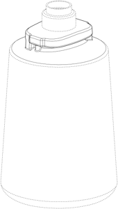

**Locarno 02-27** — Articles of clothing and haberdashery  
ID: D0947446  
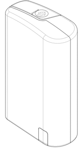

**Locarno 03-01** — Travel goods, cases, parasols and personal belongings, not elsewhere specified  
ID: D0541529  
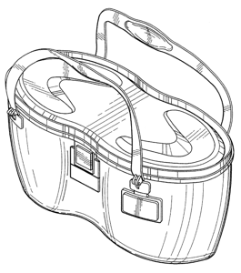

**Locarno 04-99** — Brushware  
ID: D0580179  
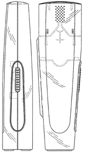

**Locarno 06-01** — Furnishing  
ID: D0577928  
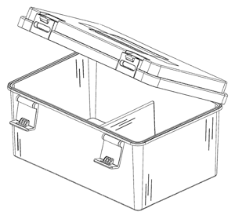

**Locarno 07-01** — Household goods, not elsewhere specified  
ID: D0536930  
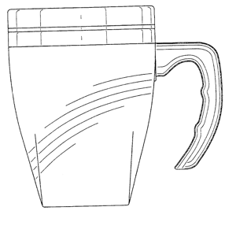

**Locarno 08-05** — Tools and hardware  
ID: D0702111  
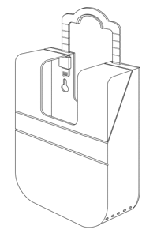

**Locarno 09-01** — Packaging and containers for the transport or handling of goods  
ID: D0539655  
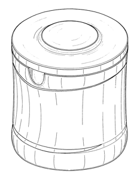

**Locarno 11-02** — Articles of adornment  
ID: D0547689  
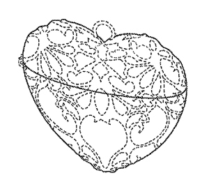

**Locarno 12-05** — Means of transport or hoisting  
ID: D0546023  
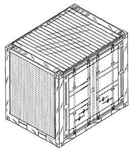

## title = "handle"（18分類にまたがる、計490件）

**Locarno 01-23** — Foodstuffs  
ID: D0940279  
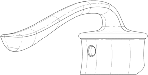

**Locarno 02-24** — Articles of clothing and haberdashery  
ID: D0951447  
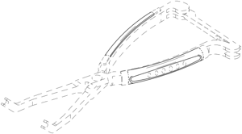

**Locarno 03-01** — Travel goods, cases, parasols and personal belongings, not elsewhere specified  
ID: D0609474  
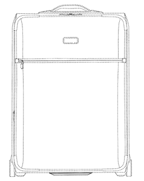

**Locarno 04-01** — Brushware  
ID: D0547554  
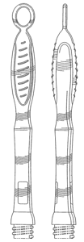

**Locarno 06-06** — Furnishing  
ID: D0594679  
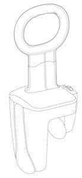

**Locarno 07-02** — Household goods, not elsewhere specified  
ID: D0538589  
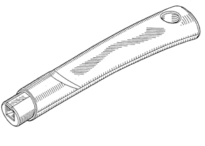

**Locarno 08-04** — Tools and hardware  
ID: D0550057  
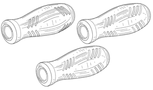

**Locarno 09-07** — Packaging and containers for the transport or handling of goods  
ID: D0536247  
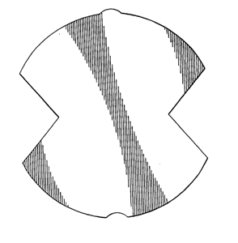

**Locarno 12-06** — Means of transport or hoisting  
ID: D0542213  
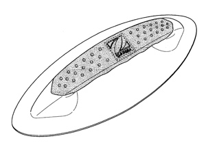

**Locarno 14-02** — Recording, telecommunication or data processing equipment  
ID: D0604303  
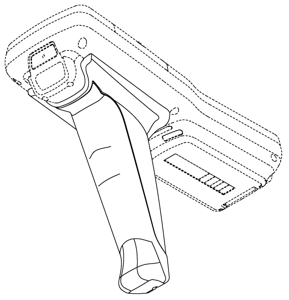

## title = "clip"（14分類にまたがる、計193件）

**Locarno 01-01** — Foodstuffs  
ID: D0778766  
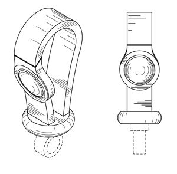

**Locarno 02-07** — Articles of clothing and haberdashery  
ID: D0640917  
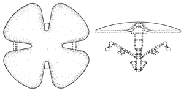

**Locarno 03-01** — Travel goods, cases, parasols and personal belongings, not elsewhere specified  
ID: D0606739  
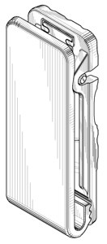

**Locarno 06-10** — Furnishing  
ID: D0637854  
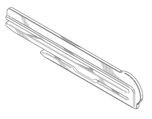

**Locarno 07-07** — Household goods, not elsewhere specified  
ID: D0643984  
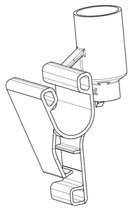

**Locarno 08-08** — Tools and hardware  
ID: D0553969  
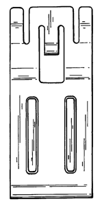

**Locarno 09-06** — Packaging and containers for the transport or handling of goods  
ID: D0803031  
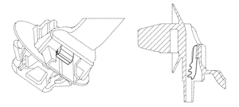

**Locarno 10-06** — Clocks and watches and other measuring instruments, checking and signalling instruments  
ID: D0754791  
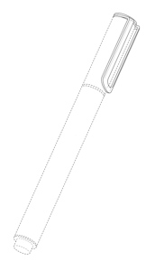

**Locarno 14-03** — Recording, telecommunication or data processing equipment  
ID: D0660690  
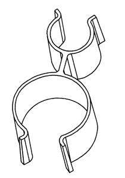

**Locarno 19-06** — Stationery and office equipment, artists' and teaching materials  
ID: D0570415  
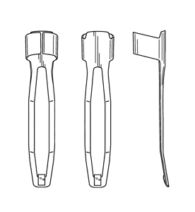

## title = "lamp"（11分類にまたがる、計1104件）

**Locarno 01-26** — Foodstuffs  
ID: D0955610  
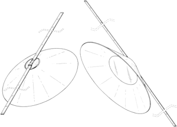

**Locarno 02-26** — Articles of clothing and haberdashery  
ID: D0944429  
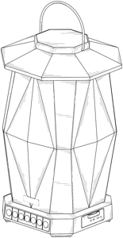

**Locarno 03-26** — Travel goods, cases, parasols and personal belongings, not elsewhere specified  
ID: D0940379  
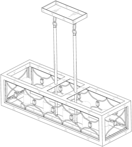

**Locarno 04-26** — Brushware  
ID: D0940356  
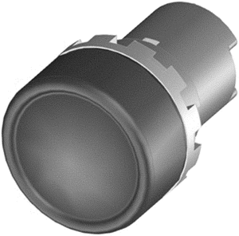

**Locarno 05-26** — Textile piece goods, artificial and natural sheet material  
ID: D0940922  
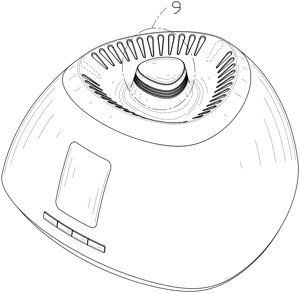

**Locarno 10-05** — Clocks and watches and other measuring instruments, checking and signalling instruments  
ID: D0760612  
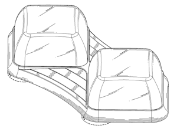

**Locarno 11-05** — Articles of adornment  
ID: D0948102  
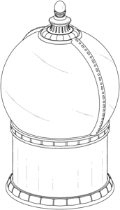

**Locarno 23-03** — Fluid distribution equipment, sanitary, heating, ventilation and air-conditioning equipment, solid fuel  
ID: D0580091  
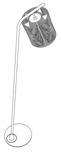

**Locarno 24-99** — Medical and laboratory equipment  
ID: D0770639  
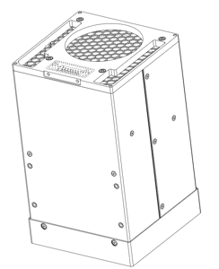

**Locarno 26-03** — Lighting apparatus  
ID: D0539970  
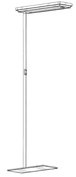

## title = "cover"（20分類にまたがる、計99件）

**Locarno 01-14** — Foodstuffs  
ID: D0963616  
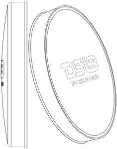

**Locarno 02-14** — Articles of clothing and haberdashery  
ID: D0942460  
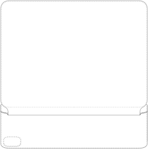

**Locarno 03-01** — Travel goods, cases, parasols and personal belongings, not elsewhere specified  
ID: D0569096  
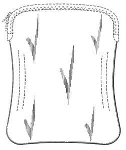

**Locarno 05-15** — Textile piece goods, artificial and natural sheet material  
ID: D0968733  
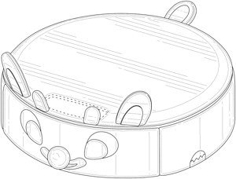

**Locarno 06-06** — Furnishing  
ID: D0610381  
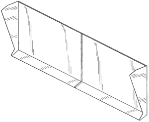

**Locarno 07-01** — Household goods, not elsewhere specified  
ID: D0644070  
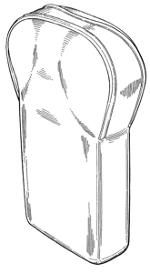

**Locarno 09-07** — Packaging and containers for the transport or handling of goods  
ID: D0621704  
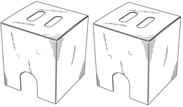

**Locarno 12-16** — Means of transport or hoisting  
ID: D0691549  
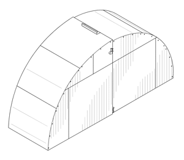

**Locarno 13-03** — Equipment for production, distribution or transformation of electricity  
ID: D0805039  
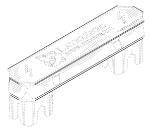

**Locarno 14-03** — Recording, telecommunication or data processing equipment  
ID: D0622716  
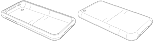
