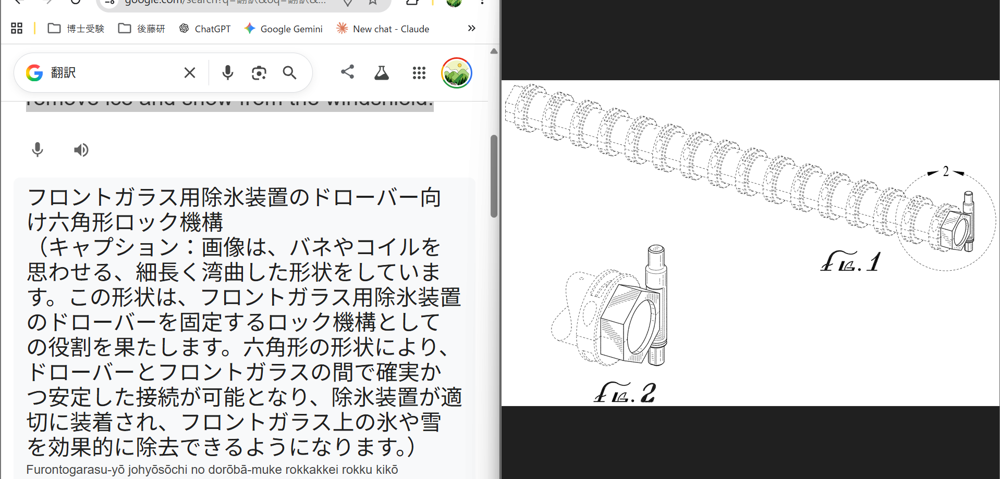
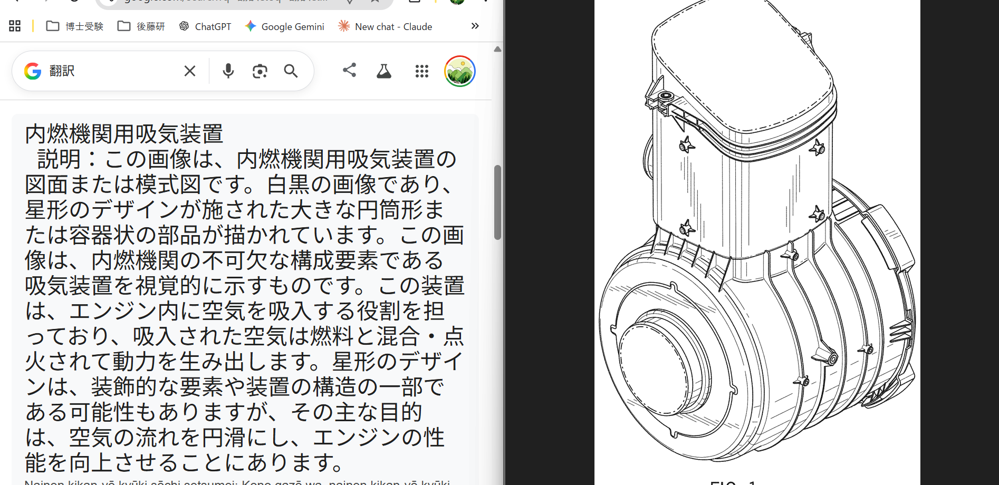
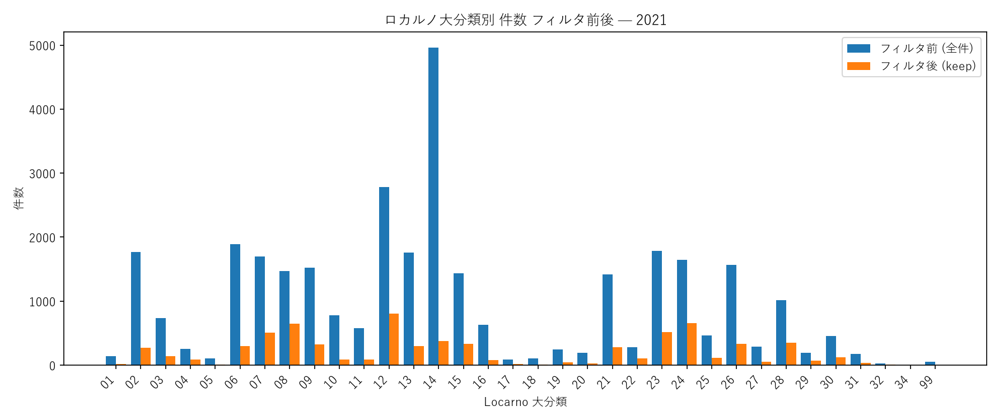
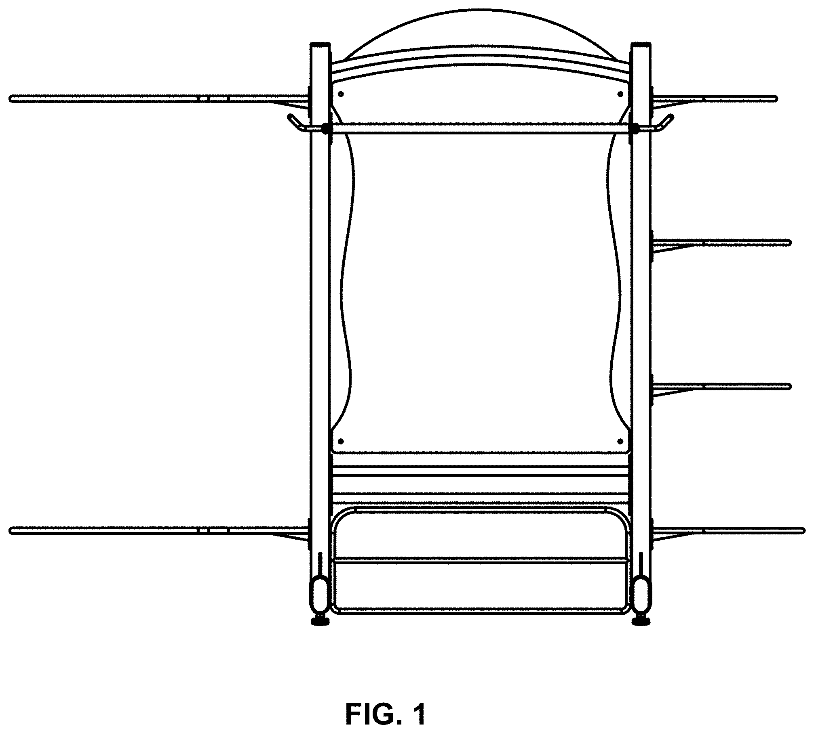
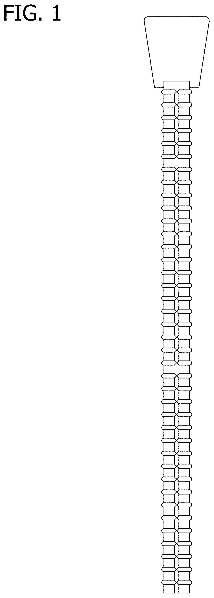

# 週次MTGレポート — 2026-07-09

## 背景・目標

デザイナーや審査官が本当に知りたいのは、タイトルの一致ではなく、**特定の機能・用途・使用文脈を持つ意匠がどのような形状として実現されているか**という形状と機能の対応関係である。

**→ 機能と形状の対応関係を埋め込み空間に学習させ、機能文をクエリとして形状画像を検索するシステムを実現したい。**

---

## 1. 今週やったこと

### 1-0. 前提：COrAL のアーキテクチャ

以降の節はすべて COrAL（Orthogonalized Multimodal Contrastive Learning with Asymmetric Masking）を前提に進める。

```text
image ─▶ 画像エンコーダ ──┐
                          ├─▶ 共有パス:  FusionTransformer([img_tok, txt_tok]) ─▶ head ─▶ Z_shared      (B, 512)
text  ─▶ テキストエンコーダ ┘
                          ┌─▶ 固有パス(画像): FusionTransformer([img_tok, zeros]) ─▶ uni_head ─▶ Z_img_unique (B, 512)
                          └─▶ 固有パス(テキスト): FusionTransformer([zeros, txt_tok]) ─▶ uni_head ─▶ Z_txt_unique (B, 512)
                             （固有パスのエンコーダは共有パスと別重み）

損失 = InfoNCE×3（Z_shared, Z_img_unique, Z_txt_unique それぞれに対して）
     + 直交性損失×2（Z_shared ⟂ Z_img_unique, Z_shared ⟂ Z_txt_unique）
```

- **共有パス**: 画像・テキスト両方のトークン列を FusionTransformer（CLS結合＋self-attention）に通し、クロスモーダル検索に使う表現 `Z_shared` を得る
- **固有パス**: 非対称マスキング（片方のモダリティをゼロ埋め）により、各モダリティ固有の情報 `Z_img_unique` / `Z_txt_unique` を分離する。「画像だけから機能を推論する」「テキストだけから形状を推論する」経路を作ることで、共有・固有に加えて**相乗（Synergistic）情報**も学習できるのが COrAL の特徴（詳細は `research_implementation_log.md` 研究上の判断§1）
- **デフォルトのエンコーダ構成**: 画像側 DINOv2-base（257トークン）、テキスト側 ModernBERT-base（128トークン）。1-1〜1-2 ではここに CLIP を差し替える実験を行う

---

### 1-1. 評価：COrAL(DINOv2+ModernBERT版) vs CLIP zero-shot

前回レポート（2026-07-02）の FB「標準的な画像のみのモデルとの比較」を受け、CLIP zero-shot をベースラインに追加した。2021年データ、100エポック、バッチサイズ64で学習・2022年データで評価した。

#### 実験条件

| 項目 | 値 |
| --- | --- |
| 学習データ | IMPACT 2021年（32,536件） |
| 評価データ | IMPACT 2022年（33,541件） |
| タスク | テキスト→意匠画像クロスモーダル検索 |
| エポック数 | 100 |
| バッチサイズ | 64 |
| 学習率 | 1e-4 |
| Weight decay | 1e-3 |
| 類似度指標 | コサイン類似度（L2正規化後の内積、`F.normalize` → `@`） |

#### 比較対象

| モデル | 画像エンコーダ | テキストエンコーダ |
| --- | --- | --- |
| **CLIP zero-shot** (ViT-B/32) | CLIP ViT-B/32 | CLIP Text Transformer |
| **COrAL shared (DINOv2+MBERT)** | DINOv2-base | ModernBERT-base |

全モデル共通：IMPACT 2022 年テストセット（33,541 件）でのテキスト→意匠画像クロスモーダル検索

#### 検索に使ったベクトル

| モデル | 画像側ベクトル | テキスト側ベクトル |
| --- | --- | --- |
| CLIP zero-shot | `visual_projection` 通過後の整合済み512次元ベクトル | `text_projection` 通過後の整合済み512次元ベクトル |
| COrAL shared (DINOv2+MBERT) | `FusionTransformer([img_tokens, zeros])` → head → 512次元（Z_shared、テキスト側ゼロマスク） | `FusionTransformer([zeros, txt_tokens])` → head → 512次元（Z_shared、画像側ゼロマスク） |

COrAL側で「片方のモダリティをゼロマスクした状態のshared path出力」を使うのは、非対称マスキング学習で片方がゼロになる状況を経験済み（in-distribution）のため。

#### 定量評価結果

| モデル | 画像エンコーダ | テキストエンコーダ | プール | R@1 | R@5 | R@10 | R@50 | R@100 | MRR |
| --- | --- | --- | --- | --- | --- | --- | --- | --- | --- |
| CLIP zero-shot (ViT-B/32) | CLIP ViT-B/32 | CLIP Text Transformer | 全件 | **0.933%** | **2.856%** | **4.329%** | **10.316%** | **14.445%** | **2.199%** |
| CLIP zero-shot (ViT-B/32) | CLIP ViT-B/32 | CLIP Text Transformer | ロカルノ内 | **1.363%** | **4.216%** | **6.473%** | **15.554%** | **21.666%** | **3.263%** |
| COrAL shared (DINOv2+MBERT, 100ep) | DINOv2-base | ModernBERT-base | 全件 | 0.012% | 0.051% | 0.092% | 0.465% | 0.942% | 0.083% |
| COrAL shared (DINOv2+MBERT, 100ep) | DINOv2-base | ModernBERT-base | ロカルノ内 | 0.188% | 0.835% | 1.655% | 7.018% | 12.811% | 0.983% |

#### 考察

CLIP zero-shot（追加学習ゼロ）が COrAL を大幅に上回る:

| | CLIP zero-shot | COrAL DINOv2+MBERT |
| --- | --- | --- |
| R@1（全件） | 0.933% | 0.012% |
| R@1（ロカルノ内） | 1.363% | 0.188% |

CLIP zero-shot との差は全件 R@1 で約78倍、ロカルノ内 R@1 で約7倍。

**CLIPの精度が大幅に上回った原因（仮説）:** CLIP のテキスト・画像エンコーダは4億ペアの画像テキストペアで対照学習により同一空間に整合済み。COrAL のエンコーダ（DINOv2+ModernBERT）はそれぞれ単一モダリティで事前学習されており、初期状態では整合がない。2021年データ（約3万件）の InfoNCE 学習だけでは、CLIP が持つ事前アライメントの強度に到達できていない。

**→ CLIP のような事前学習で得られた画像・テキストの整合を活かしつつ、COrAL のように共有・固有情報を分解して学習できるアーキテクチャを作れないか？（1-2）**

---

### 1-2. CLIPの整合済み表現を活かす `clip_aligned` エンコーダの設計

1-1 の問いを受け、CLIP の事前整合を COrAL のアーキテクチャに取り込む設計を検討した。

#### CLIPは何の単位で整合されているか

CLIPの学習ペアは「画像1枚 ↔ キャプション1文」であり、対照学習（InfoNCE）が直接教師信号をかけているのは、画像側は CLS トークンを `visual_projection` に通した1本のベクトル（512次元）、テキスト側は EOS トークンを `text_projection` に通した1本のベクトル（512次元）のみである。CLIPのクロスモーダル整合（画像とテキストが同じ空間に揃う性質）は、この projection 通過**後**の空間にしか存在しない。

つまり CLIP の恩恵を活かすには、`CLIPVisionModel`/`CLIPTextModel` の `last_hidden_state`（パッチ・トークン列、projection 前）ではなく、`visual_projection`/`text_projection` を通した後のpooledベクトルを使う必要がある。

#### 設計：整合済み表現を使う `clip_aligned` エンコーダ

```text
CLIP visual_projection(pooler_output) → (B, 512)  ← CLIP整合済みベクトル
          ↓ out_proj: Linear(512→768)
              (B, 768)
          ↓ unsqueeze(1)
              (B, 1, 768)  ← 長さ1のトークン列としてFusionTransformerに渡す
```

画像・テキストとも 1 トークンに集約されるため、FusionTransformer への入力長は **127 → 2 トークン**に激減する（self-attention のコストは系列長の2乗のため、attention計算は約4000倍軽くなる）。

#### トレードオフ：2トークンでは FusionTransformer の表現力が限定的

2トークン間の self-attention は数学的には成立するが、実質的には

```text
output = α × img_embed + (1-α) × txt_embed
```

という学習済みの重み付き混合に近い、構造的にシンプルな計算になる。127トークン版が学習できていた「どの画像パッチとどの単語が対応するか」という細粒度な対応関係は、CLIP の CLS プーリングの時点で失われているため学習できない。固有パス（unique path）についても、ゼロマスク時に渡る画像側の1トークンは既に CLIP の CLS（全体要約）であり、パッチレベルの局所的視覚情報が残っていないため、「画像固有の情報」を取り出す意味が薄くなる。

---

### 1-3. やりたいことに立ち返る

本レポート冒頭で述べた通り、本研究が本当に学習させたいのは「この意匠固有の形状が、この意匠固有の機能とどう対応するか」という**個別の**対応関係である。

#### 具体例：captionの一部と画像の一部は実際に対応している

IMPACTデータの意匠画像とcaptionを個別に見ると、captionの特定のフレーズが画像の特定の部分に対応している例が確認できる。

- フロントガラス用除氷装置のドローバー向け六角形ロック機構（USD0939336）: captionの「六角形の形状」は画像中の六角ナット部分に、「バネやコイルを思わせる、細長く湾曲した形状」は画像中のコイル状の部品に、それぞれ対応している

  

- 内燃機関用吸気装置（USD0913334）: captionの「星形のデザイン」は画像の放射状フィン、「大きな円筒形または容器状の部品」は画像中央の円筒本体に対応している

  

つまり caption 全体と画像全体を1つのベクトルに集約する「グローバルな」対応づけだけでなく、**局所的な対応関係（このフレーズはこの領域に対応する）が実際にデータ上に存在する**。この意匠固有の局所対応を学習できて初めて、「機能文→形状画像の意匠固有な対応」という目的が達成できる。

#### だからこそ必要なアーキテクチャ

1-1・1-2 を通して、「CLIP：整合済みだが1トークン（粗い）」「DINOv2+ModernBERT：多トークン（細かい）だが未整合」という二択に見える状況になっていた。CLIPの1トークン設計は画像・キャプション全体でしか整合しておらず、上記のような局所対応を学習する余地がそもそもない。DINOv2+ModernBERTの多トークン設計は局所対応を学習できる可能性を残しているが、画像・テキスト間の事前学習済み共有知識を持たないため、限られた学習データだけでゼロから整合を獲得しなければならない。

**→ 事前学習済みの画像・テキスト共通次元の知識を活かしつつ、トークンごとに（パッチ単位・単語単位で）学習できるアーキテクチャを作れないか？**

**論点の絞り込み:** ここで実際に問うべきは「最終的な埋め込みが複数トークンを保持しているか」ではなく、**「事前学習そのものがパッチ・トークン単位の画像↔テキスト対応を教師信号として使っているか」**である。DINOv2+ModernBERTは複数トークンを最後まで保持するが、そのトークンはパッチ単位の対応を学習する教師信号を一度も与えられていない（それぞれ単一モダリティの自己教師あり学習のため）。逆に、最終出力が1本のベクトルに潰れるモデルでも、事前学習の過程でパッチ／領域単位の画像↔テキスト対応（grounding）を学習していれば、その知識は内部表現に残っている可能性がある。

#### 次に調べること：phrase grounding／referring segmentation の既存研究

「画像の一部とテキストの一部を対応づける」という問題設定自体は、意匠特許に限らず既存研究がある可能性が高い（phrase grounding, referring segmentation, dense captioning など。1-2で触れた GLIP・FILIP もこの系統）。ゼロから設計する前に、この分野の既存手法を調査する。

#### 次に調べること：grounding を伴う事前学習を持つVLMの評価

CLIPの対照学習は「画像全体↔キャプション全体」の対応しか学習しない。一方 `Qwen/Qwen3-VL-Embedding-2B` のベースである Qwen3-VL は、referring expression comprehension（RefCOCO/RefCOCO+/RefCOCOg）や物体検出のような、**テキストの一部（フレーズ）を画像中の特定領域に対応づける grounding 課題**で評価されており、パッチ・領域単位の画像↔テキスト対応を事前学習の一部として持つ。上記の論点の絞り込みに従えば、Qwen3-VL-Embeddingの zero-shot 評価は「強いVLM埋め込みモデルを試す」というより、**「grounding込みの事前学習が、意匠の局所的な形状↔機能対応の学習に転移するか」を検証する意味を持つ**。1-1のCLIP zero-shotと同じ条件（IMPACT 2022年テストセット）でRecall@K・MRRを測定し、CLIP zero-shotとの比較を行う。

---

### 1-4. 学習データ・テストデータに対するフィルタを実行

#### 背景・意図

1-1〜1-3 ではアーキテクチャ側（エンコーダの整合・トークン粒度）を検討したが、これとは独立に**学習データ（caption）自体の情報量**も検証する必要がある。IMPACT データセットの caption（VLM生成の視覚的説明文）には、「機能には触れているが同カテゴリの他意匠にも当てはまる汎用的な記述」（例: "square shape, used for various purposes such as ..."）が多く混じっている。

本レポート冒頭で述べた通り、本研究の目的は

> デザイナーや審査官が本当に知りたいのは、タイトルの一致ではなく、**特定の機能・用途・使用文脈を持つ意匠がどのような形状として実現されているか**という形状と機能の対応関係である。
>
> **→ 機能と形状の対応関係を埋め込み空間に学習させ、機能文をクエリとして形状画像を検索するシステムを実現したい。**

である。この目的を達成するには、対照学習の正例ペア（title+caption ↔ image）が「**この意匠固有**の形状が、**この意匠固有**の機能とどう対応するか」を語っている必要がある。しかし caption の多くは「このカテゴリの意匠は一般的にこういう機能を持つ」という**カテゴリレベルの記述**にとどまり、同カテゴリ内で意匠同士を区別する情報（＝個別の形状と機能の対応関係）を含んでいない。つまり、1-1〜1-3 で検討したアーキテクチャ側をいくら改善しても、教師信号（caption）自体が識別力を持たなければ、目的とする「機能文→形状画像の意匠固有な対応」は学習しようがない。

そこで、caption が「この意匠固有の形状-機能の対応関係」を記述しており、同じ Locarno クラスの他意匠には当てはまらない ＝ discriminative（識別可能）と判定できるものだけを残す L3 フィルタを構築した。

#### ロジック（3条件 AND 判定、VLM 1件ずつ判定）

| 条件 | 内容 |
| --- | --- |
| C1+C2（Phase 1） | 意匠画像を見て、caption がその意匠の形状-機能関係を具体的に記述し、かつ同名意匠と区別できる設計思想を持つか |
| C3（Phase 2） | caption を同じ Locarno クラスのピア意匠（ランダム10件）の画像に当てて、caption がどのピアにも当てはまらないか（1件でも当てはまれば discard） |


使用モデル: **Qwen2.5-VL-7B-Instruct**．IMPACT 2019-2022年の caption 付き全件に適用。

#### 結果

| 年 | 件数 | keep（L3） | discard（L2） | keep率 |
| --- | --- | --- | --- | --- |
| 2021 | 32,535 | 7,142 | 25,393 | 22.0% |
| 2022 | 33,541 | 10,241 | 23,300 | 30.5% |

Locarno クラス別の keep 率は極端に偏る（クラスサイズ≥100、2021年）:



| keep率 上位5 | | keep率 下位5 | |
| --- | --- | --- | --- |
| 08-06（ドアハンドル等） | 61.2% | 14-04（GUIアイコン、最大2,111件） | 1.3% |
| 08-08（金具） | 60.7% | 10-02（腕時計） | 1.4% |
| 07-99（雑貨・その他） | 52.7% | 06-03（家具） | 4.3% |
| 15-01（機械） | 44.5% | 12-15（タイヤ） | 5.2% |
| 24-04（医療） | 44.1% | 16-01（光学機器） | 5.8% |

**傾向**: 個体差の大きい機械部品・金具・医療機器は caption が具体的になりやすく keep 率が高い。GUIアイコン・腕時計・タイヤ・家具など「大量生産で外見が似通う」製品カテゴリは caption がテンプレ化しやすく keep 率が著しく低い（`14-04` は最大件数クラスにも関わらずほぼ全滅）。

具体例（同じLocarnoクラス 08-08「金具」内でのKEEP/DISCARDの対比）:

**KEEP `Yoga rack`**

> The image is a black and white drawing of a yoga rack, which is designed to hold and organize yoga mats. The rack is shaped like an arch, with a curved structure that allows for easy access to the mats. It is a functional piece of furniture that helps keep the yoga mats organized and off the floor, making it convenient for practicing yoga or storing them when not in use.



**DISCARD `High-strength partition top anchor`**

> The image is a black and white drawing of a square shape. The functionality of the image is to showcase the design and structure of the High-strength partition top anchor, which is used to secure partitions in place.



同じ「金具」クラスでも、KEEP側は「アーチ状の、湾曲した構造」という、図面と一目で対応する具体的な形状記述があるのに対し、DISCARD側は「square shape」としか言っておらず、実際の図面（細長い帯状の留め具）とも一致していない。この差が discriminability 判定の分かれ目になっている。

なお `07-99`（Locarno の「その他・分類不能」catch-all クラス）は keep 率52.7%と高いが、蓋・ディスペンサー・ラックなど無関係な製品が混在しておりC3判定（ピアとの非一致確認）が運任せになる構造的欠陥があったため、学習・評価データセットから除外した。

---

## 2. 今後やること

### 方針

今週の結果から、課題は**データ品質**と**アーキテクチャ**の2軸に整理できる。並行して進める。

1. **データ品質**: データの絞り込みを他の年で継続
2. **アーキテクチャ**: 事前学習済みの画像・テキスト整合を活かしつつ、トークン単位で学習できる設計を模索する（1-3参照）。1-3 で挙げた問い（CLIPのような事前整合を活かしつつ、トークンごとに学習できないか）に対応するため、phrase grounding／referring segmentation／dense captioning 分野の既存研究を調査する。IMPACTデータで確認された caption↔画像の局所対応（1-3の具体例）が、既存手法でどこまで扱えるかを見極める。あわせて、自作アーキテクチャを設計する前段として `Qwen/Qwen3-VL-Embedding-2B` の zero-shot 検索性能を1-1と同条件で測定し、CLIP zero-shotとの比較を行う。

---

作成: 2026-07-09
