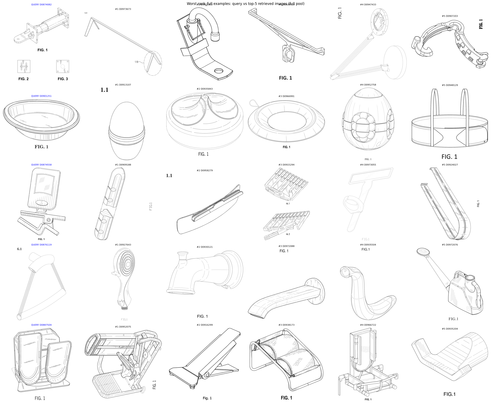
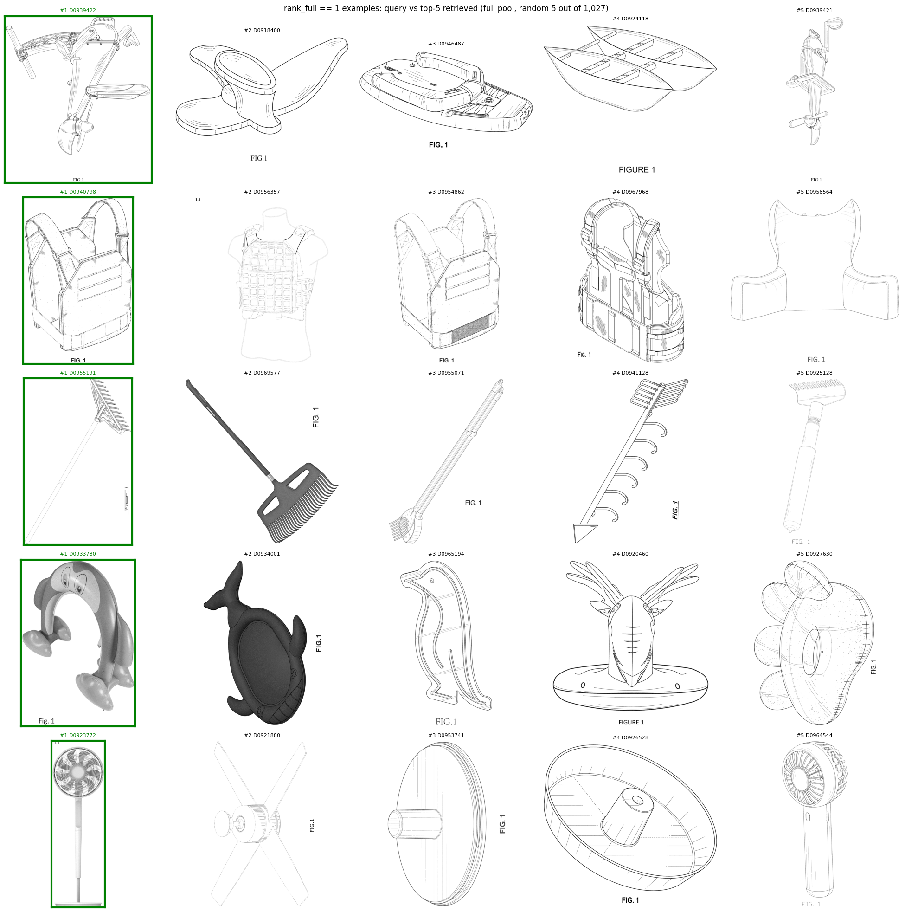
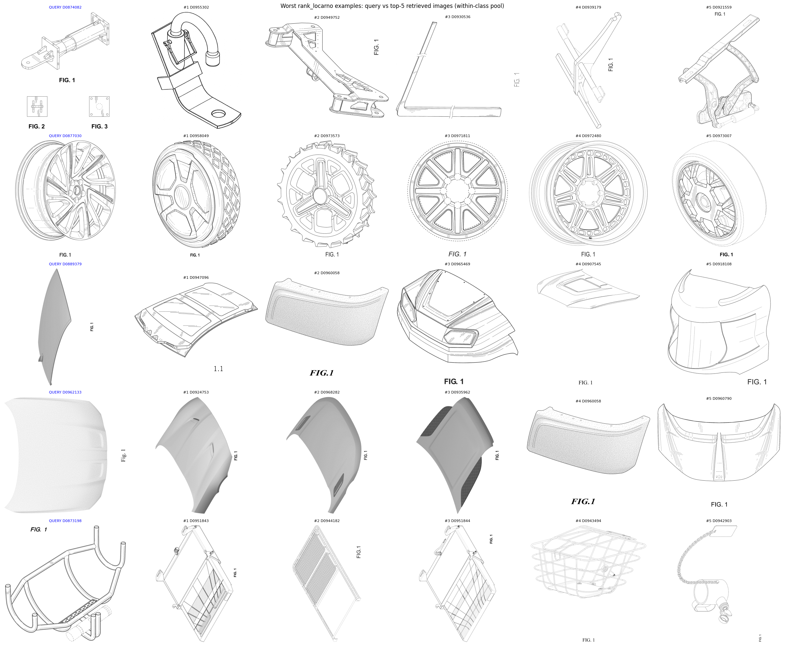
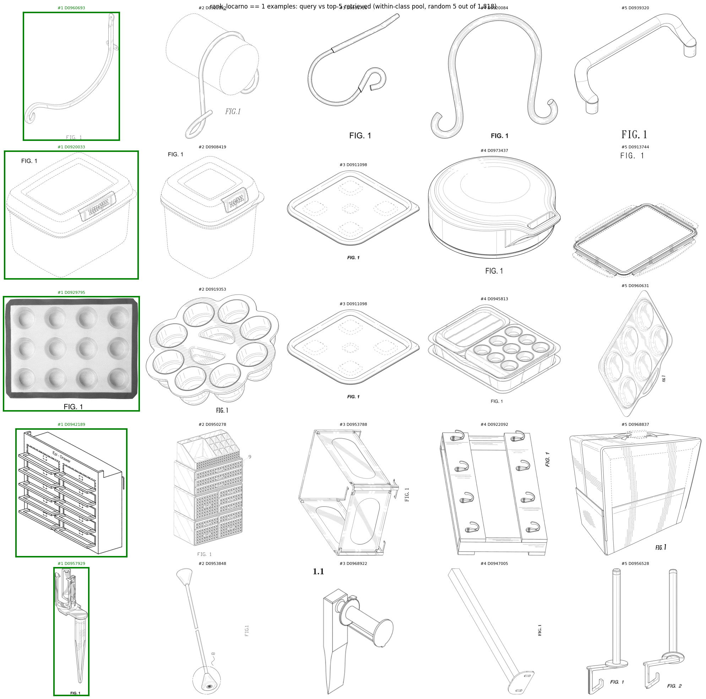
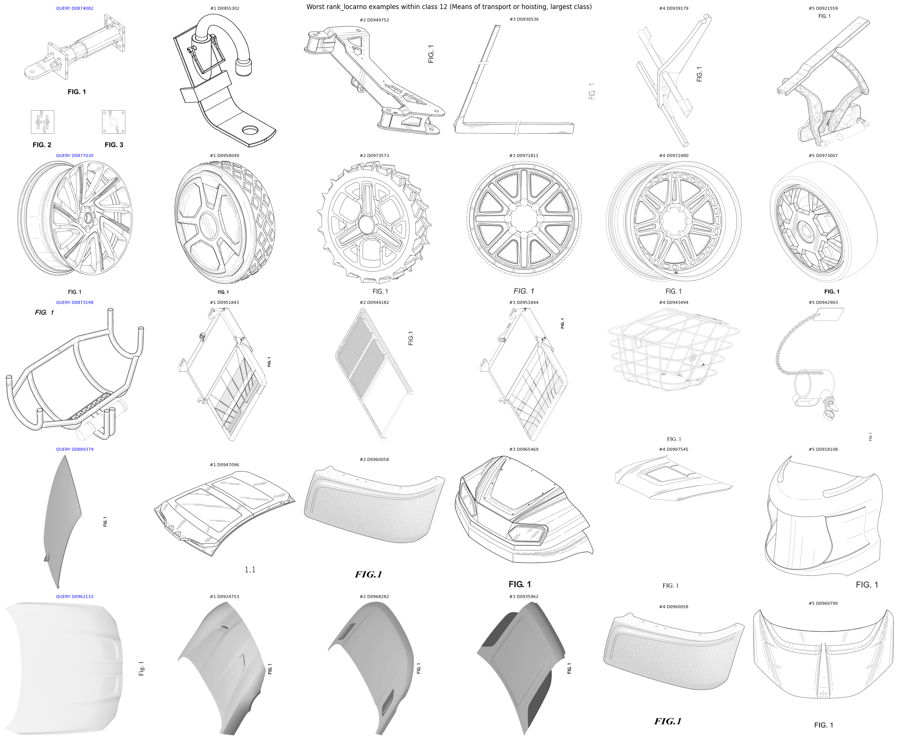
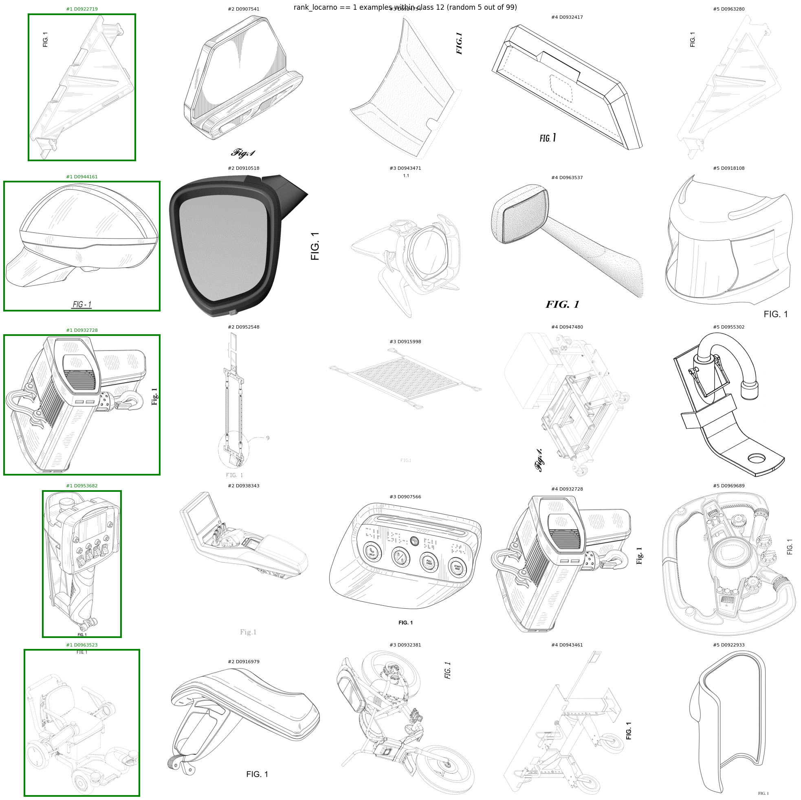

# 週次MTGレポート — 2026-07-16

## 背景・目標

デザイナーや審査官が本当に知りたいのは、タイトルの一致ではなく、**特定の機能・用途・使用文脈を持つ意匠がどのような形状として実現されているか**という形状と機能の対応関係である。

**→ 機能と形状の対応関係を埋め込み空間に学習させ、機能文をクエリとして形状画像を検索するシステムを実現したい。**

---

## 1. 今週の結果

### 1-1. Qwen3-VL-Embedding-2Bのzero-shot性能：フィルタ前後、instruction別

**前提: フィルタとは** — 今後の学習・改善対象データを、意匠固有の識別可能なcaptionを持つと判定された特許のみに絞り込む処理のこと。同一分類・同一製品種別でも意匠ごとの形状差分をcaptionが言語化できているかを基準に判定しており、判定基準を満たさない一般論的なcaptionの特許は除外される（2019-2022年の元データ133,826件中、絞り込み後は39,843件＝29.8%）。「フィルタ前」＝この絞り込みをしていない全件、「フィルタ後」＝絞り込み後の特許のみ、を指す。

フィルタ後（n=39,843）のロカルノ大分類別の内訳は以下の通り。輸送・運搬手段（12）、医療・実験機器（24）、工具・金物（08）が上位を占める一方、繊維製品（05）や印刷・事務機器（18）などは絞り込み後にほとんど残らない。

| 分類 | 件数 | 割合 | 分類 | 件数 | 割合 |
| --- | --- | --- | --- | --- | --- |
| 01 食品 | 112 | 0.3% | 17 楽器 | 114 | 0.3% |
| 02 衣類・服飾雑貨 | 1,795 | 4.5% | 18 印刷・事務機器 | 64 | 0.2% |
| 03 旅行用品・携行品 | 1,001 | 2.5% | 19 文房具 | 201 | 0.5% |
| 04 ブラシ類 | 507 | 1.3% | 20 販売・広告用品 | 102 | 0.3% |
| 05 織物・シート素材 | 28 | 0.1% | 21 ゲーム・玩具・スポーツ用品 | 1,587 | 4.0% |
| 06 家具・室内用品 | 1,555 | 3.9% | 22 武器・狩猟用品 | 928 | 2.3% |
| 07 家庭用品（その他） | 2,693 | 6.8% | 23 流体設備・衛生・空調機器 | 2,469 | 6.2% |
| 08 工具・金物 | 3,318 | 8.3% | 24 医療・実験機器 | 3,454 | 8.7% |
| 09 包装・容器 | 1,828 | 4.6% | 25 建築ユニット・構造材 | 669 | 1.7% |
| 10 計測・時計類 | 731 | 1.8% | 26 照明器具 | 2,057 | 5.2% |
| 11 装身具 | 540 | 1.4% | 27 たばこ用品 | 273 | 0.7% |
| 12 輸送・運搬手段 | 4,597 | 11.5% | 28 医薬品・化粧品・トイレタリー | 1,751 | 4.4% |
| 13 電力生産・分配設備 | 1,589 | 4.0% | 29 防火・救助用品 | 502 | 1.3% |
| 14 記録・通信・情報検索機器 | 2,129 | 5.3% | 30 動物飼育用品 | 582 | 1.5% |
| 15 その他機械 | 1,804 | 4.5% | 31 調理用機械器具（その他） | 177 | 0.4% |
| 16 写真・光学機器 | 630 | 1.6% | 32 図形記号・模様 | 19 | 0.0% |
| | | | 99 その他分類不能 | 36 | 0.1% |

**前提: 形状優先instructionとは** — クエリ文をベクトル化する際に添える指示文の書き方を変えることで、追加学習なしでzero-shot性能をどこまで引き出せるかを検証する実験。通常の指示文は形状・機能・用途・文脈を並列に扱うのに対し、形状優先の指示文は「タイトル（物体の種別）を最優先、形状の記述および形状に根拠づけられた機能の記述（例：「湾曲したハンドルで握りやすい」）を同格で次点、形状と無関係な一般的な機能・用途の記述（例：「日常使いに便利」）を最も軽視」という3段階の優先順位を明示する。

#### フィルタ前・通常instruction（2022年単年, n=33,541）

| プール | R@1 | R@5 | R@10 | R@50 | R@100 | MRR |
| --- | --- | --- | --- | --- | --- | --- |
| 全件 | 4.240% | 10.685% | 14.809% | 28.938% | 36.752% | 7.924% |
| ロカルノ内 | 5.244% | 13.229% | 18.452% | 35.554% | 45.300% | 9.796% |

#### フィルタ後（2019-2022, n=39,843） — instructionによる比較

| instruction | プール | R@1 | R@5 | R@10 | R@50 | R@100 | MRR |
| --- | --- | --- | --- | --- | --- | --- | --- |
| 通常 | 全件 | 2.542% | 5.958% | 7.893% | 14.090% | 17.574% | 4.409% |
| 通常 | ロカルノ内 | 3.303% | 7.828% | 10.343% | 18.621% | 22.920% | 5.777% |
| 形状優先 | 全件 | 2.442% | 5.662% | 7.668% | 13.528% | 16.680% | 4.218% |
| 形状優先 | ロカルノ内 | 3.150% | 7.294% | 9.801% | 17.398% | 21.492% | 5.445% |

#### 分かったこと

1. **instructionの書き方を工夫しても性能はほぼ動かない**（形状優先にした結果、むしろ全指標でわずかに悪化）。プロンプト調整による改善の天井は低く、この形状↔機能の対応関係は**学習によって明示的に教え込む必要がある**、という結論を補強する。

---

### 1-2. どういう意匠で検索が成功・失敗するか

フィルタ後データについて、ロカルノ大分類別の性能とクエリ単位の定性的な検索結果を確認した。

#### クラス別性能（上位/下位の例、全件プールと同一クラス内プールの比較）

| クラス | 該当件数 | R@1（全件） | R@1（同一クラス内） |
| --- | --- | --- | --- |
| 輸送・運搬手段 | 4,597 | 1.39% | 2.07% |
| 医療・実験機器 | 3,454 | 1.45% | 2.75% |
| その他機械 | 1,804 | 1.55% | 3.60% |
| 工具・金物 | 3,318 | 1.57% | 2.92% |
| 電力生産・分配設備 | 1,589 | 1.57% | 3.40% |
| 楽器 | 114 | 7.02%（最高） | 10.53% |
| 装身具 | 540 | 5.19% | 9.44% |
| 販売・広告用品 | 102 | 4.90% | 22.55%（クラス内トップ級） |

#### 実際の検索結果の例（画像・テキスト）

上記の分析根拠となった定性例を示す。ここでの「クエリ」はtitle・captionからなる**テキスト**であり、画像ではない。以下の画像はモデルがこのクエリ文に対して実際に返した上位5件（正解には緑枠）を並べたもので、外れ例の図では比較用の参考として、クエリに対応する正解の意匠画像を左端に青枠で添えている（この青枠画像自体は検索の入力ではない）。

##### 外れ例（全件プール、最も順位が悪かった5件）

以下、各クエリの正式ID・登録年・ロカルノ分類・全件プール中の順位（rank_full、n=39,843）、フルcaption、および実際に返された上位5件（ID・タイトル・年・分類・caption）を記録する。

**QUERY: D0874082「クレーンタイアーム」**（2020年・12 輸送・巻き上げ用機器、rank_full = 39842）
caption: 画像はクレーンタイアームの白黒図面です。タイアームはクレーンの重要な構成部品であり、クレーンのブームとクレーン本体を接続します。これによりクレーンは重い荷物を効率的かつ安全に持ち上げ、移動させることができます。タイアームは、ブームとクレーン本体の間に強固で安定した接続を提供するよう設計されており、吊り上げ作業中にクレーンがバランスと安定性を保てるようにします。

上位5件:

1. D0973673「ディスプレイ装置用スタンド」（2022年・14 記録、通信、情報検索機器）— 画像はディスプレイ装置用の白色長方形スタンドです。このスタンドは、モニターやテレビなどのディスプレイ装置を保持し、快適な視聴高さまで持ち上げるよう設計されています。
2. D0955302「ホールドダウンリテーナー付きプラットフォーム」（2022年・12 輸送・巻き上げ用機器）— 画像はホールドダウンリテーナー付きプラットフォームの白黒図面です。このプラットフォームは、パイプやその他の物体をしっかりと固定し、移動やずれを防ぐよう設計されています。
3. D0928518「コーディネートハンガーフープ」（2021年・06 家具調度品）— 画像は金属製フックの図面で、コーディネートハンガーの一種です。このフックは、衣類やその他の物品などを保持するために設計されており、それらを整理・収納するために使用できます。
4. D0947433「デスクトップランプヘッドピース」（2022年・26 照明器具）— 画像はデスクトップランプヘッドピースの白色図面です。画像の形状は円形です。デスクトップランプヘッドピースの機能は、パソコンデスクや作業スペースの照明を提供することです。
5. D0907203「結紮クリップ」（2021年・24 医療・実験用機器）— 画像は結紮クリップの白黒図面で、外科手術で使用される医療機器の一種です。このクリップは、手術中に組織を所定の位置に固定するよう設計されており、安定性を提供します。

**QUERY: D0901251「卵運搬容器」**（2020年・07 家庭用品(その他)、rank_full = 39840）
caption: 画像は卵運搬容器の白黒図面で、中央が空洞になった円形の形状をしています。卵運搬容器の主な機能は、卵を安全に保護し運搬することです。生卵・調理済みの卵どちらにも使用でき、輸送中の破損や割れを防ぐのに役立ちます。また、卵を整理された状態に保ち、バッグや容器の中で転がるのを防ぎます。

上位5件:

1. D0913107「スプーンまたはフォーク用ケース」（2021年・07 家庭用品(その他)）— 画像は中央に穴の開いた白色の卵形で、スプーンまたはフォーク用ケースの独創的なデザインです。画像の機能は、未使用時に食器を保護・収納することです。
2. D0935843「食品加工用押出成形プレート」（2021年・31 食品・飲料調理用機械器具(その他)）— 画像は押出成形プレートの白色図面で、食品加工機械の部品です。この押出成形プレートは、生地やバッター(練り生地)などの食品を特定の形に成形するよう設計されています。
3. D0966991「車輪止め」（2022年・12 輸送・巻き上げ用機器）— 画像は車輪止めの白黒図面で、駐車中の車両が転がったり動いたりするのを防ぐために使用される装置です。車輪止めは車両の車輪に合わせて取り付けられるよう設計されています。
4. D0952758「回転式マジックビーン玩具」（2022年・21 遊戯具、玩具、テント、運動用具）— 画像は回転式マジックビーン玩具の白黒図面です。この玩具は、子供にとって楽しくインタラクティブな遊び道具となるよう設計されています。玩具は独特な形状をしており、中央に穴があります。
5. D0948129「ハーネス」（2022年・29 火災予防、事故防止、救助用装置）— 画像はハーネスの白色図面で、犬をリードやテザーに繋ぐために使用される器具です。ハーネスは、犬が引っ張る力を体全体に均等に分散させるよう設計されています。

**QUERY: D0874558「取り外し可能なピックホルダー付きクリップ式楽器用チューナー」**（2020年・17 楽器、rank_full = 39840）
caption: 画像は、取り外し可能なピックホルダー付きクリップ式楽器用チューナーの白黒図面です。このチューナーは、ギターなどの楽器の弦にクリップで取り付けるよう設計されており、使用者が楽器のチューニングを簡単に行えるようにします。ピックホルダーは取り外し可能な別部品で、取り外して通常のピックとして演奏に使用することもできます。画像の形状は長方形です。

上位5件:

1. D0909188「ケーブルクリップ」（2021年・09 包装・容器）— 画像はケーブルクリップの白黒図面で、ケーブルを固定・整理するために使用される器具です。このクリップはケーブルを所定の位置に保持するよう設計されており、絡まったりずれたりするのを防ぎます。
2. D0958279「ゴルフ練習器具」（2022年・21 遊戯具、玩具、テント、運動用具）— 画像はゴルフ練習器具の白色図面で、ゴルファーのスイング技術と精度の向上を助けるよう設計されています。この器具は、大きく湾曲したブレードまたはフック状の形をしています。
3. D0915294「計量アセンブリ用接続パドル」（2021年・13 電気の生産・配電用機器）— 画像は計量アセンブリ(水やその他の流体の流量を測定する装置)の図面です。画像には、流れを制御するために使用されるハンドル付きのパドルが写っています。
4. D0973055「読書ガイドストリップ」（2022年・14 記録、通信、情報検索機器）— 画像は長方形の白色輪郭図です。読書ガイドストリップの機能は、視覚障害や低視力などの障害を持つ人々を支援することです。
5. D0924027「電球取り外し工具」（2021年・08 工具・金物）— 画像は中央に穴の開いた平らな長方形の形をしています。画像の機能は電球取り外し工具として機能することで、ソケットから電球を取り外すために使用されます。

**QUERY: D0876119「浴室用アクセサリー」**（2020年・06 家具調度品、rank_full = 39833）
caption: 画像は浴室用アクセサリーの白色図面で、シャワーヘッドまたは散水ノズルのように見えます。画像の形状は湾曲しており、シャワーまたは清掃目的で水を供給するよう設計されています。この浴室用アクセサリーの機能は、個人の衛生用途または浴室の清掃用途のいずれかのために、目的の場所に水を届けることです。

上位5件:

1. D0927643「シャワーヘッド」（2021年・23 流体分配、衛生、暖房、換気、空調設備）— 画像はシャワーヘッドの白黒図面です。画像の形状は湾曲しており、円形のデザインです。画像の機能は、シャワー中に使用者へ水を供給することです。
2. D0930121「浴槽用注水口」（2021年・23 流体分配、衛生、暖房、換気、空調設備）— 画像は浴槽用注水口の白色図面です。画像の形状は円筒形で、湾曲した上部と直線的な底部を持っています。
3. D0972088「浴用注水口」（2022年・23 流体分配、衛生、暖房、換気、空調設備）— 画像は浴用注水口の白色図面です。画像の形状は湾曲しており、パイプまたはチューブに似ています。浴用注水口の機能は、浴槽やシャワーからの水流を提供することです。
4. D0935504「ロボットの尾部」（2021年・15 機械(その他)）— 画像はロボットの尾部の図面です。画像の形状は湾曲しており、より大きなロボット構造の一部であるように見えます。画像の機能は視覚的表現を提供することです。
5. D0972076「じょうろ」（2022年・23 流体分配、衛生、暖房、換気、空調設備）— 画像はじょうろの図面で、植物や庭に水を注ぐために水を保持する容器です。じょうろは長い筒の形をしており、先端に注ぎ口が付いています。

**QUERY: D0887504「足首運動器具」**（2020年・21 遊戯具、玩具、テント、運動用具、rank_full = 39832）
caption: 画像は運動器具の図面で、具体的には足首運動器具です。この器具は、使用者の足首を強化・鍛えるのを助けるよう設計されており、全体的なバランス、安定性、可動性の向上に役立ちます。画像の形状は長方形で、椅子やベンチに似た湾曲した表面を持っています。この器具は金属やプラスチックなどの耐久性のある素材で作られている可能性が高く、運動中に使用者の足首をしっかりと快適に固定するための調整可能なストラップやサポートが付いている場合があります。

上位5件:

1. D0952075「レッグプレス運動マシン」（2022年・21 遊戯具、玩具、テント、運動用具）— 画像はレッグプレス運動マシンの白黒図面です。このマシンは下半身、特に大腿四頭筋、ハムストリング、臀筋を鍛えるよう設計されています。
2. D0916299「巻き爪矯正具」（2021年・24 医療・実験用機器）— 画像は巻き爪矯正具の白色輪郭図です。巻き爪による痛みや不快感を抱える人々にサポートと緩和を提供するよう設計されています。
3. D0938173「フットスツール(足置き台)」（2021年・06 家具調度品）— 画像はフットスツールの白色図面で、使用者の足に快適で高さのある面を提供するよう設計された家具です。フットスツールは2つの別々の部品から構成されます。
4. D0966722「椅子用サポートアダプター兼ブースターシート」（2022年・06 家具調度品）— 画像は椅子用サポートアダプター兼ブースターシートの白色輪郭図です。椅子用サポートアダプターは、椅子に追加のサポートと安定性を提供するよう設計されています。
5. D0935204「ダブルフック」（2021年・06 家具調度品）— 画像はダブルフックの白色図面で、釣り用ルアーの一種です。このフックは湾曲した形状をしており、餌となる魚の動きを模倣することで魚を釣るよう設計されています。

##### 正解例（全件プール、rank=1のうちランダム5件、n=1,027件中）

- **QUERY: Foldable pedal drive for kayak**（輸送・運搬手段）— caption: カヤックを足でこいで進む、折り畳み可能なペダル駆動装置。→ rank=1で正解。次点候補もカヤック用ペダル駆動系（Pedal drive for kayak）や折り畳みボートなど視覚的に近い候補群。
- **QUERY: Weight carrier vest**（スポーツ用品）— caption: 重い荷物や装備を体全体に分散させて支えるためのウェイトキャリアベスト。→ rank=1。次点にも同名の別特許（Weight carrier vest）が並ぶが、正解を最上位で当てられている。
- **QUERY: Rake**（工具・金物）— caption: 庭や芝生の落ち葉・ゴミをかき集めるための、柄と歯を持つ熊手。→ rank=1。次点はGardening tool（実質同じ熊手）。
- **QUERY: Inflatable penguin sprinkler**（流体・衛生設備）— caption: ペンギン型で水遊び用のスプリンクラー。→ rank=1。この独自性の高い形状表現がそのまま強い手がかりになっている。
- **QUERY: Fan**（流体・衛生設備）— caption: 中央に穴のある白い円筒形で、回転して風を送る扇風機。→ rank=1。次点はCeiling fan motor housingなど関連部品。

以下、各クエリの正式ID・登録年・ロカルノ分類・全件プール中の順位（rank_full）、フルcaption、および実際に返された上位5件（ID・タイトル・年・分類・caption）を記録する（n=1,027件中からランダムに5件抽出）。

**QUERY: D0939422「折りたたみ式カヤック用ペダル駆動装置」**（2021年・12 輸送・巻き上げ用機器、rank_full = 1）
caption: 画像は、カヤック用の折りたたみ式ペダル駆動装置の図面です。プロペラとペダルシステムを組み合わせたもので、使用者が足を使ってカヤックを推進させることができます。画像はカヤックの形をしており、その機能は、従来のパドリングを必要とせずに水上を移動するための便利で効率的な手段を提供することです。このペダル駆動システムは、長距離を移動したい人や上半身の力が限られている人にとって特に有用であり、カヤックをより身近で便利なものにしています。

上位5件:

1. D0939422「折りたたみ式カヤック用ペダル駆動装置」（2021年・12 輸送・巻き上げ用機器）— 正解（クエリと同一）。
2. D0918400「外反母趾矯正具」（2021年・24 医療・実験用機器）— 画像は外反母趾矯正具のシンプルな図面で、足の親指の位置を矯正するために使用される器具です。画像の形状は靴と足を組み合わせたものです。
3. D0946487「船体」（2022年・29 火災予防、事故防止、救助用装置）— 画像は船体(ボートの底部部分)の白黒図面です。船体の形状は、水中での浮力と安定性を提供するよう設計されています。
4. D0924118「デュアルハル折りたたみ式ボート」（2021年・12 輸送・巻き上げ用機器）— 画像は白色のボートの図面で、具体的にはデュアルハル(双胴)折りたたみ式ボートです。このボートは半分に折りたためるよう設計されています。
5. D0939421「カヤック用ペダル駆動装置」（2021年・12 輸送・巻き上げ用機器）— 画像はカヤック用ペダル駆動装置の白黒図面です。シート、ペダル、パドルが特徴です。

**QUERY: D0940798「ウェイトキャリアベスト」**（2022年・21 遊戯具、玩具、テント、運動用具、rank_full = 1）
caption: 画像は正方形の形をしたウェイトキャリアベストの図面です。ウェイトキャリアベストの機能は、着用者に追加のサポートと重量分散を提供することで、特に重い荷物や装備を運ぶ必要がある人に適しています。これらのベストは、体全体に重量を均等に分散させるよう設計されており、背中や肩、その他の筋肉への負担を軽減します。軍関係者、ハイカー、建設業や製造業など重い物を運ぶ必要がある業種の作業員によく使用されます。

上位5件:

1. D0940798「ウェイトキャリアベスト」（2022年・21 遊戯具、玩具、テント、運動用具）— 正解（クエリと同一）。
2. D0956357「ショルダーストラップの部品」（2022年・29 火災予防、事故防止、救助用装置）— 画像はショルダーストラップ(バックパックの一部品)の白色輪郭図です。
3. D0954862「ウェイトキャリアベスト」（2022年・21 遊戯具、玩具、テント、運動用具）— 画像は正方形の形をしたウェイトキャリアベストの図面です。運ぶ物品の重量を体全体に均等に分散させます。
4. D0967968「バックスプリント(背部装具)」（2022年・24 医療・実験用機器）— 画像は背部装具の白色輪郭図で、脊椎と背中にサポートと保護を提供するよう設計された医療機器です。
5. D0958564「読書用クッション」（2022年・06 家具調度品）— 画像は読書用クッションの白色輪郭図で、読書中にサポートと快適さを提供するよう設計されています。

**QUERY: D0955191「熊手」**（2022年・08 工具・金物、rank_full = 1）
caption: 画像は熊手の図面で、庭、芝生、その他の屋外空間から落ち葉やゴミ、その他の物を掃除するために使用される道具です。熊手は長い柄と一連の歯(爪)を備えたデザインで、地面から物を集めて持ち上げるために使用されます。画像の形状は、柄と歯のセットを備えた熊手のシンプルな表現です。

上位5件:

1. D0955191「熊手」（2022年・08 工具・金物）— 正解（クエリと同一）。
2. D0969577「園芸用具」（2022年・08 工具・金物）— 画像は園芸用具(熊手)の白黒図面です。この熊手は、庭、芝生、その他の屋外空間から落ち葉、土、その他のゴミを掃除するために使用されるよう設計されています。
3. D0955071「廃棄物用具」（2022年・30 動物の飼育・取扱用品）— 画像は廃棄物用の熊手(ゴミレーキ)の白色図面で、廃棄物用具の一種です。
4. D0941128「矢印形ネックレスハンギングラック」（2022年・08 工具・金物）— 画像は白色の矢印形をしたハンギングラックで、ネックレスを保持・展示するために設計されています。
5. D0925128「孫の手」（2021年・28 医薬品、化粧品、化粧用具）— 画像は丸みを帯びた先端を持つ、背が高く円筒形の形状をしています。孫の手として機能します。

**QUERY: D0933780「空気注入式ペンギン型スプリンクラー」**（2021年・23 流体分配、衛生、暖房、換気、空調設備、rank_full = 1）
caption: 画像はペンギンの形をしており、水遊び用のスプリンクラーとして機能します。

上位5件:

1. D0933780「空気注入式ペンギン型スプリンクラー」（2021年・23 流体分配、衛生、暖房、換気、空調設備）— 正解（クエリと同一）。
2. D0934001「ベビー用水遊びマット」（2021年・06 家具調度品）— 画像はイルカの形をしており、ベビー用水遊びマットとして機能します。
3. D0965194「ペンギン形ネオン壁掛けライト」（2022年・26 照明器具）— 画像はペンギン形ネオン壁掛けライトの白色図面です。画像の形状はペンギンの形をしています。
4. D0920460「浮き具」（2021年・21 遊戯具、玩具、テント、運動用具）— 画像はバナナ形の浮き具の図面で、水中で人が浮かび、浮いた状態を保つのを助けるよう設計されています。
5. D0927630「空気注入式ピロー背もたれ付きラウンジフロート」（2021年・21 遊戯具、玩具、テント、運動用具）— 画像は空気注入式ピロー背もたれ付きラウンジフロートの図面で、水に浮かびながらリラックスし快適に過ごすために設計されています。

**QUERY: D0923772「扇風機」**（2021年・23 流体分配、衛生、暖房、換気、空調設備、rank_full = 1）
caption: 画像は中央に穴が開いた白色の円筒形の物体で、扇風機に似ています。画像の機能は、円筒を回転させることで気流と冷却効果を提供し、そよ風や穏やかな風を生み出すことです。

上位5件:

1. D0923772「扇風機」（2021年・23 流体分配、衛生、暖房、換気、空調設備）— 正解（クエリと同一）。
2. D0921880「シーリングファンモーターハウジング」（2021年・23 流体分配、衛生、暖房、換気、空調設備）— 画像は黒い輪郭のある白色の長方形の形をしています。シーリングファン(天井扇)の重要な構成部品であるモーターハウジングです。
3. D0953741「イルミネーションライト収納容器」（2022年・03 旅行用品、ケース、日傘、身の回り品）— 画像は中央に円筒がある白色の円形です。イルミネーションライトを収納・整理する容器です。
4. D0926528「蓋兼用サービング皿」（2021年・07 家庭用品(その他)）— 画像は蓋とサービング皿(取り分け用皿)を組み合わせたもので、皿の中の食品を覆い保護するよう設計されています。
5. D0964544「ポータブル扇風機」（2022年・23 流体分配、衛生、暖房、換気、空調設備）— 画像はポータブル扇風機の白色図面です。この扇風機は円形の形状をしており、気流を生み出し周囲を冷却するよう設計された羽根状の構造を持っています。

##### 外れ例（同一クラス内プール＝輸送・運搬手段、最も順位が悪かった5件）

- **QUERY: Crane tie-arm**（輸送・運搬手段）— caption: クレーンのブーム（アーム）と本体を接続する連結部品で、吊り上げ作業時の強度と安定性を担う。→ 同一クラス内4,597件中の最下位。上位候補はホールドダウン付きプラットフォーム、車両クロスメンバー、ドアウェザーストリップなど、同じ「輸送・運搬手段」クラスではあるが意味的には無関係な部品。
- **QUERY: Wheel**（輸送・運搬手段）— caption: 車両の走行を支える、丸くゴムや金属でできたホイール。→ 上位候補が①ロボット芝刈機用ホイール②芝刈機用ホイール③ホイールリム④自動車用ホイール⑤ホイールハブキャップと、**すべて「ホイール」の近縁バリエーション**。正解画像も同じ集団に埋もれている。
- **QUERY: Roof for a vehicle**（輸送・運搬手段）— caption: 車両の乗員を風雨や日差しから守り、空力性能にも寄与する、湾曲したドーム状の車両ルーフ。→ 上位候補は車両ルーフ、バンパー、フロントカウル、エンジンフード、ルーフフェアリングなど、いずれも車両外装部品で視覚的に類似。
- **QUERY: Hood for a vehicle**（輸送・運搬手段）— caption: エンジンを覆い、外部要素から保護すると同時に空力性能にも寄与する車両用フード。→ 上位候補5件中4件が文字通り「Hood」「Vehicle hood」というタイトルの別特許。
- **QUERY: Lockable removable attachable catalytic converter cage**（輸送・運搬手段）— caption: 盗難・改ざんから触媒コンバーターを守るための、施錠可能で着脱式の金属製ケージ。→ 上位候補は車両アクセサリ、車両用ラック、自転車用バスケットなど、視覚的な"格子・金属フレーム"という共通点はあるが用途は無関係。

以下、各クエリの正式ID・登録年・ロカルノ分類・同一クラス内プール中の順位（rank_locarno、n=4,597件中）、フルcaption、および実際に返された上位5件（ID・タイトル・年・分類・caption）を記録する。

**QUERY: D0874082「クレーンタイアーム」**（2020年・12 輸送・巻き上げ用機器、rank_locarno = 4597）
caption: 画像はクレーンタイアームの白黒図面です。タイアームはクレーンの重要な構成部品であり、クレーンのブームとクレーン本体を接続します。これによりクレーンは重い荷物を効率的かつ安全に持ち上げ、移動させることができます。タイアームは、ブームとクレーン本体の間に強固で安定した接続を提供するよう設計されており、吊り上げ作業中にクレーンがバランスと安定性を保てるようにします。

上位5件:

1. D0955302「ホールドダウンリテーナー付きプラットフォーム」（2022年・12 輸送・巻き上げ用機器）— 画像はホールドダウンリテーナー付きプラットフォームの白黒図面です。このプラットフォームは、パイプやその他の物体をしっかりと固定し、移動やずれを防ぐよう設計されています。
2. D0949752「車両用クロスメンバー」（2022年・12 輸送・巻き上げ用機器）— 画像は車両用クロスメンバーの白色輪郭図です。クロスメンバーは、前後のサスペンションシステムを接続する構造部品であり、車両にサポートと剛性を提供します。
3. D0930536「自動車ドア用ウェザーストリップ」（2021年・12 輸送・巻き上げ用機器）— 画像は自動車ドア用ウェザーストリップの白黒図面です。長く薄い湾曲した部材で、車のドアとドアフレームの間の隙間を密閉するよう設計されています。
4. D0939179「パレットトラック用けん引ヒッチ」（2021年・12 輸送・巻き上げ用機器）— 画像はパレットトラック用けん引ヒッチの白色立体図です。このけん引ヒッチは、トラクターに取り付けてパレットトラックをけん引するよう設計されています。
5. D0921559「自動車ボンネットヒンジ」（2021年・12 輸送・巻き上げ用機器）— 画像は自動車ボンネットヒンジの図面で、車両のボンネットを支え開閉させるよう設計された機械部品です。ヒンジは湾曲したデザインの金属棒の形をしています。

**QUERY: D0877030「車輪」**（2020年・12 輸送・巻き上げ用機器、rank_locarno = 4596）
caption: 画像は車輪の白黒図面です。車輪は丸い形状をしており、車両の構成部品として、さまざまな地形上を移動できるようにします。トラクションと安定性を提供するよう設計されており、通常はハブとスポークを備えたゴムまたは金属で作られています。車輪の主な機能は、車両の重量を支え、道路、土、雪などのさまざまな路面を走行できるようにすることです。

上位5件:

1. D0958049「ロボット芝刈り機用車輪」（2022年・12 輸送・巻き上げ用機器）— 画像はロボット芝刈り機用車輪の図面で、丸い形状をしています。ロボット芝刈り機がさまざまな地形を移動・走行できるようにします。
2. D0973573「芝刈り機用車輪」（2022年・12 輸送・巻き上げ用機器）— 画像は芝刈り機用車輪の白黒図面です。この車輪は、芝刈り機にトラクションとサポートを提供するよう設計されています。
3. D0971811「ホイールリム」（2022年・12 輸送・巻き上げ用機器）— 画像は円形で、ホイールリムを描いています。ホイールリムは車輪の重要な構成部品であり、車輪にサポートと安定性を提供します。
4. D0972480「自動車用ホイール」（2022年・12 輸送・巻き上げ用機器）— 画像の形状は円形です。自動車用ホイールは車両の重要な構成部品として機能し、サポートを提供します。
5. D0973007「ホイールハブキャップ」（2022年・12 輸送・巻き上げ用機器）— 画像は丸い形状で、ホイールハブキャップの図面です。ハブキャップは車輪の装飾的かつ機能的な構成部品です。

**QUERY: D0889379「車両用ルーフ」**（2020年・12 輸送・巻き上げ用機器、rank_locarno = 4593）
caption: 画像は車両ルーフの拡大図で、湾曲したドーム状の形状をしています。ルーフは、雨、雪、日光などの外部要素から車両の乗員を保護するなど、複数の目的を果たします。さらに、ルーフは車両全体の空力性能にも寄与し、風の抵抗を減らして燃費を向上させます。場合によっては、ルーフはサンルーフや天窓など、自然光や新鮮な空気を車内に取り込むための追加機能を搭載するためにも使用されます。

上位5件:

1. D0947096「車両ルーフ」（2022年・12 輸送・巻き上げ用機器）— 画像は平らな長方形の形状で、車両ルーフを表現しています。車両ルーフは複数の目的を果たし、車両の乗員に保護を提供します。
2. D0960058「車両用バンパー」（2022年・12 輸送・巻き上げ用機器）— 画像は白色の湾曲したわずかに曲がった形状で、車両用バンパーに似ています。軽微な衝突や衝撃から車両の前部を保護します。
3. D0965469「車両用フロントカウル」（2022年・12 輸送・巻き上げ用機器）— 画像は車両用フロントカウルの白色図面です。フロントカウルは車両構造の重要な構成部品であり、ボンネット内のエンジンやその他の部品を覆います。
4. D0907545「エンジンフード」（2021年・12 輸送・巻き上げ用機器）— 画像はエンジンフード(自動車の部品)の白色図面です。フードはエンジンを覆い、外部要素から保護するよう設計されています。
5. D0918108「ルーフフェアリング」（2021年・12 輸送・巻き上げ用機器）— 画像はルーフフェアリングの白色図面で、車やオートバイなどの車両上部を保護するカバーです。画像の形状は湾曲した丸みを帯びた形です。

**QUERY: D0962133「車両用ボンネット」**（2022年・12 輸送・巻き上げ用機器、rank_locarno = 4593）
caption: 画像は白色のボンネットで、エンジンを覆い、汚れ、破片、気象条件などの外部要素から保護するのに役立つ車両の部品です。ボンネットはまた、車両の空力性能にも寄与し、空気抵抗を減らして燃費を向上させます。

上位5件:

1. D0924753「車両用ボンネット」（2021年・12 輸送・巻き上げ用機器）— 画像はエンジンを覆う車のボンネット(自動車部品)の3Dモデルです。ボンネットはエンジンを汚れ、破片、その他の環境要因から保護します。
2. D0968282「ボンネット」（2022年・12 輸送・巻き上げ用機器）— 画像はボンネット(車のエンジンを覆う部品)の3Dモデルで、雨、雪、破片などの外部要素からエンジンを保護するのに役立ちます。
3. D0935962「車両用ボンネット」（2021年・12 輸送・巻き上げ用機器）— 画像は車両用ボンネットの正方形の画像です。ボンネットのデザインと形状を示しています。
4. D0960058「車両用バンパー」（2022年・12 輸送・巻き上げ用機器）— 画像は白色の湾曲したわずかに曲がった形状で、車両用バンパーに似ています。
5. D0960790「フード」（2022年・12 輸送・巻き上げ用機器）— 画像はフード(頭部と上半身を覆うよう設計された衣類の一部)の図面です。フードは三角形の形をしており、上部が尖り、底部が広くなっています。

**QUERY: D0873198「施錠可能な着脱式触媒コンバーターケージ」**（2020年・12 輸送・巻き上げ用機器、rank_locarno = 4593）
caption: 画像は施錠可能な着脱式触媒コンバーターケージの白色図面です。このケージは、盗難や不正操作から触媒コンバーターを保護するよう設計されています。ケージは金属製で、車両に固定するための施錠機構を備えています。ケージは必要に応じて簡単に取り外し、再度取り付けることができます。

上位5件:

1. D0951843「車両用アクセサリー」（2022年・12 輸送・巻き上げ用機器）— 画像は正方形の形をしており、携帯電話を保持するよう設計された車両用アクセサリーを示しています。
2. D0944182「車両用ラック」（2022年・12 輸送・巻き上げ用機器）— 画像の形状は正方形です。車両用ラックの機能は、荷物、機材、貨物などの物品を運ぶための追加の収納スペースを提供することです。
3. D0951844「車両用アクセサリー」（2022年・12 輸送・巻き上げ用機器）— 画像は車両用アクセサリーの正方形の図面です。このアクセサリーは携帯電話を車内でしっかりと便利に保持するよう設計されています。
4. D0943494「自転車用バスケット」（2022年・12 輸送・巻き上げ用機器）— 画像は正方形の形をしており、自転車用バスケットを示しています。自転車の前部に取り付けられます。
5. D0942903「トレーラーロック」（2022年・12 輸送・巻き上げ用機器）— 画像はトレーラーロックの白黒図面です。形状は円筒形で、上部から吊り下がるチェーンが特徴です。

##### 正解例（同一クラス内プール、rank=1のうちランダム5件、n=1,818件中）

- **QUERY: Garden hose holder**（工具・金物）— caption: 使わないときにガーデンホースを掛けて収納する、大きく湾曲したホースホルダー。→ rank=1。次点はケーブルハンガーやマントルクリップなどフック形状の近縁品だが、正解を最上位で当てている。
- **QUERY: Lid for food storage container**（家庭用品）— caption: 食品保存容器にぴったり収まり、密閉して鮮度を保つ蓋。→ rank=1。次点にも同名近縁の「Lid for food storage container」「Container lid」が並ぶ激戦区だが正解している。
- **QUERY: Baking mold**（家庭用品）— caption: 丸い模様が並んだ、クッキーやケーキなど焼き菓子用の型。→ rank=1。
- **QUERY: Cabinet containing customized drawers for storing epi-pens**（家具・室内用品）— caption: エピペンを収納するためにカスタマイズされた引き出し付きキャビネット。→ rank=1。**非常に珍しい製品名だが、視覚的特徴（区画化された引き出し付きキャビネット）が明確なため正しく検索できた例。**
- **QUERY: Light stake with bulb holder**（工具・金物）— caption: 電球を取り付けられる、地面に挿して使うライトスタンド。→ rank=1。

以下、各クエリの正式ID・登録年・ロカルノ分類・同一クラス内プール中の順位（rank_locarno = 1）、フルcaption、および実際に返された上位5件（ID・タイトル・年・分類・caption）を記録する（n=1,818件中からランダムに5件抽出）。

**QUERY: D0960693「ガーデンホースホルダー」**（2022年・08 工具・金物、rank_locarno = 1）
caption: 画像はガーデンホースホルダーの白色図面で、未使用時にガーデンホースを保持・収納するよう設計されています。ホースホルダーは大きく湾曲したフックまたは曲がった金属棒の形をしており、ホースを簡単に吊るして固定できるようになっています。これにより、ホースを整理された状態に保ち、未使用時に絡まったり損傷したりするのを防ぎます。

上位5件:

1. D0960693「ガーデンホースホルダー」（2022年・08 工具・金物）— 正解（クエリと同一）。
2. D0922182「ケーブルハンガー」（2021年・08 工具・金物）— 画像は白色の湾曲した細長いプラスチック製の物体で、フックまたは釣り用ルアーに似ています。ケーブルや配線、その他の物を保持・固定するよう設計されています。
3. D0931716「マントルクリップ」（2021年・08 工具・金物）— 画像はマントルクリップの白色図面で、聴診器を患者の衣服に固定するために使用されるクリップの一種です。画像の形状はフックとループを組み合わせたものです。
4. D0920084「ダブルフック式シャワーカーテンリング」（2021年・08 工具・金物）— 画像はフックの形をしており、その機能はシャワーカーテンを所定の位置に保持することです。
5. D0939320「ハンドル」（2021年・08 工具・金物）— 画像はパイプ(ハンドルの一部)の白色図面です。パイプは曲がっており湾曲部分があります。

**QUERY: D0920033「食品保存容器用蓋」**（2021年・07 家庭用品(その他)、rank_locarno = 1）
caption: 画像は正方形の形をしており、食品保存容器用の蓋として機能します。蓋は容器にぴったりと合うよう設計されており、保存された食品の鮮度と品質を保つために確実で気密なシールを提供します。蓋はまた、開閉が簡単に行えるよう設計されており、使用者が容器内の食品に便利にアクセスできるようになっています。

上位5件:

1. D0920033「食品保存容器用蓋」（2021年・07 家庭用品(その他)）— 正解（クエリと同一）。
2. D0908419「食品保存容器用蓋」（2021年・07 家庭用品(その他)）— 画像は正方形の形をしており、食品保存容器用蓋の図面です。蓋のデザインと形状を示しています。
3. D0911098「容器用蓋」（2021年・07 家庭用品(その他)）— 画像は正方形の容器用蓋で、容器や皿の上部にぴったりと合うよう設計されています。
4. D0973437「電池式ポータブルブレンダーの蓋」（2022年・07 家庭用品(その他)）— 画像は白色の円形で、電池式ポータブルブレンダー用の蓋の図面です。
5. D0913744「容器用蓋」（2021年・07 家庭用品(その他)）— 画像は中央に穴のある正方形の容器用蓋です。容器のカバーを提供し、内容物を外部の要素から保護します。

**QUERY: D0929795「製菓用型」**（2021年・07 家庭用品(その他)、rank_locarno = 1）
caption: 画像は正方形の製菓用型で、丸い円形のパターンが特徴です。画像の機能は製菓道具として機能することで、クッキー、ケーキ、ペストリーなどさまざまな焼き菓子に均一で整った形を作ることができます。この型は一定の大きさと形を実現するのに役立ち、最終製品の焼成と装飾を容易にします。

上位5件:

1. D0929795「製菓用型」（2021年・07 家庭用品(その他)）— 正解（クエリと同一）。
2. D0919353「パン(型)」（2021年・07 家庭用品(その他)）— 画像はカップケーキを作るための型です。特定の形とデザイン(この場合はボクシングリング)をカップケーキに与えるよう設計されています。
3. D0911098「容器用蓋」（2021年・07 家庭用品(その他)）— 画像は正方形の容器用蓋で、容器や皿の上部にぴったりと合うよう設計されています。
4. D0945813「製菓調理器具セット」（2022年・07 家庭用品(その他)）— 画像はマフィン型とケーキ型を含む製菓調理器具セットの白色立体図です。
5. D0960631「調理用トレー」（2022年・07 家庭用品(その他)）— 画像は正方形の調理用トレーです。一度に複数の小さなケーキやカップケーキを保持・焼成します。

**QUERY: D0942189「エピペン収納用カスタム引き出し付きキャビネット」**（2022年・06 家具調度品、rank_locarno = 1）
caption: 画像は正方形の形をしており、エピペンの収納専用にカスタマイズされた引き出し付きキャビネットが特徴です。これらの引き出しは、エピペンの安全で整理された収納ソリューションを提供し、簡単にアクセスでき整然と管理されるようにします。

上位5件:

1. D0942189「エピペン収納用カスタム引き出し付きキャビネット」（2022年・06 家具調度品）— 正解（クエリと同一）。
2. D0950278「収納ボックス」（2022年・06 家具調度品）— 画像は収納ボックスの3D図面で、物品を効率的に収納・整理するよう設計された背が高く多層構造になっています。
3. D0953788「ベッドレール」（2022年・06 家具調度品）— 画像は正方形の形をしたベッドレールです。ベッドの出入りが困難な人にサポートと安全性を提供します。
4. D0922092「ウォールラック」（2021年・06 家具調度品）— 画像はフック付きの白色ボックスで、さまざまな物品を保持・整理するよう設計されています。
5. D0968837「変形式ベッド兼スーツケース」（2022年・06 家具調度品）— 画像は変形式ベッド兼スーツケースの白色図面です。画像の形状は長方形です。

**QUERY: D0957929「電球ホルダー付きライトステーク」**（2022年・08 工具・金物、rank_locarno = 1）
caption: 画像は電球ホルダー付きライトステークの白黒図面です。ライトステークは電球を保持するよう設計されており、電球をステークに取り付けるための便利で確実な方法を提供します。これにより、照明器具の設置とメンテナンスが容易になり、電球が適切に照明されるための安定した土台を提供します。

上位5件:

1. D0957929「電球ホルダー付きライトステーク」（2022年・08 工具・金物）— 正解（クエリと同一）。
2. D0953848「カーテンホールドバックタイ」（2022年・08 工具・金物）— 画像はカーテンホールドバックタイのシンプルな図面で、カーテンやブラインドを束ねておくために使用される機能的な金物です。
3. D0968922「薪割りくさび」（2022年・08 工具・金物）— 画像は薪割りくさびの白黒図面です。くさびは、木材に圧力をかけてひびを作り出すことで木材を割るよう設計されています。
4. D0947005「ゲーミングチェア用ラダーペダルプレートサポート」（2022年・08 工具・金物）— 画像は細長い長方形の形をしています。ラダーペダルとゲーミングチェアの間に安定した確実な接続を提供します。
5. D0956528「縦長チューブ付き角度調整ヒンジハンガー」（2022年・08 工具・金物）— 画像は白、黒、灰色で描かれた角度調整ヒンジハンガーの図面で、縦長チューブが付いています。

##### 外れ例（同一クラス内プール、最多クラス「12: 輸送・運搬手段」限定、rank_locarno上位5件）

- クラス12（4,597件）だけに絞っても、全クラス横断で見た外れ例（上記）とほぼ同じ顔ぶれ（クレーンの連結部品、ホイール、車両フード等）が最下位に並ぶ。**輸送・運搬手段クラスの難しさはプールを絞っても解消しない、クラス固有の問題**であることがこの絞り込みで確認できる。

以下、クラス12（該当件数4,597）に限定した場合の最下位5件を記録する（全クラス横断での外れ例と同一の5件であることを確認した）。

**QUERY: D0874082「クレーンタイアーム」**（2020年・12 輸送・巻き上げ用機器、rank_locarno = 4597）
caption: 画像はクレーンタイアームの白黒図面です。タイアームはクレーンの重要な構成部品であり、クレーンのブームとクレーン本体を接続します。これによりクレーンは重い荷物を効率的かつ安全に持ち上げ、移動させることができます。タイアームは、ブームとクレーン本体の間に強固で安定した接続を提供するよう設計されており、吊り上げ作業中にクレーンがバランスと安定性を保てるようにします。

上位5件:

1. D0955302「ホールドダウンリテーナー付きプラットフォーム」（2022年・12 輸送・巻き上げ用機器）— 画像はホールドダウンリテーナー付きプラットフォームの白黒図面です。このプラットフォームは、パイプやその他の物体をしっかりと固定し、移動やずれを防ぐよう設計されています。
2. D0949752「車両用クロスメンバー」（2022年・12 輸送・巻き上げ用機器）— 画像は車両用クロスメンバーの白色輪郭図です。クロスメンバーは、前後のサスペンションシステムを接続する構造部品であり、車両にサポートと剛性を提供します。
3. D0930536「自動車ドア用ウェザーストリップ」（2021年・12 輸送・巻き上げ用機器）— 画像は自動車ドア用ウェザーストリップの白黒図面です。長く薄い湾曲した部材で、車のドアとドアフレームの間の隙間を密閉するよう設計されています。
4. D0939179「パレットトラック用けん引ヒッチ」（2021年・12 輸送・巻き上げ用機器）— 画像はパレットトラック用けん引ヒッチの白色立体図です。このけん引ヒッチは、トラクターに取り付けてパレットトラックをけん引するよう設計されています。
5. D0921559「自動車ボンネットヒンジ」（2021年・12 輸送・巻き上げ用機器）— 画像は自動車ボンネットヒンジの図面で、車両のボンネットを支え開閉させるよう設計された機械部品です。ヒンジは湾曲したデザインの金属棒の形をしています。

**QUERY: D0877030「車輪」**（2020年・12 輸送・巻き上げ用機器、rank_locarno = 4596）
caption: 画像は車輪の白黒図面です。車輪は丸い形状をしており、車両の構成部品として、さまざまな地形上を移動できるようにします。トラクションと安定性を提供するよう設計されており、通常はハブとスポークを備えたゴムまたは金属で作られています。車輪の主な機能は、車両の重量を支え、道路、土、雪などのさまざまな路面を走行できるようにすることです。

上位5件:

1. D0958049「ロボット芝刈り機用車輪」（2022年・12 輸送・巻き上げ用機器）— 画像はロボット芝刈り機用車輪の図面で、丸い形状をしています。ロボット芝刈り機がさまざまな地形を移動・走行できるようにします。
2. D0973573「芝刈り機用車輪」（2022年・12 輸送・巻き上げ用機器）— 画像は芝刈り機用車輪の白黒図面です。この車輪は、芝刈り機にトラクションとサポートを提供するよう設計されています。
3. D0971811「ホイールリム」（2022年・12 輸送・巻き上げ用機器）— 画像は円形で、ホイールリムを描いています。ホイールリムは車輪の重要な構成部品であり、車輪にサポートと安定性を提供します。
4. D0972480「自動車用ホイール」（2022年・12 輸送・巻き上げ用機器）— 画像の形状は円形です。自動車用ホイールは車両の重要な構成部品として機能し、サポートを提供します。
5. D0973007「ホイールハブキャップ」（2022年・12 輸送・巻き上げ用機器）— 画像は丸い形状で、ホイールハブキャップの図面です。ハブキャップは車輪の装飾的かつ機能的な構成部品です。

**QUERY: D0873198「施錠可能な着脱式触媒コンバーターケージ」**（2020年・12 輸送・巻き上げ用機器、rank_locarno = 4593）
caption: 画像は施錠可能な着脱式触媒コンバーターケージの白色図面です。このケージは、盗難や不正操作から触媒コンバーターを保護するよう設計されています。ケージは金属製で、車両に固定するための施錠機構を備えています。ケージは必要に応じて簡単に取り外し、再度取り付けることができます。

上位5件:

1. D0951843「車両用アクセサリー」（2022年・12 輸送・巻き上げ用機器）— 画像は正方形の形をしており、携帯電話を保持するよう設計された車両用アクセサリーを示しています。
2. D0944182「車両用ラック」（2022年・12 輸送・巻き上げ用機器）— 画像の形状は正方形です。車両用ラックの機能は、荷物、機材、貨物などの物品を運ぶための追加の収納スペースを提供することです。
3. D0951844「車両用アクセサリー」（2022年・12 輸送・巻き上げ用機器）— 画像は車両用アクセサリーの正方形の図面です。このアクセサリーは携帯電話を車内でしっかりと便利に保持するよう設計されています。
4. D0943494「自転車用バスケット」（2022年・12 輸送・巻き上げ用機器）— 画像は正方形の形をしており、自転車用バスケットを示しています。自転車の前部に取り付けられます。
5. D0942903「トレーラーロック」（2022年・12 輸送・巻き上げ用機器）— 画像はトレーラーロックの白黒図面です。形状は円筒形で、上部から吊り下がるチェーンが特徴です。

**QUERY: D0889379「車両用ルーフ」**（2020年・12 輸送・巻き上げ用機器、rank_locarno = 4593）
caption: 画像は車両ルーフの拡大図で、湾曲したドーム状の形状をしています。ルーフは、雨、雪、日光などの外部要素から車両の乗員を保護するなど、複数の目的を果たします。さらに、ルーフは車両全体の空力性能にも寄与し、風の抵抗を減らして燃費を向上させます。場合によっては、ルーフはサンルーフや天窓など、自然光や新鮮な空気を車内に取り込むための追加機能を搭載するためにも使用されます。

上位5件:

1. D0947096「車両ルーフ」（2022年・12 輸送・巻き上げ用機器）— 画像は平らな長方形の形状で、車両ルーフを表現しています。車両ルーフは複数の目的を果たし、車両の乗員に保護を提供します。
2. D0960058「車両用バンパー」（2022年・12 輸送・巻き上げ用機器）— 画像は白色の湾曲したわずかに曲がった形状で、車両用バンパーに似ています。軽微な衝突や衝撃から車両の前部を保護します。
3. D0965469「車両用フロントカウル」（2022年・12 輸送・巻き上げ用機器）— 画像は車両用フロントカウルの白色図面です。フロントカウルは車両構造の重要な構成部品であり、ボンネット内のエンジンやその他の部品を覆います。
4. D0907545「エンジンフード」（2021年・12 輸送・巻き上げ用機器）— 画像はエンジンフード(自動車の部品)の白色図面です。フードはエンジンを覆い、外部要素から保護するよう設計されています。
5. D0918108「ルーフフェアリング」（2021年・12 輸送・巻き上げ用機器）— 画像はルーフフェアリングの白色図面で、車やオートバイなどの車両上部を保護するカバーです。画像の形状は湾曲した丸みを帯びた形です。

**QUERY: D0962133「車両用ボンネット」**（2022年・12 輸送・巻き上げ用機器、rank_locarno = 4593）
caption: 画像は白色のボンネットで、エンジンを覆い、汚れ、破片、気象条件などの外部要素から保護するのに役立つ車両の部品です。ボンネットはまた、車両の空力性能にも寄与し、空気抵抗を減らして燃費を向上させます。

上位5件:

1. D0924753「車両用ボンネット」（2021年・12 輸送・巻き上げ用機器）— 画像はエンジンを覆う車のボンネット(自動車部品)の3Dモデルです。ボンネットはエンジンを汚れ、破片、その他の環境要因から保護します。
2. D0968282「ボンネット」（2022年・12 輸送・巻き上げ用機器）— 画像はボンネット(車のエンジンを覆う部品)の3Dモデルで、雨、雪、破片などの外部要素からエンジンを保護するのに役立ちます。
3. D0935962「車両用ボンネット」（2021年・12 輸送・巻き上げ用機器）— 画像は車両用ボンネットの正方形の画像です。ボンネットのデザインと形状を示しています。
4. D0960058「車両用バンパー」（2022年・12 輸送・巻き上げ用機器）— 画像は白色の湾曲したわずかに曲がった形状で、車両用バンパーに似ています。
5. D0960790「フード」（2022年・12 輸送・巻き上げ用機器）— 画像はフード(頭部と上半身を覆うよう設計された衣類の一部)の図面です。フードは三角形の形をしており、上部が尖り、底部が広くなっています。

##### 正解例（同一クラス内プール、最多クラス「12: 輸送・運搬手段」限定、rank_locarno == 1のうちランダム5件、n=99件中）

- クラス12（4,597件）のうちrank=1で正解できたのはわずか99件（2.15%）。ランダムに選んだ5件は「荷重伝達プレートポケット」「車両サイドミラー（ヘルメット型と形容される特徴的な形状）」「チェーンホイスト」「クレーン操作装置」「電動車椅子用フェンダー」と、いずれも同じ輸送・運搬手段クラスの中でも用途・形状が比較的独自性の高いもの。**同じクラスでも視覚的に紛れにくい意匠であれば正解できる**という、他クラスの正解例と同じ傾向がここでも見られる。

以下、各クエリの正式ID・登録年・ロカルノ分類・同一クラス内プール中の順位（rank_locarno = 1）、フルcaption、および実際に返された上位5件（ID・タイトル・年・分類・caption）を記録する（クラス12・n=99件中からランダムに5件抽出）。

**QUERY: D0922719「荷重伝達プレートポケット」**（2021年・12 輸送・巻き上げ用機器、rank_locarno = 1）
caption: 画像は三角形の荷重伝達プレートポケットの白色図面です。画像の機能は、荷重伝達プレートポケットのデザインと構造を示すことで、通常、物品を安全かつ効率的に運搬・整理するために使用されます。画像は、ポケットの形状とデザインを明確に視覚的に表現しており、さまざまな用途におけるその目的と使用方法を理解するのに役立ちます。

上位5件:

1. D0922719「荷重伝達プレートポケット」（2021年・12 輸送・巻き上げ用機器）— 正解（クエリと同一）。
2. D0907541「バンパー」（2021年・12 輸送・巻き上げ用機器）— 画像はバンパー(通常車両の前部にある保護バリア)の正方形の図面です。
3. D0924754「トラック用ボンネットのトップパネル」（2021年・12 輸送・巻き上げ用機器）— 画像はトラック用ボンネットの上面図で、車両外装の一部です。
4. D0932417「車両キャノピー用一体型上部窓付きフロントパネル」（2021年・12 輸送・巻き上げ用機器）— 画像は車両キャノピー用一体型上部窓付きフロントパネルの正方形の図面です。
5. D0963280「荷重伝達プレートポケット」（2022年・12 輸送・巻き上げ用機器）— 画像は三角形の白色輪郭図で、荷重伝達プレートポケットの形状です。建築物の建設において使用される部品です。

**QUERY: D0944161「車両用サイドミラー」**（2022年・12 輸送・巻き上げ用機器、rank_locarno = 1）
caption: 画像は車両用サイドミラーの白色図面です。ミラーはヘルメットのような形をしており、一般的な車両ミラーの創造的で芸術的な表現となっています。車両用サイドミラーの機能は、運転者に周囲の明確な視界を提供することで、交通状況の確認、死角のチェック、運転中の安全な操作を可能にすることです。

上位5件:

1. D0944161「車両用サイドミラー」（2022年・12 輸送・巻き上げ用機器）— 正解（クエリと同一）。
2. D0910518「自動車用サイドミラー」（2021年・12 輸送・巻き上げ用機器）— 画像は正方形の自動車用サイドミラーです。運転者に死角を含む周囲の明確な視界を提供します。
3. D0943471「自動車用ステアリングホイール」（2022年・12 輸送・巻き上げ用機器）— 画像の形状は円形です。車両の方向と速度を制御するために使用されます。
4. D0963537「車両用ミラー」（2022年・12 輸送・巻き上げ用機器）— 画像は車両用ミラーの白黒図面です。運転者に周囲の明確な視界を提供するよう設計されています。
5. D0918108「ルーフフェアリング」（2021年・12 輸送・巻き上げ用機器）— 画像はルーフフェアリングの白色図面で、車やオートバイなどの車両上部を保護するカバーです。

**QUERY: D0932728「チェーンホイスト」**（2021年・12 輸送・巻き上げ用機器、rank_locarno = 1）
caption: 画像はチェーンホイストの図面で、重い荷物を移動させるために使用される吊り上げ装置の一種です。チェーンホイストは下部にフックがあり、荷物を固定して持ち上げるために使用されます。画像は長方形の形をした白黒図面です。画像の機能は、チェーンホイストのデザインと構造を表現することで、さまざまな産業における操作方法と目的の理解に役立ちます。

上位5件:

1. D0932728「チェーンホイスト」（2021年・12 輸送・巻き上げ用機器）— 正解（クエリと同一）。
2. D0952548「タイヤチェーン」（2022年・12 輸送・巻き上げ用機器）— 画像はタイヤチェーンの白色線画です。車輪への取り付け・取り外しの際にタイヤをしっかりと固定するために使用される道具です。
3. D0915998「犬用車内ネットバリア」（2021年・12 輸送・巻き上げ用機器）— 画像は正方形のネットバリアで、車やトラックなどの車両から犬が飛び出すのを防ぐよう設計されています。
4. D0947480「ホイールリフト付きメカニック用クリーパーシート」（2022年・12 輸送・巻き上げ用機器）— 画像は正方形で、ホイールリフト付きメカニック用クリーパーシートを示しています。
5. D0955302「ホールドダウンリテーナー付きプラットフォーム」（2022年・12 輸送・巻き上げ用機器）— 画像はホールドダウンリテーナー付きプラットフォームの白黒図面です。

**QUERY: D0953682「クレーン用操作装置」**（2022年・12 輸送・巻き上げ用機器、rank_locarno = 1）
caption: 画像はクレーン制御装置の図面で、クレーンの動きを操作・制御するよう設計されています。この装置は通常、使用者がコマンドを入力しクレーンの状態を監視できる一連のボタン、ノブ、ディスプレイ画面から構成されています。画像の形状は長方形で、さまざまなボタンとノブを備えた制御パネルが特徴です。クレーン制御装置の目的は、クレーンの安全かつ効率的な運転を確保し、使用者がクレーンの動き、速度、方向を制御できるようにすることです。

上位5件:

1. D0953682「クレーン用操作装置」（2022年・12 輸送・巻き上げ用機器）— 正解（クエリと同一）。
2. D0938343「リフトトラック用コントロールアームレスト」（2021年・12 輸送・巻き上げ用機器）— 画像はリフトトラック用コントロールアームレストの白色図面です。操作者に快適で人間工学的な着座エリアを提供します。
3. D0907566「インテリアヘッドライナーポッドコンソール」（2021年・12 輸送・巻き上げ用機器）— 画像はヘッドライナーポッドコンソール(車両内装の一部)の図面です。
4. D0932728「チェーンホイスト」（2021年・12 輸送・巻き上げ用機器）— 画像はチェーンホイストの図面で、重い荷物を移動させるために使用される吊り上げ装置の一種です。
5. D0969689「自動車用ステアリングホイール」（2022年・12 輸送・巻き上げ用機器）— 画像内のステアリングホイールは円形をしており、大きな中心部とその周りにいくつかの小さな円があります。

**QUERY: D0963523「電動車椅子用フェンダー」**（2022年・12 輸送・巻き上げ用機器、rank_locarno = 1）
caption: 画像は電動車椅子の白黒輪郭図です。電動車椅子用フェンダーは、車椅子の車輪とタイヤを汚れ、破片、潜在的な損傷から保護するよう設計されています。また、車椅子の外観を維持し、寿命を延ばすのにも役立ちます。

上位5件:

1. D0963523「電動車椅子用フェンダー」（2022年・12 輸送・巻き上げ用機器）— 正解（クエリと同一）。
2. D0916979「水中車両用フロータ取り付け具」（2021年・12 輸送・巻き上げ用機器）— 画像は水中車両用フロータ取り付け具の白色図面です。画像の形状は長方形で、水中車両の機能的な構成部品として機能し、浮力を提供します。
3. D0932381「オートバイ用シート」（2021年・12 輸送・巻き上げ用機器）— 画像はオートバイ用シートの3Dモデルで、運転中のライダーに快適さとサポートを提供するよう設計されています。
4. D0943461「トレーラースタンド」（2022年・12 輸送・巻き上げ用機器）— 画像はトレーラースタンドの白色輪郭図で、輸送中にトレーラーを支え安定させるために使用される機材です。
5. D0922933「車両用マウント」（2021年・12 輸送・巻き上げ用機器）— 画像は車両用マウントの白黒図面です。画像の形状は湾曲しており、剣や曲がった物体に似た細長いデザインです。

#### 分かったこと

1. **輸送・運搬手段クラス（該当件数が最多）は、候補を同一クラス内に絞っても一貫して検索が難しい**。件数が多いから難しいのではなく、車両部品を中心に視覚的に似た意匠が多く含まれるカテゴリ自体が本質的に区別しにくいと考えられる（医療・実験機器や工具・金物など件数が中程度のクラスも同様に苦戦しており、必ずしも件数と比例しない）。一方、件数の少ないクラス（販売・広告用品など）は全件プールでは低いのに同一クラス内では急上昇しており、これは「クラス自体は識別しやすいが、巨大な候補プールに埋もれている」ことを意味する。**候補プールサイズの影響と、クラス固有の識別難易度は別の要因として切り分けて見る必要がある。** 実際、最多クラスに限定した外れ例・正解例（上記）でも同じ傾向が再現されている。
2. **正しく検索できた例（rank=1）でも、実際にモデルが提示した上位候補は正解画像と視覚的にほぼ同一のクラスタを形成していた**（例: カヤック型の水上移動具群、タクティカルベスト系統、動物モチーフのインフレータブル群）。つまり「正解できているケース」も紛らわしい候補群の中から正しく1つを選べているという意味で簡単なタスクではなく、独自性の高い形状（ペンギン型・レター型など）を持つ意匠がこの競合を勝ち抜きやすい。
3. **外れ例では、上位候補がクエリと意味的・視覚的に完全に無関係な物体になっていた**（例: 「クレーンの連結部品」への検索でディスプレイ用スタンドやコート掛けフックが返ってくる）。僅差の取り違えではなく、完全な検索失敗である。
4. **上記を踏まえた仮説として、検索の成否は次の2軸で説明できるのではないか**:
   - **VLMが製品を認知できるか（一般性）**: 外れ例には、製品名自体が独自性の高い・見慣れない意匠が目立つ。人間が見ても「そもそも何のためのものか」が直感的に分からず、「なぜその形状になっているのか」もすぐには理解しづらい対象では、VLMも事前学習で得た手がかりを十分に持てていない可能性がある。
   - **意匠単位で一意に定まるか**: 同じ分類内で類似の意匠が同時期にまとめて出願されているケースがあり、意匠単位ではtitle・captionだけを手がかりにしても対象を一意に絞り込めない（同じ手がかりが他の類似意匠にも等しく当てはまってしまう）。この場合「外れた」のはモデルの能力不足というより、そもそもテキストだけでは区別不可能な設計になっている可能性がある。
   - 検索が成功しやすい意匠は、逆に**（a）広く知られた一般的な製品でありながら（b）類似の意匠が同時期に出願されていない**、という両条件を満たすものに偏っている傾向が見える。

5. **候補を同一クラス内に絞った上でも、上記の仮説を裏付ける具体例が見つかった。** 最も検索が難しいクラス（輸送・運搬手段）内で特に成績が悪かった意匠を見ると、「ホイール」への検索結果はすべて「芝刈機用ホイール」「ホイールリム」「自動車用ホイール」「ホイールハブキャップ」など実質的に同じ製品カテゴリの近縁バリエーションであり、「車両用フード」への検索でも上位候補の複数が文字通り同じ「フード」というタイトルの別特許だった。**同じクラス内に酷似した製品バリエーションが多数存在し、text情報だけでは個体を一意に絞り込めていない**ことが具体的に確認できた。一方で、同じクラス内でも「エピペン収納用カスタムドロワー付きキャビネット」のような非常に珍しい製品名の意匠が正しく1位に検索できた例もあり、**「珍しい製品は必ず失敗する」わけではなく、視覚的に十分特徴的であれば珍しい製品でも成功しうる**こともわかった。定量的な検証（同時期出願・類似意匠の件数を体系的に確認する等）は次のステップとして残っている。

---

## 2. 今後やること

今週の結果から、**「Qwenの強力なzero-shot性能をそのまま使う」のではなく、「Qwenを起点のエンコーダとしつつ、学習でこの困難なデータに対する形状↔機能の対応関係を明示的に教え込む」方針**が妥当と考えられる。次の一手は以下の通り、いずれも今週の発見から直接動機づけられるもの。

1. **論点1: 正解ラベル（IMPACTの(画像, caption)，1対1）はこれで良いのか？**
   - title+captionが他の意匠にも当てはまる → ある意匠のcaptionからなるクエリ文にマッチする他の意匠も正解（多対多）にすべきなのでは？
   - 課題 → 正解ラベルの基準が未確定，人手で実現できるか
   - 対策，今後やること → 正解ラベルの貼り方のロジックを検討
   - **FB** → 多対多化の基準にデータから自動導出できる一般解はなく、最終的には研究上のアイデアとして基準を一つ自分で定めるしかない。簡単に答えが出る問題ではない前提で地道に詰める。
2. **論点2: 精度向上のボトルネックは？**
   - 意外と意匠の専門性が高くて、汎用VLMが知らないケースがあるので、fine-tuningさせたい
   - 課題 → 意匠画像が他のtitleでも通用しそうなケースが多い（＝過学習）
   - 対策 → 複数図面を取り入れることにより意匠画像と意匠のtitle/captionを一意にする
   - 今後やること → 複数画像とテキストでfine-tuningした事例があるのか
   - **FB** → 汎用VLMのドメイン特化に関するサーベイを行う。意匠の特異性（形状中心・線画表現など）に特化した事後学習（post-training）手法が既存研究にあるかを調べる。

---

## 3. リサーチアイデアメモ

### タスク定式化の候補：VQA/生成系

これまで検討してきた「機能文→形状画像」の検索（retrieval）としての定式化に加えて、**VQA/生成系タスク**として立てる案がある。

- IMPACT論文自体が示唆するIMPACT-VQA方向（意匠固有の質問応答）が下敷きになる
- 具体的には「なぜこの形状がこの機能を実現しているか」を説明生成させるタスクが候補
- 検索タスクが「機能文に合う形状を当てる」のに対し、生成タスクは「形状と機能の対応関係そのものを言語化させる」点で評価軸が異なる。今後、両者のどちらを主タスクに据えるか、あるいは補助タスクとして組み合わせるかを検討する

---

作成: 2026-07-16
