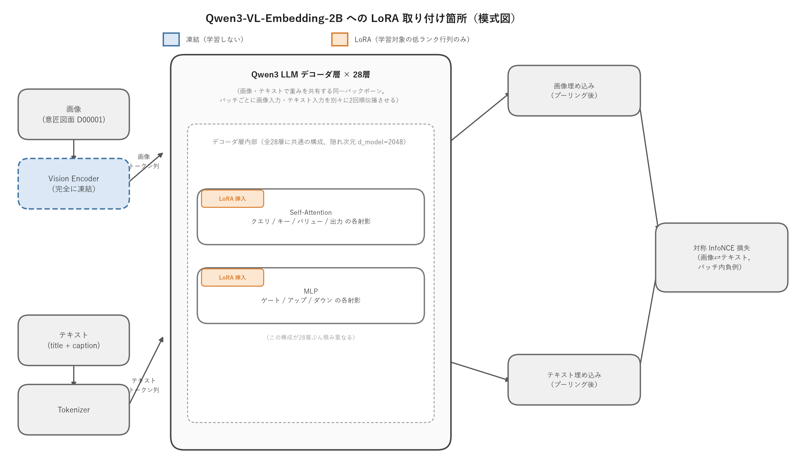
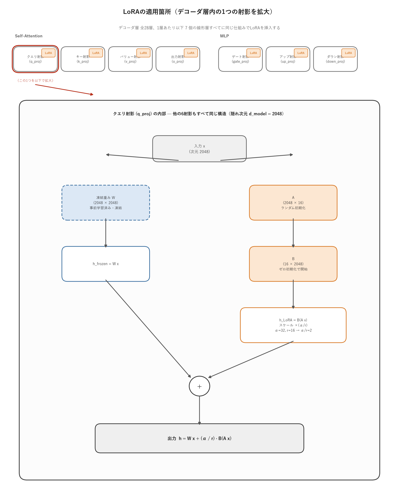
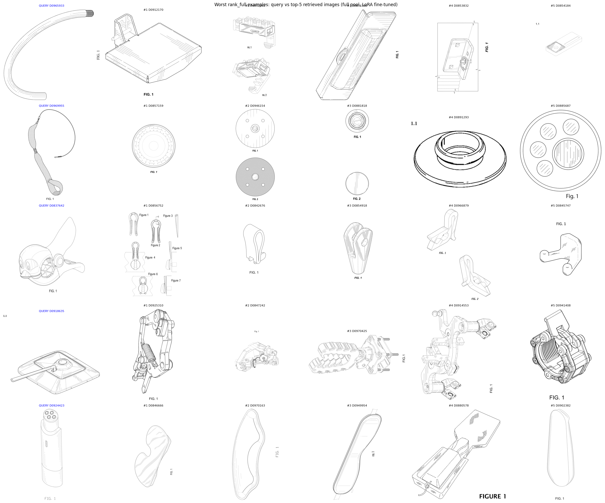
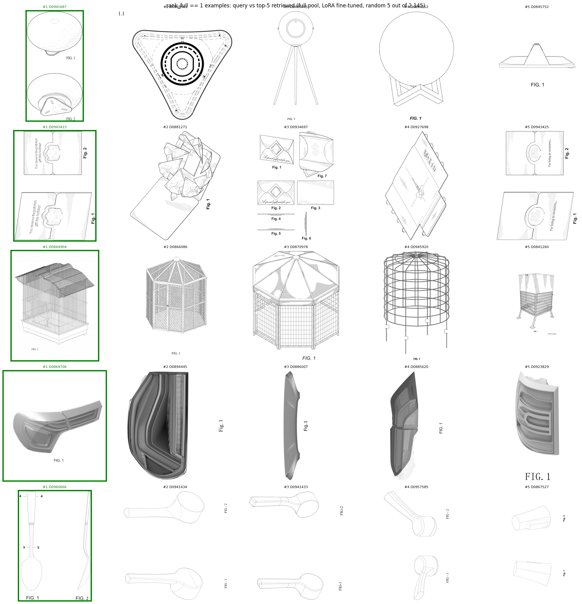
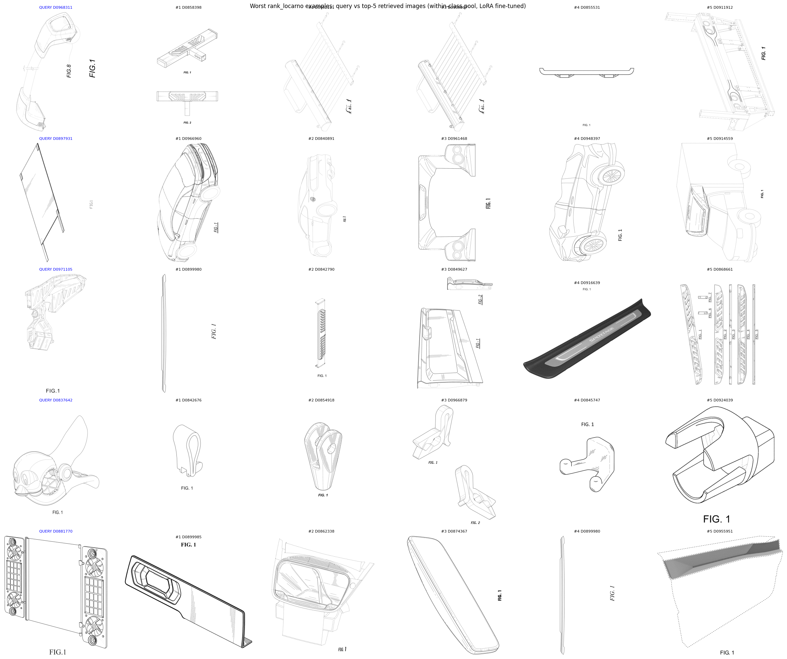
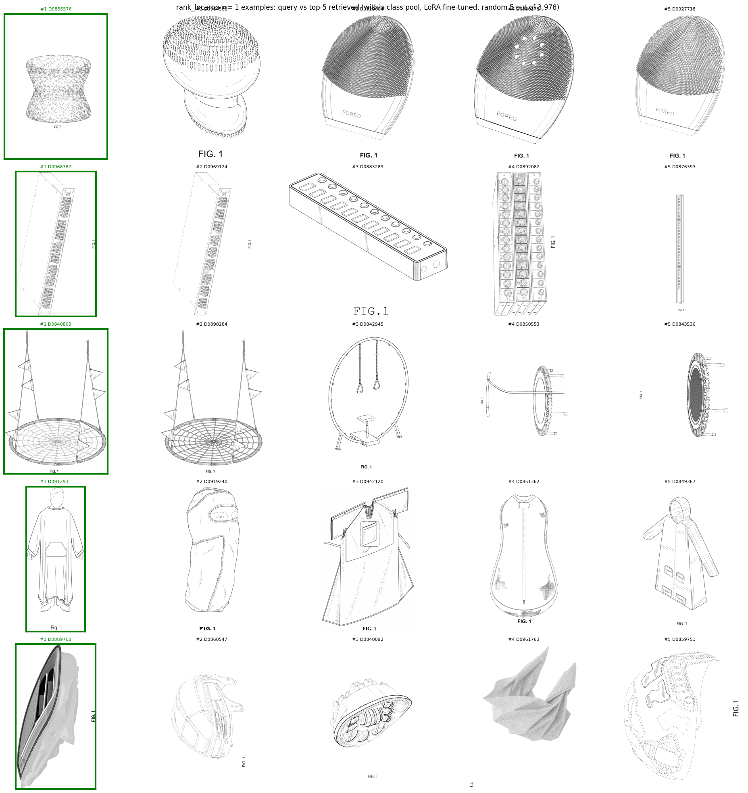

# 週次MTGレポート — 2026-07-23

## 背景・目標

デザイナーや審査官が本当に知りたいのは、タイトルの一致ではなく、**特定の機能・用途・使用文脈を持つ意匠がどのような形状として実現されているか**という形状と機能の対応関係である。

**→ 機能と形状の対応関係を埋め込み空間に学習させ、機能文をクエリとして形状画像を検索するシステムを実現したい。**

前回（7/16）の結果から、instructionの工夫だけではzero-shot性能の天井は低く、**学習によってこの形状↔機能の対応関係を明示的に教え込む必要がある**という結論に至った。今週はこれを実際に検証した。

---

## 1. 今週の結果

### 1-1. LoRAによる軽量ファインチューニングの効果検証

Qwen3-VL-Embedding-2Bをベースに、モデル全体のごく一部（言語側のattention・MLP層のみ、画像側のエンコーダは凍結）だけを低ランクで学習対象とする軽量な追加学習を実施した。

学習データと評価データは意図的に分離している。学習には、意匠固有の識別可能なcaptionを持つと判定された特許（フィルタ後データ）のうち2014-2018年分を使用し、評価はzero-shotベースラインと全く同じ2019-2022年のフィルタ後データ（n=39,843）・同じ評価条件を用いた。学習期間と評価期間に重なりがないため、この比較は**未見の年のデータに対する汎化性能**を見ていることになる。

#### 実験条件

| 項目 | 設定 |
| --- | --- |
| ベースモデル | Qwen3-VL-Embedding-2B |
| 学習対象 | 言語側バックボーンのattention（クエリ/キー/バリュー/出力の各射影）とMLP（ゲート/アップ/ダウンの各射影）へのLoRAのみ。画像側の視覚エンコーダは完全に凍結 |
| LoRAランク r / alpha / dropout | 16 / 32 / 0.05 |
| 学習データ | 2014-2018年、意匠固有の識別可能なcaptionを持つと判定された特許のみ（評価データの2019-2022年とは重複なし） |
| 評価データ | 2019-2022年、同条件で絞り込んだデータ（n=39,843、zero-shot評価と共通） |
| 学習ペア | 特許のtitle+captionをテキスト、表紙図面1枚を画像とするペア |
| 損失関数 | 対称InfoNCE（画像→テキスト・テキスト→画像の双方向、バッチ内負例） |
| InfoNCE温度 | 0.02 |
| バッチサイズ（学習時） | 4（2Bモデルのため小さめに設定。評価時のエンコードは32） |
| epoch数 | 3 |
| 学習率 | 1e-4（AdamW、更新するのはLoRAパラメータのみ） |
| 言語バックボーンの規模 | デコーダ層28層、隠れ次元2048 |

LoRAをモデルのどこに取り付けているかを図示すると以下の通り。画像とテキストは同じ重みを持つ1本の言語バックボーン（Qwen3のデコーダ層、全28層）にそれぞれ別々に入力され、各デコーダ層のattention（クエリ/キー/バリュー/出力の射影）とMLP（ゲート/アップ/ダウンの射影）にのみLoRAの低ランク行列を追加して学習する。画像側の視覚エンコーダおよびバックボーン本体の重みは完全に凍結したままである。

デコーダ層1層あたり、上記のattention側4種・MLP側3種、合わせて7個の線形層すべてに同じ仕組みでLoRAを挿入しており、これが28層ぶん繰り返される。その1つ（クエリ射影）を拡大すると以下の通り。

- 元の重み W（2048×2048、凍結・事前学習済みのまま）と並行して、低ランクの2つの行列 A（2048×16）・B（16×2048、学習対象）を新たに追加する。A はランダム初期化、B はゼロ初期化のため、**学習開始時点ではLoRA側の出力は必ずゼロになり、元のモデルの挙動を一切変えない状態からスタートする**。
- 出力は「元の重みによる計算結果」と「低ランク行列 A・B を通した計算結果（スケール α/r 倍）」の単純な足し算になる。今回は r=16、α=32 なのでスケールは2倍。
- 学習で更新されるのはこの A・B（各射影あたり2048×16と16×2048の小さな行列2つ）だけであり、7個の射影 × 28層 = 196箇所でこの仕組みが繰り返される。元の2Bパラメータ本体はどこも変更されない。

#### zero-shot vs LoRAファインチューニング後（2019-2022, フィルタ後, n=39,843）

| 手法 | プール | R@1 | R@5 | R@10 | R@50 | R@100 | MRR |
| --- | --- | --- | --- | --- | --- | --- | --- |
| zero-shot | 全件 | 2.542% | 5.958% | 7.893% | 14.090% | 17.574% | 4.409% |
| zero-shot | ロカルノ内 | 4.583% | 10.752% | 14.359% | 25.267% | 31.275% | 7.987% |
| LoRAファインチューニング後 | 全件 | 5.406% | 13.347% | 18.420% | 34.438% | 43.179% | 9.863% |
| LoRAファインチューニング後 | ロカルノ内 | 10.054% | 24.069% | 32.854% | 57.443% | 69.310% | 17.584% |

#### 分かったこと

1. **全指標でおおよそ2倍前後の改善**が見られた（全件R@1: 2.542%→5.406%、全件MRR: 4.409%→9.863%、ロカルノ内R@1: 4.583%→10.054%、ロカルノ内MRR: 7.987%→17.584%）。学習に使っていない年のデータでこの改善幅が出ていることから、instructionの調整では動かなかった性能の天井が、学習によって明確に押し上げられることが確認できた。
2. **改善幅は「全件プール」より「同一ロカルノクラス内プール」で顕著に大きい**（R@100で全件+25.6pt、ロカルノ内+38.0pt）。前回の定性分析で指摘した「同一カテゴリ内に酷似した製品バリエーションが多数存在し、text情報だけでは個体を一意に絞り込めない」という失敗パターンに対して、学習がまさにこの"紛らわしい候補同士の絞り込み"を強化する方向に効いていると考えられる。
3. 今回はLoRAによる軽量な学習・限定的な学習データ（5年分）・少ないepoch数という控えめな設定でこの改善が出ている。**学習方針自体の有効性は検証できた**ため、次はこの効果がどこまで伸びるか、また具体的にどのような失敗が解消されたのかを詰める段階に入る。

---

### 1-2. どういう意匠で検索が成功・失敗するか（LoRA後）

前回（7/16）行ったロカルノ大分類別の性能分析とクエリ単位の定性チェックを、LoRA後のモデルに対しても同じ条件で行い、zero-shotと比較した。

#### クラス別性能（zero-shotとの比較、代表クラス）

| クラス | 該当件数 | R@1（全件, zero-shot→LoRA） | R@1（同一クラス内, zero-shot→LoRA） |
| --- | --- | --- | --- |
| 12 輸送・運搬手段 | 4,597 | 1.44%→3.44%（2.4倍） | 2.15%→5.26%（2.4倍） |
| 24 医療・実験機器 | 3,454 | 1.45%→2.98%（2.1倍） | 2.69%→6.37%（2.4倍） |
| 08 工具・金物 | 3,318 | 1.66%→2.71%（1.6倍） | 2.86%→5.46%（1.9倍） |
| 13 電力生産・分配設備 | 1,589 | 1.57%→3.27%（2.1倍） | 3.34%→7.87%（2.4倍） |
| 19 文房具 | 201 | 3.48%→10.95%（3.1倍、最大改善率） | 13.93%→31.84%（2.3倍） |
| 01 食品 | 112 | 5.36%→10.71%（2.0倍） | 14.29%→25.89%（1.8倍） |
| 17 楽器 | 114 | 7.02%→10.53%（1.5倍、改善率は小さいが元々最高水準） | 10.53%→21.93%（2.1倍） |

#### 分かったこと

1. **難しいクラスの顔ぶれ自体はzero-shotから変わらない**（輸送・運搬手段、医療・実験機器、工具・金物、電力生産・分配設備が全件・同一クラス内の両方で下位グループのまま）。学習は全体を底上げしたが、クラス間の相対的な難易度構造そのものは変えていない。
2. **改善率はクラスによってばらつきがある。**最も難しいクラス群はおよそ2.0〜2.4倍の改善にとどまる一方、文房具や包装・容器のようなクラスは3倍を超える改善を示した。元々易しいクラスの方が学習の効果を出しやすい傾向が見える。
3. 前回、同一クラス内プールでの最下位候補として指摘した「クレーンタイアーム」「車輪」「車両ルーフ」「車両ボンネット」「触媒コンバーターケージ」（輸送・運搬手段クラス内4,597件中の下位1〜5位）は、今回はいずれも最下位5件から姿を消した。今回の最下位5件（ルーフラック用クロスバー、充電ポートカバー、カードアステップ、サンバイザー、車両修理用シート）は同クラス内で下位1,300〜1,500位付近まで改善しており、絶対的などん底からは脱している。ただし、**「同一カテゴリ内の近縁バリエーションを取り違える」という失敗パターン自体は解消されていない**。学習は個々の最悪事例を救ったが、パターンそのものは残存している。

#### 実際の検索結果の例（画像・テキスト）

前回と同様、「クエリ」はtitle・captionからなる**テキスト**であり、画像ではない。以下の画像はモデルがこのクエリ文に対して実際に返した上位5件（正解には緑枠）を並べたもので、外れ例の図では比較用の参考として、クエリに対応する正解の意匠画像を左端に青枠で添えている（この青枠画像自体は検索の入力ではない）。

##### 外れ例（全件プール、最も順位が悪かった5件）

**QUERY: D0965933「RVキャンピングカー用スライドアウト清掃アタッチメント」**（2022年・07 家庭用品(その他)、全件39,843件中の順位 = 38019）
caption: 画像は正方形の形をした、RVキャンピングカーのスライドアウト用清掃アタッチメントです。このアタッチメントの機能は、スライドアウト部分を清掃・維持し、汚れやゴミなどの堆積物を除去して良好な状態を保つことです。

上位5件:
1. D0912170「ウェイトラックアタッチメント」（2021年・21 遊戯具、玩具、テント、運動用具）— 画像は長方形の形をしたウェイトラックアタッチメントの図面で、そのデザインと構造を示すものです。
2. D0852082「ブレスレット用ロック部品」（2019年・11 装身具）— 画像は白色輪郭のブレスレット用ロック部品で、ブレスレットや腕時計バンドを手首に固定し外れるのを防ぎます。
3. D0876396「通信インターフェース用保護カバー」（2020年・14 記録、通信、情報検索機器）— 画像は白色の長方形で、通信インターフェースを埃や汚れなどの環境要因から保護します。
4. D0853832「ドアストッパー」（2019年・08 工具・金物）— 画像は正方形のドアストッパーで、ドアが強く閉まりすぎて損傷するのを防ぐ小さな器具です。
5. D0854184「分光分析用基板」（2019年・24 医療・実験機器）— 画像は正方形で白色の空の容器で、分光分析用のサンプルを保持するために設計されています。

**QUERY: D0969955「銃身洗浄具」**（2022年・22 武器、狩猟用品、rank_full = 36537）
caption: 画像は円形で銃身洗浄具を描いています。銃の銃身を清掃・維持し、汚れや残留物を除去することで、銃が効率的かつ安全に作動するようにする道具です。

上位5件:
1. D0857159「シャワーヘッド」（2019年・23 流体分配、衛生設備）— 画像は大きな円形で中央に穴があり、人の上から水を噴射するシャワーヘッドです。
2. D0946154「医療機器用電極」（2022年・24 医療・実験機器）— 画像は円形で、電気治療などの医療処置で身体に電気刺激を与える電極です。
3. D0881818「コネクタ用ダミーピン」（2020年・13 電力生産・分配設備）— 画像は円筒形の白色図面で、コネクタの正しい位置を示す仮置き部品として機能します。
4. D0891293「アイレット（鳩目）」（2020年・02 衣類・服飾雑貨）— 画像は円形で、布地にリングやフックを取り付けるための穴あき金属リングです。
5. D0885687「中空骨形状のドッグフィーディングボウル」（2020年・30 動物飼育用品）— 画像は円形で中空の骨形をした犬用給餌容器で、骨形状が遊び心を演出します。

**QUERY: D0837642「タオルクリップ」**（2019年・08 工具・金物、rank_full = 32193）
caption: 画像はタオルクリップの黒白図面です。タオル掛け棒やフックに取り付け、タオルをきちんと掛けて使いやすくするための器具で、クリップの形状はタオルをしっかり掴み棒から滑り落ちるのを防ぐよう設計されています。

上位5件:
1. D0842676「ハンドル」（2019年・08 工具・金物）— 画像は白色のハンドルで、扉や引き出しを開閉・移動する際の握り・支えとして使われます。
2. D0854918「締結具」（2019年・08 工具・金物）— 画像は中央に穴のある金属製の締結具で、ネジやボルトを所定の位置にしっかり固定します。
3. D0966879「マイクロクリップ物品」（2022年・08 工具・金物）— 画像はクリップの付いた椅子の白色図面で、本などをしっかり固定するクリップです。
4. D0845747「小物用ハンガー」（2019年・08 工具・金物）— 画像は黒白の小物用ハンガーで、衣類やアクセサリーなど小さな品物を整理・収納します。
5. D0924039「締結具締め込み用工具」（2021年・08 工具・金物）— 画像は湾曲したハンドルとまっすぐな先端を持ち、ネジを材料にしっかり締め込むための工具です。

**QUERY: D0918635「座席機構」**（2021年・06 家具調度品、rank_full = 31377）
caption: 画像は座席機構の図面で、車両や家具の一部です。ヒンジ・スプリングなど座席の調整・固定を可能にする内部構造・部品を示しており、エンジニアやデザイナー、保守担当者がこの部品を理解・作業できるよう視覚的に表現したものです。

上位5件:
1. D0925310「ワイヤーストレイナー」（2021年・08 工具・金物）— 画像はバネと金属フレームを組み合わせた形状のワイヤーストレイナーの黒白図面です。
2. D0847242「ロボット用関節駆動部材」（2019年・15 その他機械）— 画像は白色の長方形で、ロボット関節駆動部材の詳細図です。
3. D0970425「U字形工具」（2022年・12 輸送・運搬手段）— 画像はU字形工具の黒白図面で、ネジやナットなど複数の小物を保持・固定します。
4. D0914553「モーターグレーダー用ラジアルサドル」（2021年・12 輸送・運搬手段）— 画像は円と四角を組み合わせた形状のラジアルサドル図面です。
5. D0941408「サイドマグネット付きロッキングバーベルカラー」（2022年・21 遊戯具、玩具、テント、運動用具）— 画像はバーベルを固定し滑り・移動を防ぐロッキングバーベルカラーの3Dモデルです。

**QUERY: D0924423「アイマッサージャー」**（2021年・28 医薬品、化粧品、化粧用具、rank_full = 31300）
caption: 画像は長方形の図で、優しい圧力で目に快適さとリラックスを与える装置、アイマッサージャーのデザイン・形状を示したものです。

上位5件:
1. D0846666「エクササイズアシストプラットフォーム」（2019年・21 遊戯具、玩具、テント、運動用具）— 画像はハート形の白色図面で、各種エクササイズ時にサポート・補助を提供するプラットフォームです。
2. D0970163「ヒールグリップ」（2022年・02 衣類、服飾雑貨）— 画像は湾曲した白色図面で、足のかかと部分をサポート・グリップするための器具です。
3. D0949954「アイマスク」（2022年・16 写真、光学機器）— 画像は湾曲した黒白図面で、目を快適に保護するアイマスクです。
4. D0880578「フットサステインペダル用スタビライザー」（2020年・17 楽器）— 画像は長方形の白色輪郭図で、フットサステインペダルを安定・サポートします。
5. D0902382「呼気検出器」（2020年・24 医療・実験機器）— 画像は長方形の黒白図面で、呼気中のアルコール濃度を測定する装置です。

##### 正解例（全件プール、rank=1のうちランダム5件、n=2,145件中）

- **QUERY: Portable device with a triangular mounting plate**（計測・時計類）— caption: テーブルや壁などの平らな面にデバイスを固定するための三角形取付プレート付き携帯機器。→ rank=1。
- **QUERY: Interlocking gift card sleeve**（包装・容器）— caption: 猫の形をした、ギフトカードをコンパクトに収納・保護する紙製インターロッキングスリーブ。→ rank=1。次点にも同名の別特許が並ぶ激戦区だが正解している。
- **QUERY: Bird cage**（動物飼育用品）— caption: 屋根と側面を備えた小さな家のような形状の、鳥を安全に収容するワイヤー製鳥かご。→ rank=1。
- **QUERY: Rear light for a vehicle**（照明器具）— caption: 盾や鎧の一部のような湾曲した細長い形状の車両用リアライト。→ rank=1。次点も車両用テールライトやリアコンビネーションランプなど視覚的に近い照明部品。
- **QUERY: Flatware handle**（家庭用品）— caption: 円筒形をした、フォークやナイフなどの食器を握りやすくするためのハンドル。→ rank=1。

##### 外れ例（同一クラス内プール、最も順位が悪かった5件）

**QUERY: D0968311「ルーフラック用クロスバー」**（2022年・12 輸送・運搬手段、同一クラス内4,597件中の順位 = 3252）
caption: 画像は白色輪郭のルーフラック用クロスバーです。車両の屋根に水平に取り付けられ、自転車ラックやカーゴキャリアなど各種アクセサリーの安全な取付点を提供し、積載物の重量を屋根全体に均等に分散して車両構造への負担を防ぎます。

上位5件:
1. D0858398「車両用トレーラーヒッチステップ」（2019年・12 輸送・運搬手段）— 画像は段差構造を持つ白色の長方形のトレーラーヒッチステップ図面です。
2. D0952111「ウィンドシールドデアイサーハウジング出口プレート」（2022年・12 輸送・運搬手段）— 画像はデアイサーへの接続点となる平らな長方形部品の上面図です。
3. D0939067「ウィンドシールドデアイサーハウジング」（2021年・12 輸送・運搬手段）— 画像は長方形の上面図で、フロントガラスを氷雪の堆積から保護します。
4. D0855531「トラック用ステップ」（2019年・12 輸送・運搬手段）— 画像は白色輪郭のトラック用ステップで、乗降時の安定した足場を提供する金属バーです。
5. D0911912「リアボルスター」（2021年・12 輸送・運搬手段）— 画像は白色の金属構造の一部であるリアボルスターの図面です。

**QUERY: D0897931「自動車用充電ポートカバー」**（2020年・12 輸送・運搬手段、rank_locarno = 3236）
caption: 画像は充電ポートカバー付き車両の白色図面です。埃・破片・水分から充電ポートを保護し、バッテリー充電のため清潔かつ機能的な状態を保つ部品です。

上位5件:
1. D0966960「自動車後部（トイレプリカ含む）」（2022年・12 輸送・運搬手段）— 画像は長方形の自動車後部（玩具レプリカ等含む）の黒白図面です。
2. D0840891「フューエルドア」（2019年・12 輸送・運搬手段）— 画像は車のフューエルドアの黒白図面で、給油のため燃料タンクへのアクセスを提供します。
3. D0961468「ボンネット」（2022年・12 輸送・運搬手段）— 画像はボンネットの側面図で、エンジンを雨・雪・破片などから保護します。
4. D0948397「フェンダースカート」（2022年・12 輸送・運搬手段）— 画像は正方形で、車輪周りの下部を覆う保護カバー付きの車です。
5. D0914559「ウィンドフェアリング」（2021年・12 輸送・運搬手段）— 画像は平らな長方形のウィンドフェアリング図で、空力性能に寄与する部品です。

**QUERY: D0971105「車のドアステップ」**（2022年・12 輸送・運搬手段、rank_locarno = 3226）
caption: 画像は車のドアステップの黒白図面です。乗員の乗降時に支え・安定を提供し、ドアが急に閉まるのを防ぐ機能部品で、車が駐車中であることを示す視覚的な合図にもなります。

上位5件:
1. D0899980「車両用フロントディフューザー」（2020年・12 輸送・運搬手段）— 画像は湾曲し細長い形状の車両用フロントディフューザー図面で、前部の気流を制御し空気抵抗を減らします。
2. D0842790「車両用ステップバー」（2019年・12 輸送・運搬手段）— 画像は白色輪郭の長く細い湾曲したステップバーで、乗降時の追加サポートを提供します。
3. D0849627「車両用エンドゲート」（2019年・12 輸送・運搬手段）— 画像は長方形のエンドゲートで、車両とトレーラー・荷台の安定した接続を提供します。
4. D0916639「車両用ドアステッププレート」（2021年・12 輸送・運搬手段）— 画像は長方形で、乗降時に足場を提供し滑りを防ぎます。
5. D0868661「ランニングボード」（2019年・12 輸送・運搬手段）— 画像は白色のランニングボード（スケートボードの一種）図面です。

**QUERY: D0837642「タオルクリップ」**（2019年・08 工具・金物、rank_locarno = 3195）— 上記「外れ例（全件プール）」で既出のものと同一特許。全件プールでも同一クラス内プールでも下位に沈んでおり、クラスを問わず苦手な意匠であることが分かる。

**QUERY: D0881770「車両用サンバイザー」**（2020年・12 輸送・運搬手段、rank_locarno = 3113）
caption: 画像は正方形の車両用サンバイザーです。運転者・同乗者を直射日光から守りまぶしさを軽減する、多くの車両の安全機能の一つです。

上位5件:
1. D0899985「車両用インストルメントクラスター」（2020年・12 輸送・運搬手段）— 画像は長方形の車のダッシュボード部品の図面です。
2. D0862338「車両用フロントトランク」（2019年・12 輸送・運搬手段）— 画像は白色輪郭の、通常ボンネット下に位置する収納スペースです。
3. D0874367「リアビューデバイス」（2020年・12 輸送・運搬手段）— 画像は細長い長方形で、車両後方の視界を提供します。
4. D0899980「車両用フロントディフューザー」（2020年・12 輸送・運搬手段）— 上記と同一特許（#1に再掲）。
5. D0955951「車両用ドアパネル」（2022年・12 輸送・運搬手段）— 画像は白色の長方形のドアパネルで、車両ドアの構造部品です。

##### 正解例（同一クラス内プール、rank=1のうちランダム5件、n=3,978件中）

- **QUERY: Facial sponge**（医薬品・化粧品）— caption: 円形で質感のある、洗顔・角質除去用フェイシャルスポンジ。→ rank=1。次点にもフェイシャルスクラバーやスキンマッサージャーなど視覚的に近い美容器具が並ぶが正解している。
- **QUERY: Shuffle for connecting nodes in a direct interconnect network**（記録・通信機器）— caption: 番号付きボックスが並ぶ長方形の、ネットワークのノード接続用シャッフル装置。→ rank=1。次点にも同名の別特許が並ぶ激戦区。
- **QUERY: Web swing**（遊戯具・玩具・スポーツ用品）— caption: 円形プラットフォームにロープが取り付けられた蜘蛛の巣状のブランコ。→ rank=1。
- **QUERY: Blanket with sleeves, inside foot pockets and open back**（衣類・服飾雑貨）— caption: 袖・内側フットポケット・背面オープンを備えた、保温性と可動性を両立するブランケット。→ rank=1。**非常に珍しい製品名だが、視覚的特徴が明確なため正しく検索できた例。**
- **QUERY: Head light**（防火・救助用品）— caption: 夜間・低照度時の視認性向上のための車両照明システム部品、ヘッドライト。→ rank=1。

##### 最多クラス「12: 輸送・運搬手段」限定の傾向

クラス12（4,597件）だけに絞った場合の最下位5件は、上記の全クラス横断での外れ例とほぼ同じ顔ぶれ（ルーフラック用クロスバー、充電ポートカバー、カードアステップ、サンバイザーに加え、車両修理用シートが5位に入る）で、いずれも同クラス内で下位1,300〜1,500位付近にとどまる。前回指摘した最下位5件（クレーンタイアーム、車輪、車両ルーフ、車両ボンネット、触媒コンバーターケージ、いずれも下位1〜5位）は完全に姿を消しており、絶対的などん底の事例は解消された。一方、正解例（rank=1）はクラス12だけで242件（該当4,597件中5.3%）あり、タイヤ・ホイールリム・クラッチレンチなど**視覚的特徴が強く独自性の高い部品**では引き続き高精度に検索できている。

---

## 2. 今後やること

今週、「学習で形状↔機能の対応関係を教え込む」方針の有効性が定量的に確認でき、さらに定性分析から「改善は全体的な底上げであり、特定の失敗パターン（同一カテゴリ内の近縁バリエーション取り違え）自体は解消されていない」ことが分かった。次の一手は以下の通り。

1. **薄い線画に対して精度を上げるためのアプローチ**
   - 
2. **LoRAをより適切な箇所に挿入できないか？**
3. **複数図面を用いた学習の検討**
   - 今回は表紙図面1枚のみでの学習だったため、これを拡張した場合の効果は未検証。特に近縁バリエーション取り違えの解消には、複数視点による一意化が有効な可能性がある。

## 3. FB
2は今のままでいい．Attention層とMLP層に入れるのは普通．
1,3は続けて良い．1は先行研究にありそう．線の薄い濃いで精度に差が出るのは良くない．3は意匠特有なのでやってほしい．

先週メモ
   **失敗する理由をボトルネックの順番に分解すると：**

   1. モデルがその製品の画像と製品名の関係を理解していない
   2. データの性質上、類似製品画像が多すぎる。title+captionでは一意に決まらない
      - 同時期に同様の意匠が大量に出願されるケースがある
      - IMPACT内のcaptionが画像を一意に限定できるものではないケースがある
   3. 違う製品でも見た目が類似している（人間でも画像だけでは分からない）
      - 画像に製品を特定するだけの特徴が少ない（例：車両ルーフ、バンパー、エンジンフードなど）

   **対策案仮説：**

   4. モデルがその製品の画像と製品名の関係を理解していない
      - 学習時の工夫（学習データ／アーキテクチャ・アルゴリズム）
      - 検索（＝ベクトル化）時の工夫：Reasoningでどういう観点で推論すべきか考えさせ、captionを増強する案 → Reasoningにコストがかかるため見送り（✕）
   5. データの性質上、類似製品画像が多すぎる（title+captionでは一意に決まらない）→ 複数視点画像で対応できるか？
   6. 違う製品でも見た目が類似している → 複数視点画像で対応できるか？

---

作成: 2026-07-23
