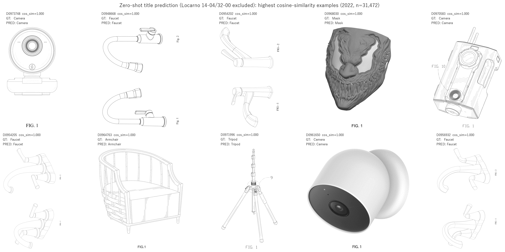
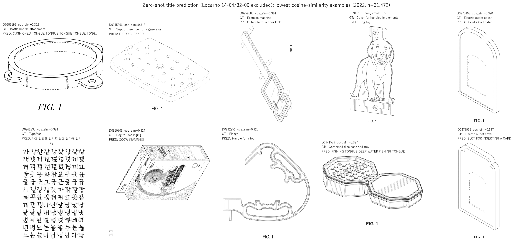
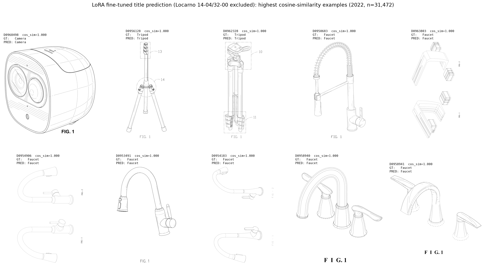
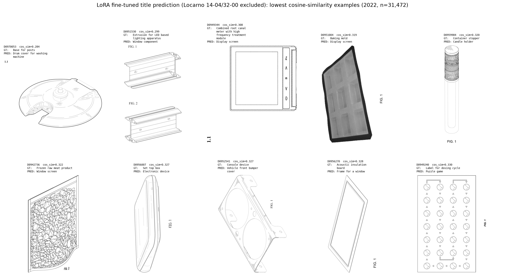

# 週次MTGレポート — 2026-07-30

## 背景・目標

前回まで「機能文に合う過去の意匠画像を検索する」検索システムを作っていたが，意匠にはニッチな工業製品が多く含まれており，汎用VLMがその概念を認識していないケースが散見された．これはVLMのEmbeddingモデルだけではなく，生成モデルとしてのVLMも同じ課題を持っていると考えられる．そこで，リサーチクエスチョンとして「どうやって汎用VLMに意匠に含まれるニッチな工業製品の形状の知識をつけさせるのが有効か」とおいて進めることにした．ユースケースが限られる検索システムよりも，「この製品画像は何か？」を生成する識別タスクとして進めるほうが，発展可能性（世界モデルやフィジカルAIの分野にも応用できるかもしれない）やユースケース（画像系のタスクになるので）が増えるのではないかと思ったため，「この製品画像は何か？」を生成する識別タスクとして進めることにした．

---

## 1. 今週の結果

### 1-1. ゼロショットでの意匠タイトル予測（2022年、GUI・アイコン意匠を除外）

意匠図面（表紙図面1枚のみ）をVLMに見せ、「この製品のタイトルは？」とだけ聞き、生成されたタイトル文字列を正解タイトルと埋め込みベースのコサイン類似度で比較した。few-shot例やヒントは一切与えていない。

本研究のねらいは、汎用VLMが知らない**ニッチな工業製品**の立体形状をAIに学習させることであり、GUI・画面アイコン意匠はそもそも物理的な立体形状を持つ工業製品ではないため、評価対象から除外している（Locarno国際分類 **14-04**「Screens and icons for interfaces」・**32-00**「Graphic symbols, logos, surface patterns, ornamentation」に該当する特許）。以下は特に断りがない限りこの除外後の数値。

#### 実験条件

| 項目 | 設定 |
| --- | --- |
| タイトル生成モデル | Qwen3-VL-4B-Instruct（zero-shot、学習なし） |
| 入力 | 表紙図面1枚のみ |
| プロンプト | 「このデザイン特許画像の製品タイトルは？タイトルのみを簡潔に答えよ」 |
| 評価データ | IMPACT 2022年、titleが存在する全件からLocarno 14-04・32-00（GUI・アイコン意匠）を除外（n=31,472、除外2,069件・6.2%） |
| 評価方法 | 予測titleと正解titleをそれぞれ埋め込み化し、ペアごとにコサイン類似度を算出（Qwen3-Embedding-0.6B使用） |

#### 精度結果

| 指標 | GUI除外後（n=31,472） | 参考: 除外前（n=33,541） |
| --- | --- | --- |
| コサイン類似度 平均 | 0.6512 | 0.6385 |
| コサイン類似度 中央値 | 0.6116 | 0.6028 |
| コサイン類似度 標準偏差 | 0.1501 | 0.1553 |
| 類似度 ≥ 0.8 の割合（ほぼ完全一致） | 18.1% | 17.0% |
| 類似度 ≥ 0.5 の割合（緩やかに関連） | 88.1% | 84.1% |

GUI・アイコン意匠は全体のわずか6.2%だが、除外すると類似度≥0.5の割合が84.1%→88.1%（+4.0pt）と、除外した件数の割合以上に伸びる。これはGUI意匠の予測がほぼ全て類似度0.5未満（＝完全に無関係な出力）に集中していたことを裏付けている。

#### 分かったこと

1. **完全一致（類似度=1.0）はいずれも視覚的に一意で日常的に見慣れた製品だった。** 上位10件は「Faucet（蛇口）」4件、「Camera（カメラ）」3件、「Mask」「Armchair」「Tripod」各1件で、いずれも予測titleが正解titleと文字列レベルで完全一致していた。GUI除外前と同じ傾向で、視覚的特徴が強く一般的な製品カテゴリでは高精度が出る。

   

2. **GUI意匠を除いても下位10件はやはり深刻に外れている（類似度0.30〜0.33）が、内容は物理製品らしい"見た目からの誤認"が中心になった。** 「Exercise machine」を鍵のような形状から「Handle for a door lock」と誤認、「Cover for handled implements」（犬の形をした部品カバー）を素直に「Dog toy」と誤認、「Flange」を「Handle for a tool」と誤認するなど、形状は捉えているが正しい製品カテゴリ名に結び付けられていない例が多い。「Electric outlet cover」が2件連続で下位に入っており、この製品は形状から特定しづらい定番の苦手カテゴリだと分かる。

   

3. **GUI意匠で見られた崩壊パターン（画面内テキストの転記・多言語応答・デコード退化）は、GUIに限らず「密な印刷・グラフィック内容を含む意匠」全般で再発している。** 「Typeface（書体）」の正解に対し、画像内に並ぶハングル文字グリッドをそのまま読み上げるように韓国語の意味不明な文字列を出力（"가장 간결한 감각의..."）、「Bag for packaging」（商品パッケージの印刷モックアップ）に対して中国語の宣伝文句らしき文字列（"COOW 超感温設計"）を出力、「Bottle handle attachment」「Combined dice case and tray」では同一単語（"TONGUE"）を連呼するデコード退化が発生している。TypefaceのようなカテゴリはGUIと同様に**物理的な立体形状を持たない2D意匠**であり、除外基準をさらに広げる余地がありそうだ。

### 1-2. 意匠タイトル予測に特化したファインチューニング（学習途中の暫定チェックポイントで評価）

zero-shotベースラインに対し、同じ画像→タイトル予測タスクに特化して追加学習したモデルを、**全く同一のテストデータ・同一の評価方法**で比較した。学習データはIMPACT 2007-2021年（GUI・アイコン除外後）で、検証データを分離して検証lossが改善する限り学習を続ける設計にしている。

**注意: 今回評価に使ったのは学習が収束する前の、ごく初期段階（1エポック目の途中）で区切った暫定チェックポイントである。** 最終的な効果を見るには学習を最後まで進めた上での再評価が必要だが、傾向を先に見るために暫定チェックポイントでの数値を記録しておく。

#### 精度結果（GUI除外後、n=31,472、zero-shotと同一テストセット）

| 指標 | zero-shot | タイトル特化ファインチューニング（学習途中） |
| --- | --- | --- |
| コサイン類似度 平均 | 0.6512 | 0.6667 |
| コサイン類似度 中央値 | 0.6116 | 0.6197 |
| コサイン類似度 標準偏差 | 0.1501 | 0.1629 |
| 類似度 ≥ 0.8 の割合 | 18.1% | 22.2% |
| 類似度 ≥ 0.5 の割合 | 88.1% | 88.5% |

#### 分かったこと

1. **学習のごく初期段階でも、すでにzero-shotを上回る方向のシグナルが出ている。** 平均コサイン類似度が+0.0155、ほぼ完全一致とみなせる類似度≥0.8の割合が18.1%→22.2%（+4.1pt）向上した。汎用VLMがニッチな工業製品名を知らないという当初の仮説に対し、タイトルに特化した追加学習が有効に働きうる方向性を示している。
2. **改善は「ほぼ完全一致」帯に偏っている。** 類似度≥0.5の割合はほぼ変化していない（88.1%→88.5%）一方、≥0.8の割合は明確に伸びており、zero-shotでもある程度当てられていた製品カテゴリをより正確に言い当てられるようになった可能性が高い。逆に、zero-shotが根本的に外していた製品カテゴリへの効果は、この段階ではまだ見えていない。
3. **ばらつき（標準偏差）はわずかに増加している**（0.1501→0.1629）。学習がまだ収束していない過渡的な段階であるため、収束後にこのばらつきがどう変化するか（縮小するのか、特定カテゴリへの過学習で悪化するのか）を追う必要がある。
4. **上位10件はzero-shotと同じ顔ぶれ（カメラ・三脚・蛇口など視覚的に一意な製品）で維持されている一方、下位10件の誤答の性質が変化している。** zero-shotの下位例で見られた画面内テキストの転記・多言語応答・同一単語の連呼といった生成の破綻は見られなくなり、代わりに「もっともらしいが違う」自然な誤答（根管治療器や焼き型を"ディスプレイ画面"と誤認、支柱の土台を"洗濯機のドラムカバー"と誤認、など）に置き換わった。特に"ディスプレイ画面"という同一の予測が下位10件中2件で重複しており、自信のない入力に対して学習データ中の頻出カテゴリに引っ張られる傾向が新たに生じている可能性がある。

#### 定性チェック（類似度が高い例・低い例）

**類似度が高い上位10件**

| id | title | pred_title | cos_sim |
| --- | --- | --- | --- |
| D0968498 | Camera | Camera | 1.000 |
| D0956128 | Tripod | Tripod | 1.000 |
| D0962328 | Tripod | Tripod | 1.000 |
| D0950683 | Faucet | Faucet | 1.000 |
| D0963803 | Faucet | Faucet | 1.000 |
| D0954906 | Faucet | Faucet | 1.000 |
| D0953491 | Faucet | Faucet | 1.000 |
| D0954183 | Faucet | Faucet | 1.000 |
| D0958940 | Faucet | Faucet | 1.000 |
| D0958941 | Faucet | Faucet | 1.000 |

**類似度が低い下位10件**

| id | title | pred_title | cos_sim |
| --- | --- | --- | --- |
| D0970053 | Base for posts | Drum cover for washing machine | 0.284 |
| D0951530 | Extrusion for LED based lighting apparatus | Window component | 0.299 |
| D0949344 | Combined root canal meter with high frequency treatment module | Display screen | 0.308 |
| D0951004 | Baking mold | Display screen | 0.319 |
| D0959984 | Container stopper | Candle holder | 0.320 |
| D0942736 | Frozen raw meat product | Window screen | 0.322 |
| D0956007 | Set top box | Electronic device | 0.327 |
| D0952541 | Console device | Vehicle front bumper cover | 0.327 |
| D0956270 | Acoustic insulation board | Frame for a window | 0.328 |
| D0949240 | Label for dosing cycle | Puzzle game | 0.330 |

---

## 2. 今後やること

1. 学習データとテストデータを複数視点で使う．

---

作成: 2026-07-30
