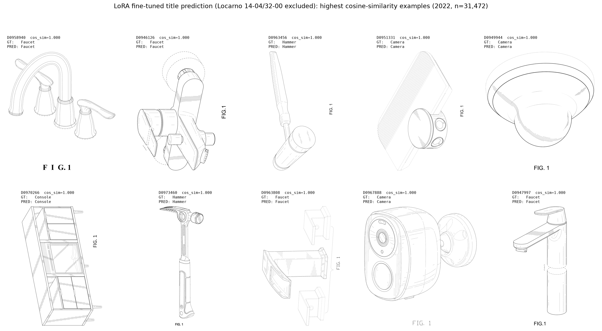
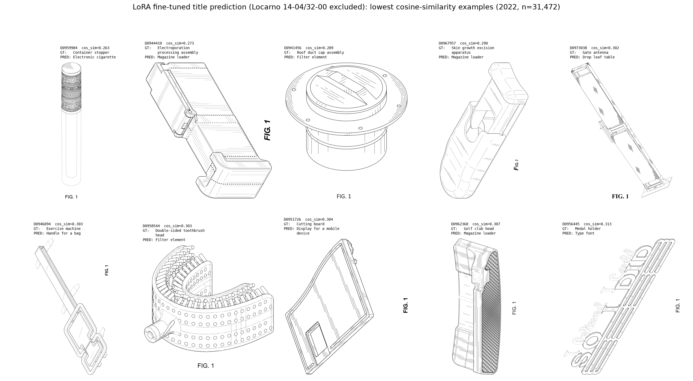
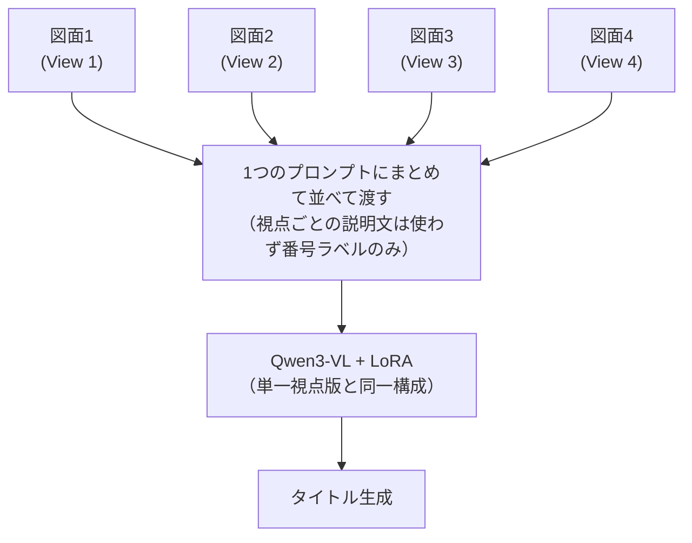
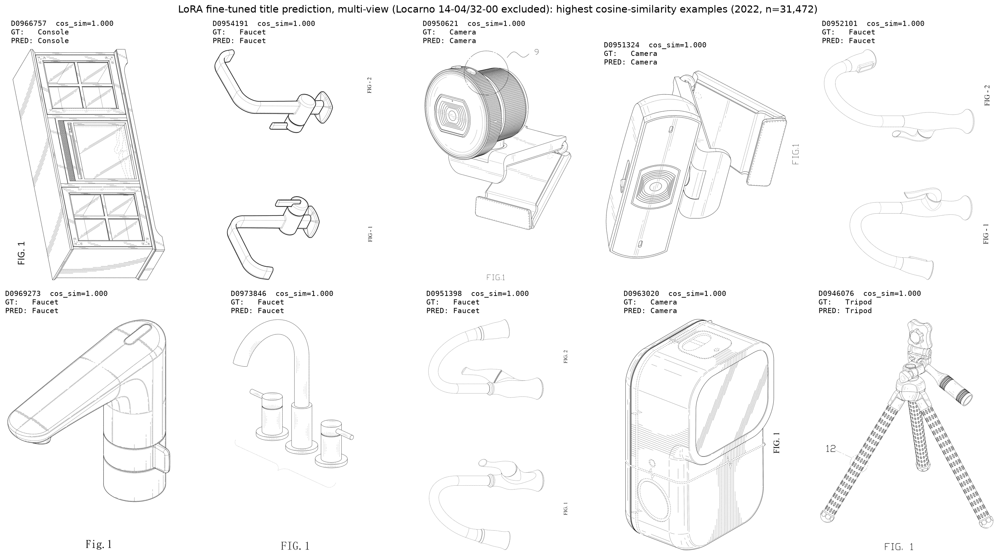
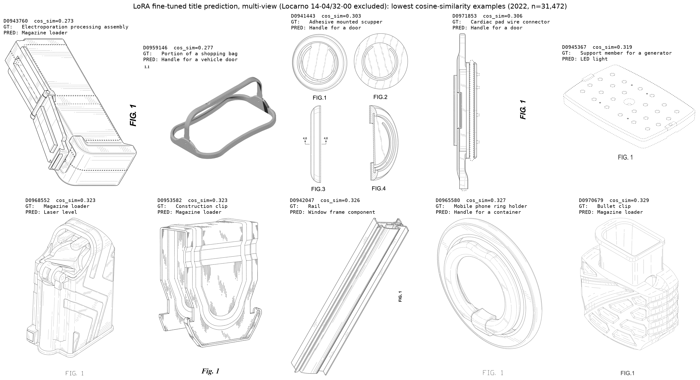

# 週次MTGレポート — 2026-08-06

## 背景・目標

前回（7/30）、意匠タイトル予測に特化したLoRAファインチューニングを開始し、学習ごく初期の暫定チェックポイントでzero-shotベースラインを上回る方向のシグナルを確認した。今週は学習データを2021年単年に絞って最後まで学習を完了させ、zero-shotとの最終比較を行った。続けて、表紙図面1枚だけでなく同一特許の複数図面（最大4枚）を同時に見せてタイトルを予測させる拡張実験も学習・評価まで完了させ、単一視点との比較を行った。

---

## 1. 今週の結果

### 1-1. 意匠タイトル予測に特化したファインチューニング（学習完了後の最終結果）

zero-shotベースラインと全く同一のテストデータ・評価方法で、意匠タイトル予測に特化して最後まで学習したモデルを比較した。

**注意:** 今回の評価は画像解像度に上限をかけた条件で実行しており、zero-shot評価（解像度上限なし）とは厳密には同一条件ではない。ただし意匠図面は線画中心で情報量が少なく、解像度差が精度比較に与える影響は小さいとみている。

#### 実験条件

| 項目 | 設定 |
| --- | --- |
| モデル | Qwen3-VL-4B-InstructをLoRAでファインチューニング（画像→タイトル生成） |
| 学習データ | IMPACT 2021年、GUI・アイコン除外後の全件から10%を検証用に分離 |
| 学習状態 | 検証lossに基づくアーリーストッピング（step単位でチェック）付きで最後まで学習完了 |
| テストデータ・評価方法 | zero-shotと完全に同一（2022年、GUI・アイコン除外後 n=31,472、コサイン類似度） |

#### 精度結果（GUI除外後、n=31,472、zero-shotと同一テストセット）

| 指標 | zero-shot | タイトル特化ファインチューニング（学習完了後） |
| --- | --- | --- |
| コサイン類似度 平均 | 0.6512 | 0.6959 |
| コサイン類似度 中央値 | 0.6116 | 0.6509 |
| コサイン類似度 標準偏差 | 0.1501 | 0.1733 |
| 類似度 ≥ 0.8 の割合 | 18.1% | 28.2% |
| 類似度 ≥ 0.5 の割合 | 88.1% | 90.0% |

#### 分かったこと

1. **学習完了後は、前回の暫定チェックポイント時点よりもさらに大きくzero-shotを上回った。** 平均コサイン類似度は+0.0447（前回の暫定時点では+0.0155）、ほぼ完全一致とみなせる類似度≥0.8の割合は18.1%→28.2%（+10.1pt、前回の暫定時点では+4.1pt）まで伸びており、学習を最後まで進めたことの効果がはっきり出た。
2. **改善は依然として「ほぼ完全一致」帯に偏っている。** 類似度≥0.5の割合はほぼ変化していない（88.1%→90.0%、+1.9pt）一方、≥0.8の割合は10pt以上伸びており、zero-shotである程度当てられていた製品カテゴリをより正確に言い当てられるようになった、という前回確認した傾向が学習完了後も一貫して見られる。
3. **前回懸念していた「誤答が頻出カテゴリに引っ張られる」傾向が、学習完了後により明確に現れている。** 下位10件の誤答のうち3件（"Electroporation processing assembly"・"Skin growth excision apparatus"・"Golf club head"という、互いに無関係な3種類の正解に対して）が揃って"Magazine loader"という同一の誤答になっている。前回（暫定チェックポイント時点）は同一誤答の重複が2件（"Display screen"）だったのに対し、学習が進むほどこの頻度バイアスが強まっている可能性がある。

#### 定性チェック（類似度が高い例・低い例）

**類似度が高い上位10件**

| id | title | pred_title | cos_sim |
| --- | --- | --- | --- |
| D0958940 | Faucet | Faucet | 1.000 |
| D0946126 | Faucet | Faucet | 1.000 |
| D0963456 | Hammer | Hammer | 1.000 |
| D0951331 | Camera | Camera | 1.000 |
| D0949944 | Camera | Camera | 1.000 |
| D0970266 | Console | Console | 1.000 |
| D0973460 | Hammer | Hammer | 1.000 |
| D0963808 | Faucet | Faucet | 1.000 |
| D0967888 | Camera | Camera | 1.000 |
| D0947997 | Faucet | Faucet | 1.000 |

**類似度が低い下位10件**

| id | title | pred_title | cos_sim |
| --- | --- | --- | --- |
| D0959984 | Container stopper | Electronic cigarette | 0.263 |
| D0944410 | Electroporation processing assembly | Magazine loader | 0.273 |
| D0941456 | Roof duct cap assembly | Filter element | 0.289 |
| D0967957 | Skin growth excision apparatus | Magazine loader | 0.290 |
| D0973038 | Gate antenna | Drop leaf table | 0.302 |
| D0946094 | Exercise machine | Handle for a bag | 0.303 |
| D0958544 | Double-sided toothbrush head | Filter element | 0.303 |
| D0951726 | Cutting board | Display for a mobile device | 0.304 |
| D0962368 | Golf club head | Magazine loader | 0.307 |
| D0956445 | Medal holder | Type font | 0.313 |

### 1-2. 複数視点拡張の結果

上記の結果を受けて、表紙図面1枚だけでなく同一特許の複数の図面（正面・上面・斜視図など、最大4枚程度）を同時に見せてタイトルを予測させた場合に精度が上がるかを検証した。学習の枠組み（LoRA構成・損失・アーリーストッピング・評価方法）は単一視点版と完全に揃え、「入力する図面の枚数」だけを変えた効果を切り出せるようにしている。視点間で情報をやり取りする専用の仕組みはあえて導入せず、複数枚の図面をそのまま並べて見せるだけという最も素朴な拡張から試した。

視点間の関連付けは、クロスビュー注意機構のような専用モジュールを新設するのではなく、モデルが元々持つ自己注意機構に委ねている。単一視点版との違いは「並べる画像の枚数」だけで、モデル構造・学習方法は完全に同一。

設計段階で1つ重要な注意点が見つかった。各図面には向きを説明する短い文（「〜の正面斜視図」等）がデータに付随しており、これを視点情報としてそのまま与えると、その説明文に対象物の名称がほぼそのまま含まれてしまっているケースが多いことが分かった（例:「〜のデータリーダーの斜視図」）。予備実行でこの説明文を含めたところ、精度指標が現実的でない水準まで跳ね上がり、画像を見なくてもテキストから答えを丸写しできてしまう構造になっていたことを確認した。現在はこの説明文を使わず、「何枚目の図面か」という中身のない番号だけを添える設計に修正し、学習をやり直している段階。

学習・評価に使う複数図面入りの元データのアップロードが完了し次第、修正版での学習・評価を実行する。

#### 精度結果（GUI除外後、n=31,472、zero-shot・単一視点LoRAと同一テストセット）

| 指標 | zero-shot | 単一視点LoRA | 複数視点LoRA |
| --- | --- | --- | --- |
| コサイン類似度 平均 | 0.6512 | 0.6959 | 0.7147 |
| コサイン類似度 中央値 | 0.6116 | 0.6509 | 0.6820 |
| コサイン類似度 標準偏差 | 0.1501 | 0.1733 | 0.1740 |
| 類似度 ≥ 0.8 の割合 | 18.1% | 28.2% | 31.7% |
| 類似度 ≥ 0.5 の割合 | 88.1% | 90.0% | 91.8% |

#### 分かったこと（複数視点拡張）

1. **複数視点にすることで単一視点をさらに上回った。** 平均コサイン類似度は単一視点の0.6959から0.7147へ、ほぼ完全一致とみなせる類似度≥0.8の割合は28.2%から31.7%（+3.5pt）まで伸びており、zero-shotからの改善幅（+13.6pt）の一部を複数視点化がさらに積み増す形になった。
2. **単一視点で見られた「改善は≥0.8帯に偏る」傾向とは異なり、今回は≥0.5帯（90.0%→91.8%）も一定伸びている。** 複数の図面から総合的に判断できるようになったことで、単一視点では類似度0.5未満まで外していたケースの一部を救えるようになった可能性がある。
3. **一方で、単一視点で確認された「誤答が頻出カテゴリに引っ張られる」傾向は複数視点でも解消していない。** 下位10件のうち3件（"Electroporation processing assembly"・"Construction clip"・"Bullet clip"という、互いに無関係な正解に対して）が揃って"Magazine loader"という同一の誤答になっており、単一視点の学習完了時点（3件が"Magazine loader"に集中）とほぼ同じ頻度バイアスが残っている。視点数を増やしても、この種の頻出カテゴリへの引っ張られは改善しないパターンのようだ。

**類似度が高い上位10件**

| id | title | pred_title | cos_sim |
| --- | --- | --- | --- |
| D0966757 | Console | Console | 1.000 |
| D0954191 | Faucet | Faucet | 1.000 |
| D0950621 | Camera | Camera | 1.000 |
| D0951324 | Camera | Camera | 1.000 |
| D0952101 | Faucet | Faucet | 1.000 |
| D0969273 | Faucet | Faucet | 1.000 |
| D0973846 | Faucet | Faucet | 1.000 |
| D0951398 | Faucet | Faucet | 1.000 |
| D0963020 | Camera | Camera | 1.000 |
| D0946076 | Tripod | Tripod | 1.000 |

**類似度が低い下位10件**

| id | title | pred_title | cos_sim |
| --- | --- | --- | --- |
| D0943760 | Electroporation processing assembly | Magazine loader | 0.273 |
| D0959146 | Portion of a shopping bag | Handle for a vehicle door | 0.277 |
| D0941443 | Adhesive mounted scupper | Handle for a door | 0.303 |
| D0971853 | Cardiac pad wire connector | Handle for a door | 0.306 |
| D0945367 | Support member for a generator | LED light | 0.319 |
| D0968552 | Magazine loader | Laser level | 0.323 |
| D0953582 | Construction clip | Magazine loader | 0.323 |
| D0942047 | Rail | Window frame component | 0.326 |
| D0965580 | Mobile phone ring holder | Handle for a container | 0.327 |
| D0970679 | Bullet clip | Magazine loader | 0.329 |

---

## 2. 今後やること

* 複数視点にしても解消しなかった「頻出カテゴリへの誤答の引っ張られ」を軽減する方法を検討する（学習データの誤答傾向の分析、クラス不均衡への対処など）
* Geminiなど最新の汎用AIとタイトル予測精度を比較する

## 3. FB
* タイトル予測もやる意味あるけど，既存のベンチマークを上げる方がイメージに合う．続けていいんじゃないかな．Geminiとか最近のAIと比べたい．
---

作成: 2026-08-06
