# 週次MTGレポート — 2026-08-27

## 背景・目標

前回構築した「見た目が紛らわしい製品を見分ける4択ベンチマーク」について、Qwenに加えて，GPT-5での評価結果を得た。ローカルでファインチューニングしたモデルとの比較で、汎用APIモデルがどこまで通用するかを確認する。

---

## 1. 今週の結果

### 1-1. 最新の汎用マルチモーダルAIによるゼロショット評価

Qwenの評価と同一のテストセット・同一の設問形式（意匠図面1枚＋4択から記号で回答）で、より高性能な汎用マルチモーダルAI（GPT-5）にも解かせた。ファインチューニングは一切行わず、ゼロショットでの評価。

#### 正答率比較

| モデル | 評価件数 | 正答率 | 標準誤差 |
| --- | --- | --- | --- |
| Qwen（ゼロショット） | 31,470（全件） | 54.84% | ±0.28% |
| Qwen（タイトル特化ファインチューニング後） | 31,470（全件） | 56.36% | ±0.28% |
| GPT-5（ゼロショット） | 1,000 | 59.1% | ±1.55% |

標準誤差は二項比率の標準誤差（$\sqrt{p(1-p)/n}$）。95%信頼区間はおよそ標準誤差の2倍幅。

#### 分かったこと

1. **GPT-5はゼロショットのまま、Qwenのファインチューニング後モデルより高い正答率だった。** タイトル特化のファインチューニングによる+1.5ptの向上（54.84%→56.36%）よりも大きな差（Qwenファインチューニング後比+2.7pt、Qwenゼロショット比+4.3pt）が、モデルを変えるだけで得られている。
2. ただし評価件数はGPT-5が1,000件、Qwenが全件（31,470件）と異なるため、単純比較には幅を持たせて見る必要がある。1,000件時点の統計的な誤差幅はおよそ±3ポイント程度で、この差は誤差の範囲を超えている可能性が高いが、確定的な結論にはより多くの件数での確認が望ましい。

### 1-2. ベンチマークの難化と、より厳密な比較条件での再評価

GPT-5がゼロショットのままQwenのファインチューニング後モデルを上回ったことで、上記のベンチマーク（4択）は最先端モデルにとって易しすぎることが判明した。学術的に意味のある評価にするため、以下の見直しを行った。

- 選択肢数を4択→8択に増やし、誤答の同義語除外基準もより厳しくして難化
- モデル間の比較がフェアになるよう、画像の解像度をAPIモデル側のコスト制約に合わせて統一
- 生成方式を決定的な設定に統一し、結果の再現性を確保

この新しい条件でQwenとGPT-5を再評価した結果は以下の通り。

#### 正答率比較（8択・難化後）

| モデル | 評価件数 | 正答率 | 標準誤差 |
| --- | --- | --- | --- |
| Qwen（ゼロショット） | 31,470（全件） | 41.94% | ±0.28% |
| Qwen（タイトル特化ファインチューニング後） | 31,470（全件） | 43.80% | ±0.28% |
| GPT-5（ゼロショット） | 1,000 | 51.0% | ±1.58% |

Qwenのファインチューニングによる差分: +1.86pt。GPT-5とQwenファインチューニング後の差分: +7.2pt。

#### 分かったこと

1. **難化により正答率は大きく下がった**（4択の54.84%→8択の41.94%）。狙い通りタスクが難しくなっている。
2. **ファインチューニングによる改善幅はむしろ拡大した**（4択の+1.52pt→8択の+1.86pt）。タスクを難化したことで、ファインチューニングの効果がより見えやすくなった可能性がある。正答率に伸びしろが残っている難しいタスクの方が、学習の効果を測る評価として適していることを示唆している。
3. **画像の解像度・生成方式を揃えたより厳密な条件でも、GPT-5がQwenのファインチューニング後モデルを上回る傾向は再現された**（51.0% vs 43.80%、+7.2pt）。1,000件時点の標準誤差（±1.58%）を踏まえても、この差は誤差の範囲を超えている可能性が高い。1-1で見られた差（比較条件が揃っていなかった時点のもの）が、条件を揃えても消えなかったことになる。

---

## 2. 今後やること

1. Qwenを事後学習することでGPT-5 ゼロショットの精度を超える方向
   1. 今のSFTの教師は（画像（正面図），タイトル） 
   2. 学習の際に画像ごとに注目する箇所を選択できないか．
      1. 学習データでもベンチマークを作って，正例・負例で学習
2. GPT-5の正誤分析，どういう間違え方をしているのか．合っているのにはどういう特徴があるか調べる．
---

## 3. FB

1. **メインカンファレンスを狙うなら評価軸をより抽象化すべき。** ベンチマークがマルチモーダルVLMの「何の能力」を測っているのかを明確にする必要がある。細かい違いを見分けられることがどういう意味を持つのか、先行研究がどう位置づけているかを早い段階で調べておくべき。
2. **事後学習（対照学習など）で識別能力が上がった場合に、他のどんな能力の向上が期待できるかを事前に当たりをつけておく。** 意匠データの識別能力だけが上がり、他の能力は変わらない・むしろ低下するという結果では、研究としてのインパクトが弱い。
3. **VLMの根本的な能力不足の議論に回収する。** 人間なら製品の違いを見極めてすんなり判断できるのに、VLMはどんな能力が欠けているためにそれができないのか、という形に落とし込みたい。
4. **単なる意匠識別精度の向上だけだとindustry trackっぽく見えてしまう。** メインカンファレンスを狙うなら、VLMの本質的な限界の議論に接続する必要がある。

次のアクション: VLMの能力の限界・弱点に関する先行研究を調査する。

## 付録: 8択ベンチマークの例題

8択・しきい値0.70版の実例を2問示す。画像は左が正解、続く7枚が誤答（DINOv2の画像埋め込みによる見た目の類似度が高い順）。

### 例題1（ID: D0949851）

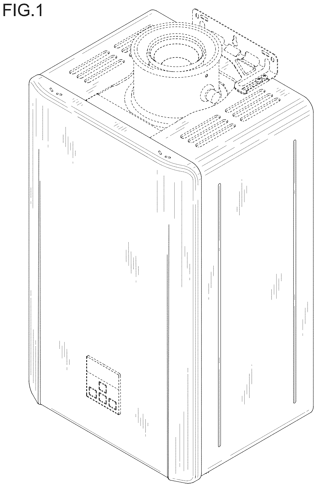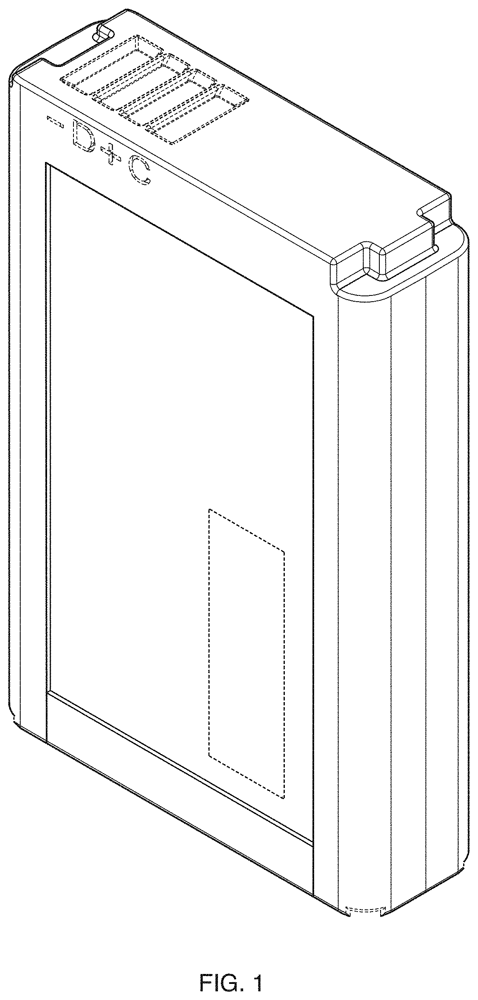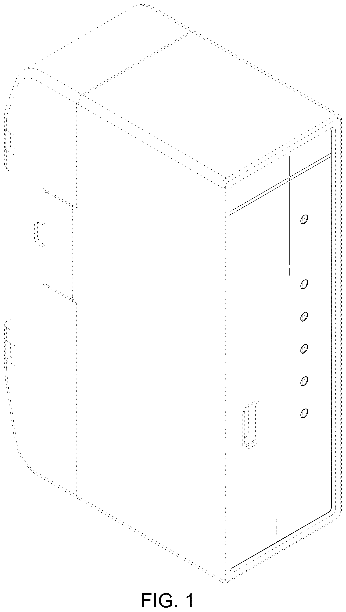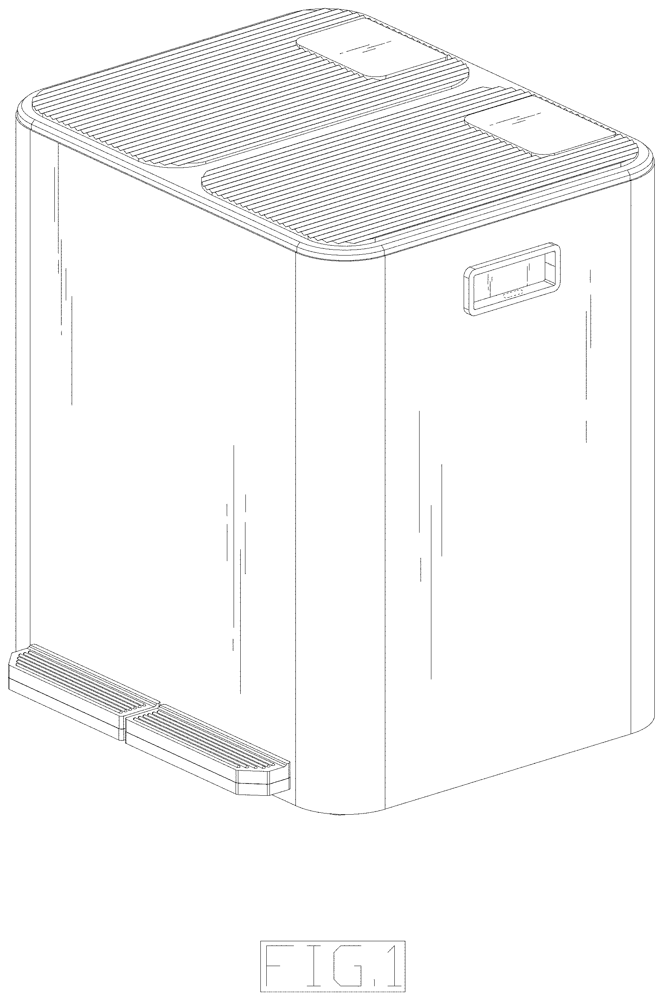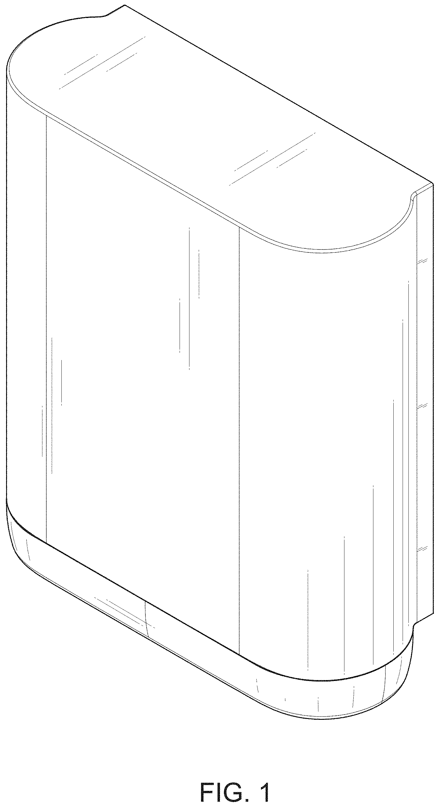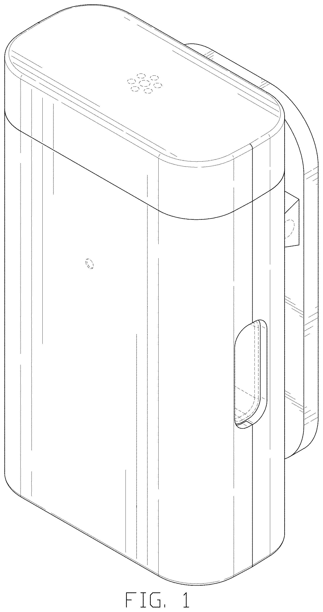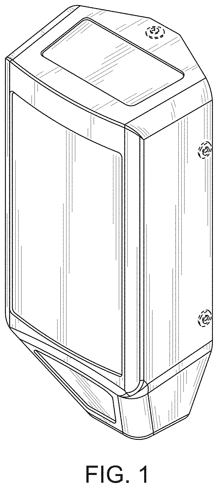

1. **Data reader（正解）**
2. Water heater（類似度0.80）
3. Battery pack（類似度0.75）
4. Data output interface（類似度0.75）
5. Step trash can（類似度0.75）
6. Towel dispenser（類似度0.74）
7. Microphone emitter（類似度0.74）
8. Modular radio enclosure（類似度0.74）

見た目のジャンル（データリーダー・給湯器・バッテリーパック・ゴミ箱・タオルディスペンサーなど）はバラバラだが、シルエットはどれも同じような箱型の直方体で、画像だけでは区別が難しい。

### 例題2（ID: D0971479）

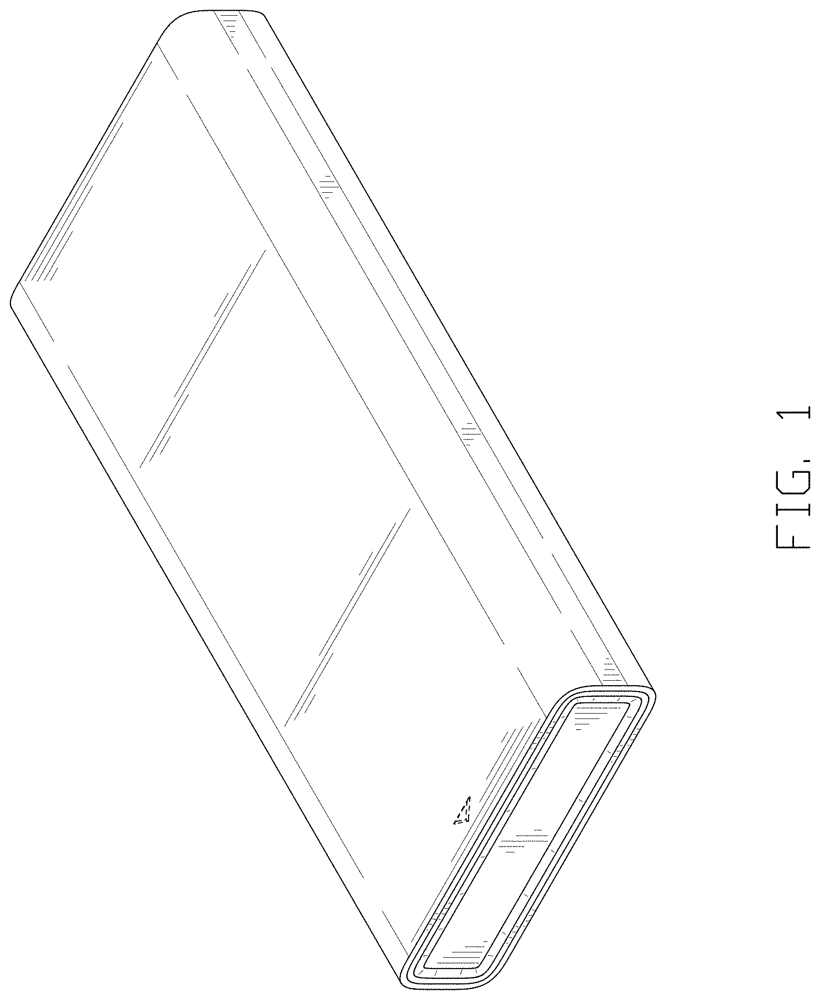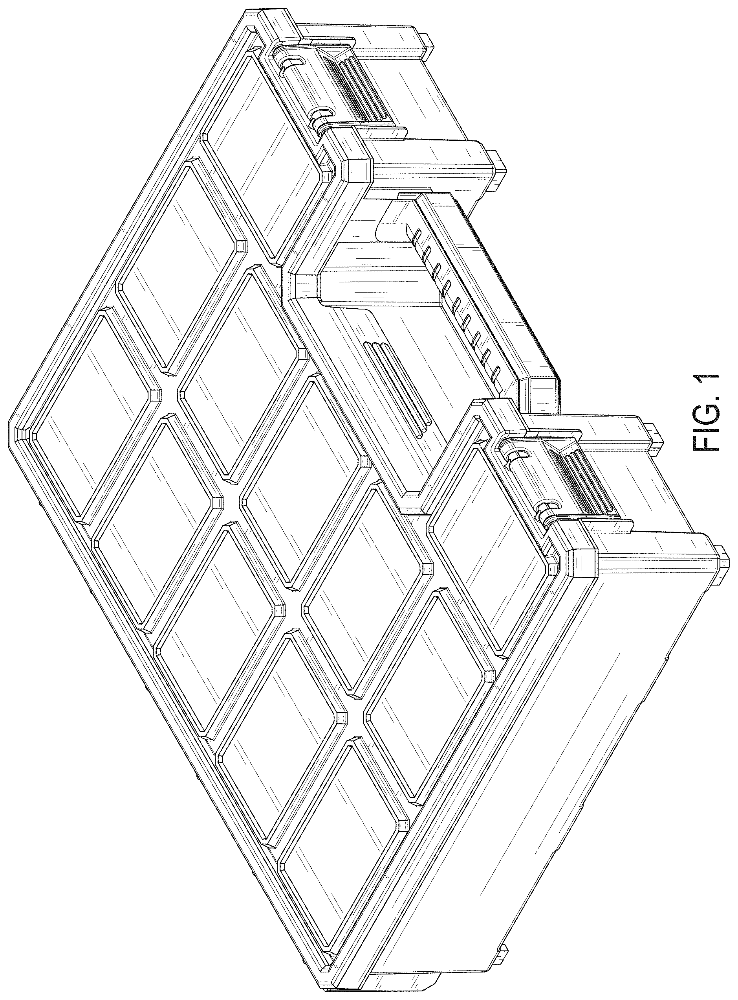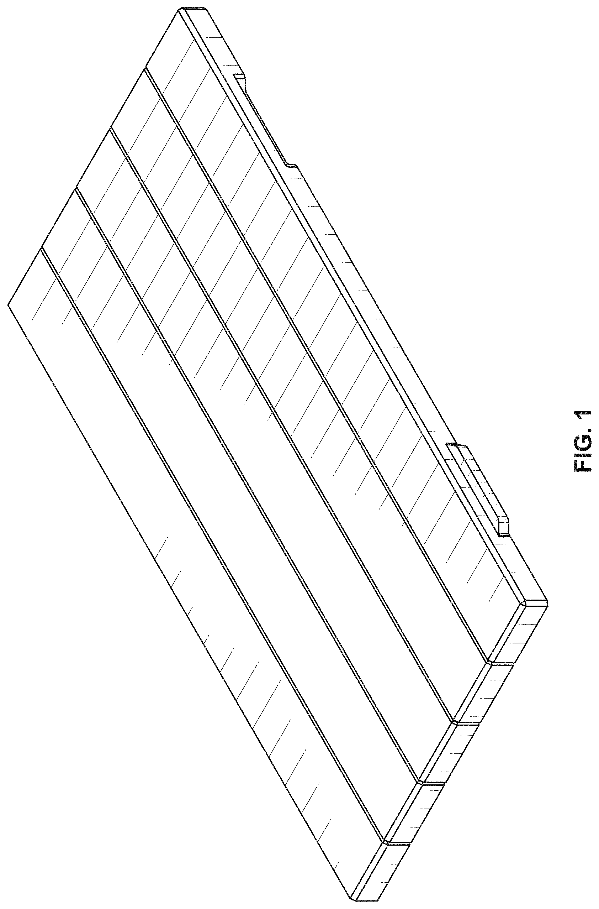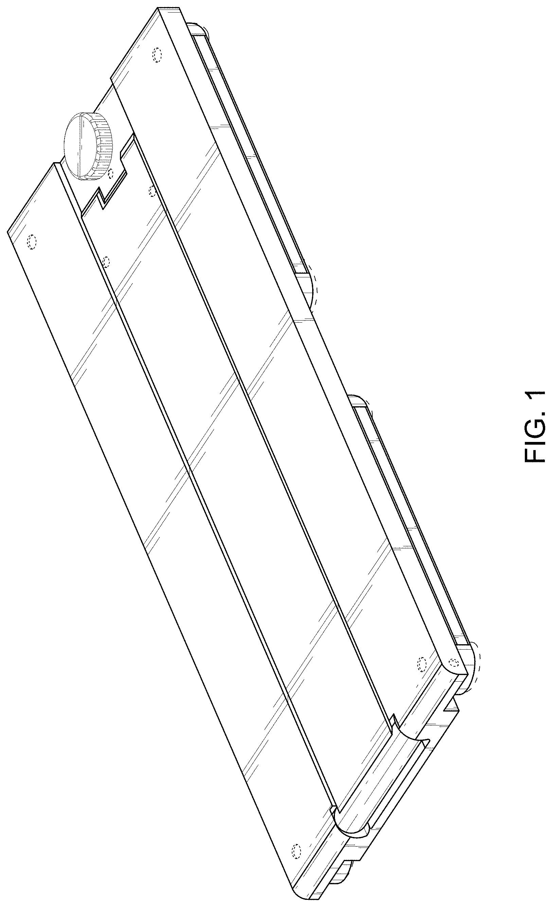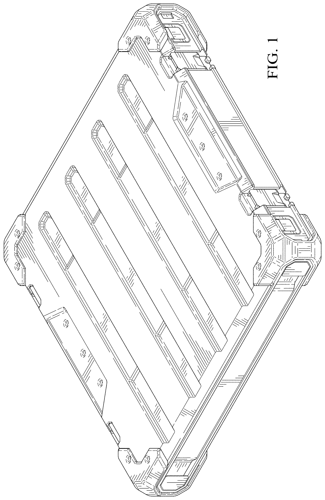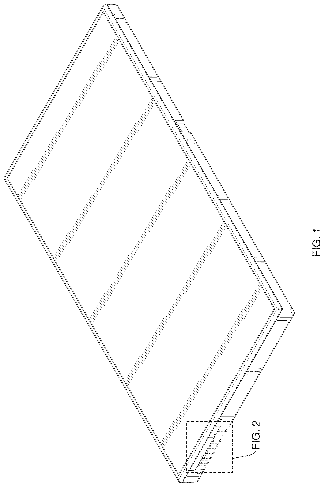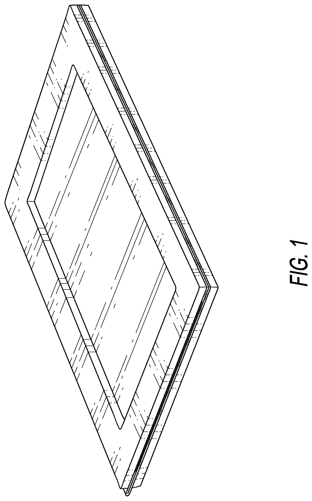

1. **Panel light（正解）**
2. Medication case（類似度0.71）
3. Organizer system and components of the organizer system（類似度0.70）
4. Panel tread for a paving system（類似度0.70）
5. Base support for a massager（類似度0.70）
6. Protective information handling system case（類似度0.69）
7. Flat battery pack（類似度0.67）
8. Wooden greeting card（類似度0.67）

こちらも同様に、パネル状・トレー状の菱形〜長方形シルエットで統一されており、意味的なカテゴリは全く異なるのに見た目だけでは非常に紛らわしい。

---

作成: 2026-08-27
