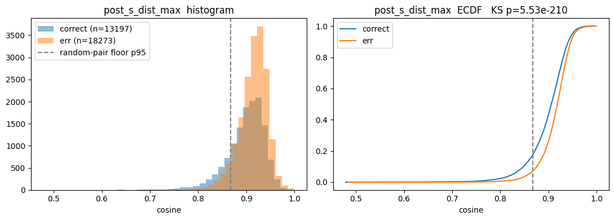

# 週次MTGレポート — 2026-09-15

## 意匠識別ベンチマークの確定

先週まで検討していた多肢選択ベンチマークを確定した。

- **8択（正解1＋誤答7）、誤答は意匠図面の画像埋め込み（DINOv2）で視覚的に近い別特許のタイトルから選ぶ。** テキスト・意味的類似度は誤答選定には一切使わず、意味的な同義語だけを除外に使う。
- 当初の4択・同義語除外しきい値0.80は最先端モデルに易しすぎた（GPT-5 のゼロショットが59.1%で、意匠タイトル予測用に LoRA したモデルの56.36%を上回った）。消去法が効きやすく、タイトルの意味的な近さでも切れてしまうため、誤答を4→8に増やし、同義語除外を厳しく（0.80→0.70）して「見た目だけで判断させる」難易度に引き上げた。
- 入力画像は**表紙図面（正面図）1枚のみ**。多方向図面は使わない方針で固定した。
- テスト用（2022年、GUI・アイコンを除外して31,470問）を構築済み。年を切り替えて他年も構築できるようにした。

---

## 帰属診断：Qwen3-VL-4B の誤答はどこで躓いているか

### 結論

**誤答率は、図面の「ありふれ度」（どれだけ他の図面と似た、ありきたりな見た目か）で大きく変わる。ありふれていない図面では 43.6%、ありふれた図面では 70.8% で、27ポイントの差がある。**

**その誤答は、図面の見た目を区別できないこと（層A）ではなく、図面を正しい製品名に結びつけられないこと（層B）で起きている。ありふれた図面ほど、この結びつけができていない。**

### 問い

ゼロショットの8択で Qwen3-VL-4B が間違える原因を、能力の3層——A 視覚的保持／B 視覚-意味接地／Reasoning 比較推論——に切り分ける。今週は層Aと層Bを測った。いずれも追加学習なし、2022年テストベンチ全件（正答 13,197問／誤答 18,273問、正解率 41.9%）で、**正答問と誤答問を比べる**。

### 実験1（層A）：LLM に渡る視覚表現は、アンカーと誤答図面を区別できているか

- LLM が実際に受け取る視覚表現（視覚言語マージャの出力、画像全体で平均）で、アンカー図面と7つの誤答図面のコサイン類似度を取る。
- 視覚エンコーダ直後（マージャ前）の表現は、全画像に共通する巨大な成分のせいで無関係な図面同士でも類似度が約1.0になり、指標として使えないため判定から外した。

| | 正答問 | 誤答問 |
|---|---|---|
| アンカーと最も近い誤答のコサイン（中央値） | 0.906 | 0.918 |
| モデルが実際に選んだ誤答とのコサイン（中央値） | — | 0.891 |

- **正答問と誤答問の差は 0.012 とわずかで、分布はほぼ重なる。**
- **誤答問でモデルが選んだのは、最も近い誤答ではない**（0.891 < 0.918）。一番似た選択肢に釣られたわけではない。
- → **「見た目が似すぎて区別できなかった」誤答はほとんどない。**

### 実験2（層B）：図面を正しい製品名に結びつけられているか

選択肢を並べず、記号（A〜H）も使わずに、8つのタイトルを1つずつ Qwen に採点させる。**押し上げ**は次のように数値化する。

1. **図面ありの確率**：図面と質問文（「この画像は意匠特許の図面です。この意匠は何の製品を表していますか。製品タイトルだけで答えてください。」）を入力し、Qwen がそのタイトルをそのまま回答として出力する確率を求める。タイトルを構成する各トークン（回答の終わりを表すトークンを含む）の対数確率を、トークン数で平均した値を使う。
2. **図面なしの確率**：図面を外し、同じ質問文だけを入力して、同じタイトルについて同じ値を求める。タイトル自体の言いやすさ（ありがちな製品名ほど高い）にあたる。
3. **押し上げ ＝ 図面ありの確率 − 図面なしの確率**（どちらも対数確率なので差を取る）。図面を見たことで、そのタイトルがどれだけ言いやすくなったかを表す。

- 各問で押し上げが最大のタイトルが正解なら、**図面を正しい製品名に結びつけられている（接地できている）**とみなす。
- トークン数で平均せず合計した場合でも、結果はほぼ変わらなかった（誤答問の内訳の差は1pt未満）。
- 判定基準と、測定自体を疑う条件（図面なしでも当たる、など）は結果を見る前に固定し、いずれにも該当しなかった。

| | 正答問 | 誤答問 |
|---|---|---|
| 押し上げで正解のタイトルを選べる率（チャンス 0.125） | **0.596** | **0.195** |

- → **層Aとは対照的に、正答問と誤答問ではっきり違う。** 正答問は約6割が図面から正解の製品名を引けているが、誤答問は約2割しか引けていない。

### 誤答はどこで躓いているか：ありふれた図面ほど、接地できていない

アンカー図面の「ありふれ度」で全問を5等分した。**ありふれ度の定義**は次のとおり。

1. ベンチに登場する全図面（31,470枚）それぞれについて、実験1と同じ視覚表現（視覚言語マージャの出力を画像全体で平均し、長さ1に正規化したベクトル）を求める。
2. 全図面のベクトルを平均し、長さ1に正規化したものを「平均的な図面の向き」とする。
3. 各図面のベクトルと「平均的な図面の向き」とのコサイン類似度を、その図面のありふれ度とする。

値が大きいほど、Qwen の視覚表現の中で**多くの図面に共通する特徴ばかりで、その図面固有の特徴が少ない**ことを表す。問題への正解・誤答の情報や、タイトルは一切使っていない。

| ありふれ度 | 誤答率 | 押し上げで正解を選べる率 |
|---|---|---|
| 1（最もありふれていない） | 43.6% | 0.49 |
| 2 | 52.0% | 0.41 |
| 3 | 59.0% | 0.35 |
| 4 | 64.9% | 0.31 |
| 5（最もありふれている） | 70.8% | 0.25 |

- **ありふれた図面ほど誤答率が上がり（両端で27ポイント差）、それと並行して押し上げで正解を選べる率も下がる（0.49 → 0.25）。** 実験1で正答問と誤答問に見えたわずかな差も、ほぼこのありふれ度で説明できた。
- 珍しい図面からありふれた図面にかけて増える誤答（+1,712問）の**約93%が接地の失敗**（押し上げで正解を選べない問）。

### 注意

- 押し上げは、各タイトルを他の選択肢なしで1つずつ評価するので、8択より厳しい（正答問でも約4割は接地の失敗と判定される）。正確には「誤答の約8割は、図面が単独では正解の製品名を指していない問」。
- 実験1は画像全体を平均した表現で測っている。白地の多い線画では、細部の形の違いが平均で薄まっている可能性があり、層Aの寄与はまだ完全には否定できていない。

---

## 今後やること

1. **躓きが層Aか再確認** 層Aで類似度が大きいのは，白黒の線画画像をさらにmen poolingしたベクトルで測っているからではないのかを確かめる．違うベクトルで測れば正答と誤答で違いが出るのではないか．もしそうならば，画像に対するアプローチとなり，CVPRで提案できる足がかりになるかもしれない．（白い背景のトークンを除いた平均と、トークンごとに最も似た相手との類似度で、正答問と誤答問の分離がありふれ度を揃えても上がるかを見る。上がらなければ、平均で細部が薄まって層Aの失敗が隠れていた可能性が消える。）

## FB
- 先行研究をもっと見たほうがいい．製品名を生成する．キャプション生成としては素朴なやり方．
  - 考えられる工夫を先行研究で探すほうがいい．
- 細かい部分を見たほうがいいのと，大まかを見たほうがいいやつがある．データごとに切り替えられる．
  - フォーカスが動的に変わる．
- 画像の問題になればいいというか，画像の問題として無理やり解決する．

---

作成: 2026-09-15
