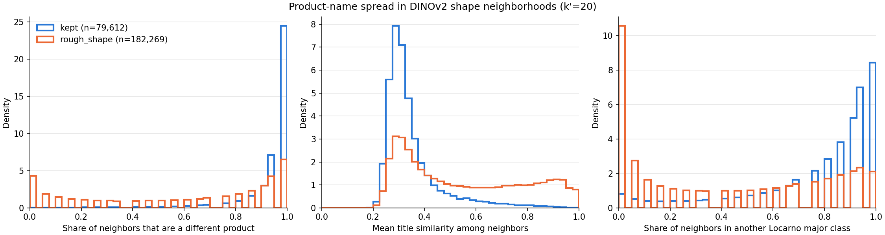

# 週次MTGレポート — 2026-10-13

## 形状が似ている図面の中で、製品名はどれくらい散らばっているか

前回の FB（形状が似ているものを集め、その中で製品名の意味の散らばりを確認する）を受けて、2007〜2022 年の全図面（約 41.5 万件）で確認した。

**確認の仕方**

- 図面ごとに、画像の特徴（DINOv2）で形が最も近い図面を 20 件取り出し、その 20 件の製品名を調べた。
- 製品名の埋め込みの類似度が 0.70 以上なら、同じ製品とみなした。
- ベンチマークに残した図面（約 8.0 万件）と、大まかな形だけで製品名が分かるとして除いた図面（約 18.2 万件）を比べた。除くかどうかは Qwen3-VL-8B が判定しており、ここで使った画像の特徴とは独立している。
- ベンチマークには、意味が同じ製品（製品名の類似度 0.90 以上）ごとに、形の典型の 1 件だけを残している。

| 形が最も近い 20 件について | 残した図面 | 除いた図面 |
| --- | --- | --- |
| 別の製品の割合 | **0.94** | 0.59 |
| 含まれる製品名の数 | 14.6 | 9.0 |
| 製品名どうしの平均の類似度（低いほど散らばっている） | 0.35 | 0.55 |
| Locarno の大分類（上位カテゴリ）が違う割合 | **0.79** | 0.41 |
| 形の近さ（平均のコサイン類似度） | 0.71 | 0.74 |

**図の読み方**

- **左（別の製品の割合）**：残した図面は 1.0 の所に高く積み上がる。形が似た 20 件が全部別の製品、という図面が多い。除いた図面は 0 の所にも山がある。これはタイヤや靴のように同じ製品が大量にあり、形が似た図面が全部同じ製品になる場合である。
- **中（製品名どうしの平均の類似度）**：残した図面は 0.3 付近に鋭い山がある。0.3 は、この埋め込みで無関係な製品名どうしが取る値なので、形が似た図面の製品名はばらばらだということになる。除いた図面は 0.9 近くまで裾が伸び、形が似た図面の製品名も似ている。
- **右（上位カテゴリが違う割合）**：除いた図面は 0 の所に大きな山があり、形が似た図面が同じ大分類の中に収まる。残した図面は 0.8〜1.0 に集まり、形が似た図面が別の上位カテゴリから来ている。

**分かったこと**

- 残した図面では、形が似た 20 件のうち約 19 件が別の製品で、約 16 件は上位カテゴリまで違う。**大まかな形だけでは製品名が決まらず、形の似た物体が上位カテゴリをまたいで存在する。** これは、提案ベンチマークの前提（上位カテゴリをまたいで形状が似ている状況）を数字で示すものである。
- Qwen の判定とは独立した画像の特徴でも、除いた図面は形が似た図面に同じ製品が多く並ぶ。大まかな形で分かるとして絞り込んだ判定が、狙い通りに働いていることの裏付けになる。
- 近傍の件数を 10 件、50 件に変えても、大小の関係は変わらない。
- 注意点：除いた図面の方が、形が似た図面との近さが少し高い（0.74 と 0.71）。同じ製品の図面が密集しているためである。その分、残した図面の散らばりがやや大きく見えている可能性はあるが、差は 0.04 で、別の製品の割合の差（0.35）よりずっと小さい。
